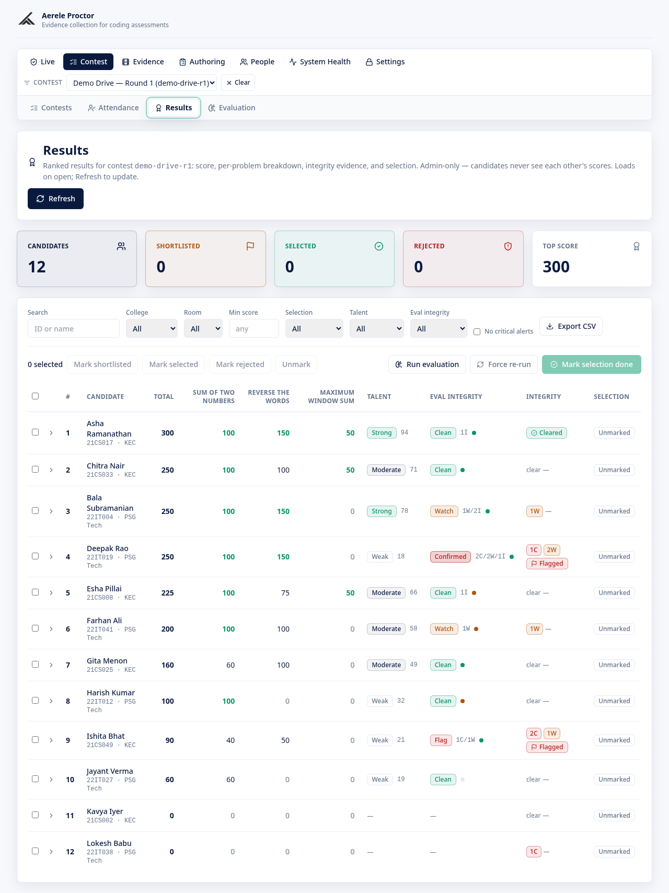
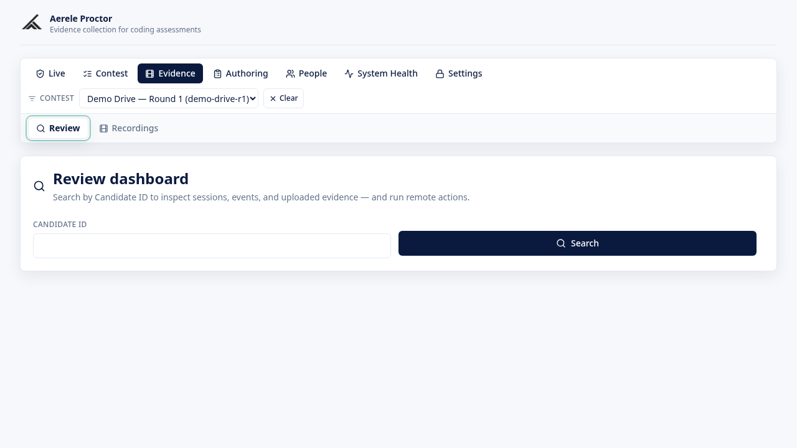
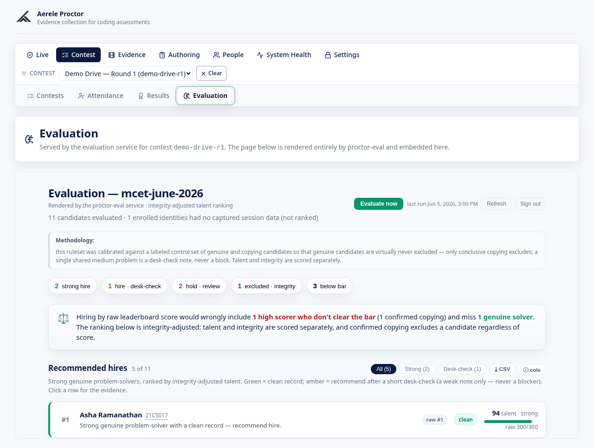

<div align="center">

# Aerele Proctor

**A self-hosted, own-editor coding-exam platform — with live proctoring, real code execution, and a calibrated integrity + talent hire-recommendation engine.**

Candidates register, share their entire screen, and solve problems inside your own
React + Monaco workspace with Judge0-backed Run/Submit. You run the whole exam from
one admin console; afterwards you get ranked results with evidence-backed integrity
flags and a hire recommendation per candidate.

</div>

---

## What it is

Aerele Proctor is **honest, browser-based proctoring**: evidence collection and
triage, not lockdown theatre. Candidates never leave your editor — registration,
fullscreen enforcement, the coding workspace, and Run/Submit all happen in one
React app. Screen video, a separate low-res camera stream, and JSONL event logs
stream to Google Cloud Storage; every integrity signal lands in one console.

It is built for **hiring and campus assessments** where the question after the
exam is not just *"who scored highest?"* but *"who is a genuine problem-solver, and
is the work their own?"* — so the platform ships a deterministic, calibrated
evaluation layer that turns the captured evidence into a per-candidate
**talent score**, an **integrity tier**, and an explainable **hire
recommendation** you can defend in a review.

> **The honest threat model.** A plain web app cannot force-close tabs, enumerate
> other tabs, continuously read the OS clipboard, see a second device, or detect an
> overlay on another monitor — no browser app can without a managed extension or
> endpoint agent. What Aerele Proctor *does*: hold candidates in fullscreen with an
> enforcement ladder, record the user-selected **Entire Screen** (it refuses
> anything else), capture a camera stream for live monitoring, detect tab-hidden /
> recording-stopped / screen-share-stopped, track IP changes, and stream evidence
> to GCS. The spine of integrity is **human review of recorded evidence** plus the
> live signal feed and the post-exam evaluation. Treat alerts as triage for review,
> never as automatic disqualification.

## Key features

- **Own-editor candidate experience.** A permissions-first onboarding, fullscreen
  enforcement, roster identity confirmation, and a multi-problem **Monaco**
  workspace with per-language starter stubs and curated autocomplete — as smooth as
  the commercial platforms, but entirely yours.
- **Live proctoring + recording.** Entire-screen capture (nothing else accepted), a
  separate low-res camera stream for live monitoring, chunked uploads via signed
  URLs with reload recovery, and a JSONL event log of editor / shell / submission
  activity.
- **A fullscreen enforcement ladder.** L1 typed-acknowledgement overlay → L2 lock,
  with three unlock paths, per-session exemptions, switch-away debounce, and an
  `alert_first` mode that keeps honest candidates from being penalised.
- **Real code execution (Judge0).** Run against sample tests and Submit against
  hidden tests, with per-session cooldowns, submission budgets, and tuned
  concurrency. Works with the managed **Judge0 on RapidAPI** out of the box, or a
  self-hosted Judge0.
- **One admin console.** Contests + reusable templates, a problem bank, flexible
  CSV/TSV roster upload with a cross-contest person model, live stats with 5-second
  auto-poll, a sessions list with per-candidate actions, an alerts console with
  filtering / grouping / video deep-links, an IP report, attendance, and recording
  review with a test-relative scrubber.
- **Calibrated integrity + talent evaluation.** After a contest, a deterministic
  engine derives a **talent score + tier** and an **integrity tier** from the
  captured evidence (17 signal families: paste provenance, away-paste correlation,
  keystroke cadence, code-clone clusters, replay-vs-submission tamper checks, and
  more). The two axes are **never averaged** — integrity gates talent. It outputs
  **evidence and flags, never a verdict**; a supervised round or a human is ground
  truth.
- **An explainable hire recommendation.** A read-time layer turns each scorecard
  into a FOR / AGAINST argument a reviewer can break, surfaced in a dedicated
  **Evaluation tab** (the `/eval-ui`). Calibrated so an honest candidate is
  ~never excluded: only conclusive copying excludes; a single shared medium problem
  is a desk-check note, never a block.
- **Tokenized invigilator portal.** A name-only, per-room console with its own auth,
  start-code gate, per-student unlock + exemption toggles, and selective alerts
  (default all off) — least-privilege by design.
- **Built-in data lifecycle.** Per-contest export, a triple-gated purge →
  tombstone, an evidence-retention clock with a daily sweep, and a GCS lifecycle
  backstop — so candidate PII does not linger.

## Screenshots

> These use synthetic personas; swap in your own captures if you prefer. Every
> screenshot under [`docs/assets/`](docs/assets/) uses fabricated personas — no
> real candidate data. The four images below are from the curated
> [`docs/assets/harness/`](docs/assets/harness/) set; the per-feature guides under
> [`docs/features/`](docs/features/) embed their own step-by-step walkthrough
> captures (mostly under `docs/assets/e2e/` and `e2e-live/`).

| Admin live monitoring | Ranked results + integrity |
|---|---|
|  |  |

| Recording review | Hire-recommendation report |
|---|---|
|  |  |

_A short demo video / GIF is a recommended addition before a public launch._

## Architecture at a glance

```
                          three path-routed surfaces, one React/Vite app
       candidate  /  ───┐
       admin    /admin ─┼─▶ ┌──────────────────────────────┐
       invig /invigilator┘  │ proctor-web (React+Vite+TS)   │
                            │  • candidate recorder +       │
                            │    Monaco workspace (Run/Submit)│
                            │  • admin console              │
                            │  • invigilator portal         │
                            │  • Evaluation tab → /eval-ui  │
                            └───────────────┬──────────────┘
   signed-URL PUT (screen + camera chunks)  │ JSON: session lifecycle, exec
   + JSONL events to GCS                     │ run/submit, editor events,
                                             │ admin/invigilator reads + actions
                                             ▼
                            ┌──────────────────────────────┐        ┌────────────┐
                            │ proctor-api (Cloud Run)       │◀──────▶│ Firestore  │
                            │  • src/handler.mjs (74 rts)  │ sessions, contests,
                            │  • Judge0 adapter (Run/Submit)│ problems, roster,
                            │  • shared /api/alerts ingest  │ persons, alerts,
                            └───┬───────────▲────────┬──────┘ reviews, evaluations…
        POST /api/alerts        │ (x-api-key)│        │       └────────────┘
        (shared contract)       │            │        │ signed video_key
                                │            │        ▼       ┌────────────┐
   ┌────────────────────────────┴──┐  ┌──────┴─────┐ ┌────────┴───────────┐│ GCS        │
   │ monitoring/ (Python tab-away  │  │ Judge0      │ │ proctor-eval        ││ evidence   │
   │  detector)                    │  │ (RapidAPI)  │ │ (separate Cloud Run)││ (chunks +  │
   │  • image-recog on recordings  │  │ Run/Submit  │ │ • /eval-ui pages    ││ manifests) │
   │  • POSTs source:proctor       │  └─────────────┘ │ • evaluation engine │└────────────┘
   │    tab_away alerts to /api/…  │                  │   (calibrated)      │
   └───────────────────────────────┘                  └─────────────────────┘
                                                       ┌─────────────────────┐
                                                       │ video-worker/        │
                                                       │ (OPTIONAL chunk merge│
                                                       │  service)            │
                                                       └─────────────────────┘
```

**The services**

- **proctor-web** (`frontend/`) — one React/Vite/TS/Tailwind app with **three
  surfaces selected by URL path** (no router library): `/` candidate recorder +
  Monaco workspace, `/admin` console, `/invigilator` portal. Runs fully offline in
  `VITE_DEMO_MODE`. → [`frontend/README.md`](frontend/README.md)
- **proctor-api** (`backend/`) — one Node ESM Cloud Run handler
  (`src/handler.mjs`, 74 `/api/*` routes; route bodies decomposed into
  `src/routes/*.mjs` factories) for the candidate exam lifecycle, the admin
  console, the invigilator portal, the Judge0 Run/Submit adapter, and the shared
  `/api/alerts` ingest. State lives in **Firestore** + **GCS**.
  → [`backend/README.md`](backend/README.md)
- **proctor-eval** (`backend/`, separate Cloud Run service) — the **same source,
  a different entrypoint** (`Dockerfile.eval` → `evalApi`). It forwards only the
  evaluation routes and serves the `/eval-ui` Evaluation tab, so the
  evaluation/calibration logic can be redeployed without ever touching the
  test-taking service. Separation is at the **deploy** boundary, not the data
  boundary — it shares the same Firestore + GCS + config.
- **video-worker** (`video-worker/`) — **optional** Cloud Run service that merges
  per-session screen chunks into one review video. Not required to run an exam.
  → [`video-worker/README.md`](video-worker/README.md)
- **monitoring** (`monitoring/`) — the local image-recognition **tab-away
  detector** (`tab_away_detector.py`) that flags a candidate navigating away from
  the assessment and POSTs a `source:"proctor"` `tab_away` alert into
  `/api/alerts`. (The old HackerRank contest-eval poller that lived here was
  removed.) → [`monitoring/tab-away-README.md`](monitoring/tab-away-README.md)

**How they connect.** Every producer — the recorder, the enforcement ladder, and
the tab-away detector — emits the **same shared `Alert` JSON contract**, and they
all land in one Firestore collection the admin console reads. Evidence is stored
under one contest-foldered GCS prefix every component agrees on.

## Tech stack

| Layer | Stack |
|---|---|
| **Frontend** | React 18, Vite 5, TypeScript 5.7, Tailwind CSS 3.4, Monaco Editor, lucide-react, react-markdown. Served as a static site (nginx on Cloud Run). |
| **Backend** | Node.js 22 (ESM), Google Cloud Functions Framework, `@google-cloud/firestore`, `@google-cloud/storage`. Deployed on Cloud Run. |
| **Code execution** | Judge0 CE — managed via RapidAPI by default, or self-hosted. |
| **Data** | Firestore (sessions, contests, problems, roster/persons, alerts, reviews, evaluations…) + Google Cloud Storage (screen/camera chunks, JSONL event logs, manifests). |
| **Optional video-worker** | Node.js 22 + `ffmpeg`/`ffprobe` on Cloud Run. |
| **Tab-away detector** | Python 3 + numpy/Pillow (or OpenCV) image recognition. |
| **Cloud** | Google Cloud: Cloud Run, Cloud Storage, Firestore, Artifact Registry, Cloud Build, (optional) Cloud Scheduler + Secret Manager. |

## Quickstart

### Run the UI locally — no backend, no Google Cloud

The fastest way to see the product. Demo mode runs the entire UI on a localStorage
fake — real screen capture, fake everything else.

```bash
npm install
VITE_DEMO_MODE=true VITE_ADMIN_PASSWORD=dev npm run dev
# candidate:    http://localhost:5173/
# admin:        http://localhost:5173/admin   (unlock with: dev)
# invigilator:  http://localhost:5173/invigilator
```

Open it in a Chromium-based browser (Chrome / Edge) — `getDisplayMedia` is real
even in demo mode. Edit anything under `frontend/src/` and the browser hot-reloads.
See [`LOCAL_DEV.md`](LOCAL_DEV.md) for the full local-dev guide, including running
against a real backend.

### Deploy to Google Cloud

Aerele Proctor self-hosts on Google Cloud Run. The deploy scripts enable APIs and
create missing buckets / repos / indexes idempotently.

```bash
# 1. Configure deployment values (placeholders only — never commit the filled copy)
cp .env.deploy.example .env.deploy.local
$EDITOR .env.deploy.local          # PROJECT_ID, REGION, ADMIN_PASSWORD, buckets, …

# 2. Deploy, from the repo root, in order:
backend/deploy-gcp.sh              # proctor-api
frontend/deploy-gcp.sh             # proctor-web  (the ONLY sanctioned frontend deploy)
video-worker/deploy-gcp.sh         # optional
```

> **Always deploy the frontend through `frontend/deploy-gcp.sh`.** Ad-hoc
> `npm run build` / `gcloud builds submit` skip the admin/invigilator password-hash
> bake and the post-build verification gate — an empty baked hash silently breaks
> every login.

The backend deploy script sets a subset of env vars; Judge0, the invigilator/sweep
secrets, and the `EXEC_*` tuning are applied after the first deploy. The full
recipe — project bootstrap, env-var table, retention sweep, and a verify-the-deploy
smoke test — is in **[`docs/DEPLOY.md`](docs/DEPLOY.md)**.

### Configure Judge0 (code execution)

Run/Submit executes candidate code on **Judge0**. By default the backend targets
the public Judge0 CE on RapidAPI:

1. Subscribe to [Judge0 CE on RapidAPI](https://rapidapi.com/judge0-official/api/judge0-ce).
2. Set `JUDGE0_API_KEY` (and leave `JUDGE0_MODE=rapidapi`,
   `JUDGE0_BASE_URL=https://judge0-ce.p.rapidapi.com`).

To self-host Judge0 instead: set `JUDGE0_MODE=selfhosted`, point `JUDGE0_BASE_URL`
at your instance, and use `JUDGE0_AUTH_TOKEN`. See the per-service env templates:
[`backend/.env.example`](backend/.env.example),
[`frontend/.env.example`](frontend/.env.example),
[`video-worker/.env.example`](video-worker/.env.example).

## Documentation

The [`docs/`](docs/README.md) folder holds code-verified, per-area guides. Start
points:

- **[`docs/README.md`](docs/README.md)** — the documentation index.
- **[`docs/features/architecture-overview.md`](docs/features/architecture-overview.md)** — the fullest single-page technical tour.
- **[`docs/DEPLOY.md`](docs/DEPLOY.md)** — the from-scratch Google Cloud deploy runbook.
- **[`docs/EXAM-DAY-OPS.md`](docs/EXAM-DAY-OPS.md)** / **[`docs/CONDUCTOR-GUIDE.md`](docs/CONDUCTOR-GUIDE.md)** — the action-ordered exam-day runbooks.
- **[`docs/features/candidate-evaluation.md`](docs/features/candidate-evaluation.md)** — the integrity + talent evaluation engine (the D1–D17 signal families).
- **[`docs/proctoring-research.md`](docs/proctoring-research.md)** / **[`docs/platform-alternatives.md`](docs/platform-alternatives.md)** / **[`docs/ROADMAP.md`](docs/ROADMAP.md)** — the threat-model research and roadmap behind the design.

## Configuration reference

Each service reads its config from environment variables. The templates are the
canonical list:

| Service | Template | Key variables |
|---|---|---|
| **proctor-api / proctor-eval** | [`backend/.env.example`](backend/.env.example) | `ADMIN_PASSWORD`, `EVIDENCE_BUCKET`, `JUDGE0_*`, `ALERTS_INGEST_API_KEY`, `INVIGILATOR_PASSWORD`, `RETENTION_SWEEP_API_KEY`, the `EXEC_*` tuning, Firestore collection names. |
| **proctor-web** | [`frontend/.env.example`](frontend/.env.example) | `VITE_API_BASE_URL`, `VITE_DEMO_MODE`, `VITE_EVAL_API_URL`, and the deploy-baked `VITE_*_PASSWORD_HASH` values. |
| **video-worker** | [`video-worker/.env.example`](video-worker/.env.example) | `WORKER_TOKEN`, `SOURCE_BUCKET`, `DEST_BUCKET`. |
| **deployment** | [`.env.deploy.example`](.env.deploy.example) | The full Google Cloud deploy template consumed by the `deploy-gcp.sh` scripts. |

Secrets are **closed by default**: `POST /api/alerts` and the retention-sweep
endpoint reject every request until their API key is set; an unset
`INVIGILATOR_PASSWORD` rejects the global invigilator path. Lock `PUBLIC_APP_ORIGIN`
to the exact frontend URL in production.

## Repo layout

| Path | What lives here |
|---|---|
| `frontend/` | The React app — `src/App.tsx` (a ~26-line pathname router), `src/candidate/` (candidate surface), `src/admin/` (admin console + `AdminApp.tsx`), `src/InvigilatorApp.tsx`, `src/RecordingReview.tsx`, `src/useProctorRecorder.ts`, `src/api.ts` (incl. the demo shim), and per-area folders (`coding/`, `shell/`, `roster/`, `results/`, `people/`, `problems/`, `markers/`, `attendance/`, `ui/`). |
| `backend/` | The HTTP handler `src/handler.mjs` plus split-out modules (`config.mjs`, `lib/*.mjs`, `routes/*.mjs`, the `evaluation*.mjs` engine), `Dockerfile` + `Dockerfile.eval`, the deploy script, the Firestore index, and the mocked-GCP test suite. |
| `video-worker/` | Optional Cloud Run chunk-merge service (`src/server.mjs`). |
| `monitoring/` | The local image-recognition **tab-away detector** (`tab_away_detector.py`) + its self-test and README. (The old HackerRank contest-eval poller that lived here was removed.) |
| `docs/` | Per-area feature guides (`features/`), the deploy + exam-day runbooks, and the background research. |
| `scripts/` | Operational helpers (e.g. `merge-gcs-videos.mjs`, `deploy-preflight.sh`). |
| `*.env.example` · `.env.deploy.example` | Configuration templates (placeholders only). |

## Tests

```bash
cd backend  && npm test            # backend handler suite (mocked Firestore/Storage)
cd frontend && npx vitest run      # frontend unit suite
cd frontend && npm run build       # frontend production build
python3 monitoring/test_tab_away.py     # tab-away detector self-test (synthetic clip; no real sample needed)
```

## Contributing & local development

Contributions are welcome. The fast loop is demo mode (above); the full guide —
what runs locally vs. what needs Google Cloud, the demo-mode internals, and the
test commands — is in [`LOCAL_DEV.md`](LOCAL_DEV.md). Please run the backend and
frontend test suites before opening a PR, and never commit secrets (the
`.gitignore` blocks `.env*`, `*.bak`, `*.pem`, and service-account keys; use the
`*.env.example` templates).

## Security

See **[`SECURITY.md`](SECURITY.md)** for the vulnerability-reporting process, the
threat model, and the operator security responsibilities (secrets, closed-by-default
ingest, CORS, candidate-PII handling). This public repository contains **no real
candidate data** — all screenshots use synthetic personas.

## Capacity notes

Tuned for cost: zero min instances (set 1 for a real exam), low-bitrate screen
chunks, and a short evidence auto-delete window with longer-lived export zips.
Video is inherently large — at ~800 candidates × 90 min, expect meaningful GCS
usage. Test with 20–30 devices before a real drive.

---

## HTTP API reference

This is the **canonical route reference** for the project (the
[architecture overview](docs/features/architecture-overview.md#11-full-http-route-inventory-77-routes)
links here rather than duplicating it). **77 routes total**: **74** `/api/*`
routes dispatched from the `api` handler in `backend/src/handler.mjs` (route bodies
decomposed into `backend/src/routes/*.mjs` factories), plus the **3** `/eval-ui/*`
pages served by the separate proctor-eval entrypoint `backend/src/eval-server.mjs`
(listed under Evaluation below). Auth is timing-safe (`safeEqual`) and
**closed-by-default** when the secret is unset:

- **admin** = `x-admin-password` vs `ADMIN_PASSWORD`
- **invig** = `x-invigilator-password` vs the contest's `invigilator_key` OR
  `INVIGILATOR_PASSWORD` (admin password also accepted)
- **api-key** = `x-api-key` vs `ALERTS_INGEST_API_KEY`
- **sweep** = `x-api-key` vs `RETENTION_SWEEP_API_KEY` (or admin)
- **session** = knowing the `session_id` (no header) — the candidate write bearer

Any unmatched path → `404`. Intentional 4xx echo a `detail` message; unexpected
errors return a generic `500` with no internal detail. CORS allows
`GET,POST,OPTIONS` (`PUBLIC_APP_ORIGIN`, default `*`).

### Candidate / public

| Method | Path | Auth | Purpose |
|---|---|---|---|
| GET | `/api/exam-config` | none | Public sanitized exam config for a contest/slug. |
| POST | `/api/access-code` | none | Resolve a typed 6-char access code → contest slug. |
| POST | `/api/roster/lookup` | none (rate-limited) | Verify a candidate's roster unique ID (person-mode may return a college picker). |
| POST | `/api/session/start` | time-window gate | Register/start a session, or idempotently replay an owned `session_id`. Serves `problems[]` + `submissions_summary` + `submit_budget`. |
| POST | `/api/session/resume` | session | Return an existing session verbatim after a reload (no re-collection). |
| POST | `/api/upload-url` | session (writable) | Mint a v4 signed **write** URL for a `screen` or `camera` chunk. |
| POST | `/api/events` | session (writable) | Append a JSONL event batch; raise sure-shot alerts for high-signal types. |
| POST | `/api/editor-events` | session (writable) | Ingest editor (keystroke/paste) events (cap `EDITOR_EVENTS_INGEST_LIMIT`). |
| POST | `/api/exec/run` | session (writable) | Run code against **sample** tests on Judge0 (visible results). |
| POST | `/api/exec/submit` | session (writable) | Submit against **hidden** tests (verdict + pass/fail counts only). |
| POST | `/api/review-file` | session (writable) | Store a review record set (`clipboard`/`tabs`/`cookies`). |
| POST | `/api/heartbeat` | session (writable) | Liveness + recording state + IP; raises `recording_stopped`/`ip_changed`; serves live enforcement config. |
| POST | `/api/session/beacon` | session (sendBeacon-friendly) | Liveness beacon (`hidden`/`visible`/`closing`); `hidden`/`closing` raise `tab_hidden`. |
| POST | `/api/session/room-gate` | session | Submit the invigilator room start code. |
| POST | `/api/session/enforcement-violation` | session | Report a fullscreen exit; server decides lock vs alert. |
| POST | `/api/session/unlock-gate` | session | Submit an invigilator unlock code to release a fullscreen lock. |
| POST | `/api/session/validate-end` | session (writable) | Pre-flight the end (requires `assurance_accepted:true`). |
| POST | `/api/session/end` | session (writable) | End the session, write `manifest.json`, release the live slot. |
| POST | `/api/submission-events` | session (writable) | Append submission-time timeline markers. |

### Admin — contests, templates, problems, roster

| Method | Path | Purpose |
|---|---|---|
| GET/POST | `/api/admin/contests` | List / create contests (create may use `template_slug`). |
| POST | `/api/admin/contest-update` · `contest-status` · `contest-regenerate` · `contest-set-code` · `contest-exam-time` | Update fields / status / regenerate codes / set a custom access code / set exam time. |
| GET | `/api/admin/templates` · `/api/admin/template` | List / read templates. |
| POST | `/api/admin/templates` · `template-update` · `template-archive` · `template-clone` · `template-delete` | Template CRUD. |
| GET | `/api/admin/problems` · `/api/admin/problem` | List / read problems (with hidden tests). |
| POST | `/api/admin/problems` · `problem-delete` | Save / delete a problem (live-reference guard). |
| GET/POST | `/api/admin/roster` | Read / upload a per-contest roster (college column → identity pipeline). |

### Admin — live monitoring, sessions, alerts

| Method | Path | Purpose |
|---|---|---|
| GET | `/api/admin/sessions` · `recording-sessions` · `sessions-list` · `session-detail` · `session-events` | Per-user sessions + evidence / recording picker / list / one-session detail / event stream. |
| POST | `/api/admin/session-action` · `session-details` | Bulk action (`approve`/`lock`/`unlock`/`bypass`/`end`/`exempt`) / per-user detail CSV. |
| GET | `/api/admin/submission-events` | Submission timeline markers for a session. |
| GET | `/api/admin/stats` | Counts by status (live/locked/pending/finished/disconnected) + rooms. |
| GET | `/api/admin/ip-report` · `attendance` | IP clustering drill-down / roster taken–not-taken. |
| POST | `/api/admin/health-check` | Pre-test pre-flight canary: stands up an ephemeral namespaced contest+session and probes signing / chunk upload / recordings read / telemetry write / bundle hash-gate / Judge0 reachability with real auth, then tears it down (`light` skips metered Judge0; `full` adds 2 submissions). |
| POST | `/api/admin/contest-exam-time` | Live end-time control for the scoped contest (absolute / extend / force-end-now). |
| POST | `/api/alerts` | Ingest one alert or a batch (`{alerts:[…]}`, idempotent on `alert.id`). |
| GET | `/api/admin/alerts` | List alerts newest-first with filters + `download_url` from `video_key`. |
| POST | `/api/admin/alert-action` | `archive`/`unarchive` a set of alert ids. |
| GET/POST | `/api/admin/alert-settings` | Read / upsert per-type proctor alert config. |

### Admin — results, people, recording review, lifecycle

| Method | Path | Purpose |
|---|---|---|
| GET | `/api/admin/contest-results` | Per-contest scoreboard (rank / per-problem / integrity). |
| POST | `/api/admin/contest-selection` · `contest-selection-done` | Bulk-select shortlist / finalize the selection snapshot. |
| GET | `/api/admin/people` · `/api/admin/person` | People directory (capped fan-out) / one person's cross-round scorecard. |
| POST | `/api/admin/contest-export` · `contest-purge` · `retention-sweep` | Export zip / triple-gated purge → tombstone / scheduled retention sweep. |
| POST/GET | `/api/admin/review-roster` · `review-next` · `review-verdict` · `review-mine` · `reviews` | Multi-reviewer recording-review queue (set roster / serve next / verdict / mine / list). |

> The recording **player** path (used by recording review and alert deep-links)
> resolves in both legacy and person-keyed modes. The distributed reviewer
> **queue** (`review-roster`/`review-next`/`review-verdict`) is candidate-norm-keyed;
> full person-mode queue serving is a roadmap item.

### Evaluation (proctor-eval `/eval-ui` + routes)

| Method | Path | Purpose |
|---|---|---|
| POST | `/api/admin/contest-evaluate` | Run the integrity + talent evaluation over a contest's sessions (batched). |
| GET | `/api/admin/contest-evaluations` · `contest-evaluate-status` | Read computed scorecards / poll batch status. |
| GET | `/eval-ui` · `/eval-ui/app.js` · `/eval-ui/recommend.js` | The embedded Evaluation tab page + its browser app + the pure recommendation module. |

### Invigilator (`backend/src/routes/invigilator.mjs`)

| Method | Path | Purpose |
|---|---|---|
| GET | `/api/invigilator/overview` | Which rooms exist, gate on/off. |
| GET | `/api/invigilator/room` | Room stats + session rows + shared alerts. |
| POST | `/api/invigilator/release-code` · `open-room` | Release the 6-digit room start code / open the whole room. |
| POST | `/api/invigilator/exempt` | Per-student enforcement exemption toggle. |
| POST | `/api/invigilator/unlock-code` · `unlock` | Mint a fullscreen unlock code / unlock a specific session. |

### Shared alert contract

Every producer and the backend agree on this shape (required on ingest: `source`,
`type`, `severity`, `timestamp`, `hackerrank_username`, `title` — the wire field
name `hackerrank_username` is **frozen for back-compat**; the candidate-facing
label is "Candidate ID"):

```jsonc
{
  "id": "<source>:<type>:<username_norm>:<contest_slug>:<dedupe>", // stable + idempotent
  "source": "proctor", // the only accepted source (the contest-eval poller was removed)
  "type":   "<see alert taxonomy below>",
  "severity": "critical | warning | info",
  "timestamp": "<ISO 8601>",
  "contest_slug": "<optional>",
  "hackerrank_username": "<required (frozen wire name)>",
  "username_norm": "<lowercase/sanitized>",
  "person_id": "<optional; person-mode>",
  "session_id": "<optional>",
  "room": "<optional>",
  "title": "<headline>",
  "detail": "<optional explanation>",
  "data": { /* optional structured payload */ },
  "video_key": "<optional GCS key; resolved to download_url on READ, never stored>",
  "verdict": { "status": "pending | real | false_positive | inconclusive" }
}
```

## Alert taxonomy

Two producers, two config surfaces. The fuller catalog (with severity rules) is in
[`docs/features/alert-taxonomy.md`](docs/features/alert-taxonomy.md).

### Proctor alerts — admin **Settings** (`/api/admin/alert-settings`)

`source:"proctor"`. Every type is enabled by default; a disabled type is skipped, a
configured severity overrides, and `show_to_invigilator` defaults **false** for
every type.

| Type | Default severity | Raised by |
|---|---|---|
| `recording_stopped` | critical | `/api/events` event **or** `/api/heartbeat` stopped composite `recording_state` |
| `screen_share_stopped` | critical | `/api/events` event |
| `recording_error` | critical | `/api/events` event |
| `fullscreen_enforcement` | critical | `/api/session/enforcement-violation` (server-decided) |
| `ip_changed` | warning | server-derived on `/api/heartbeat` |
| `tab_hidden` | warning | `/api/session/beacon` `kind:"hidden"`/`"closing"` |
| `tab_away` | warning (+ `threshold_seconds`, default **12**) | the optional monitoring tab-away detector |
| `disconnected` | warning | reserved type; also a derived count in `/api/admin/stats` |

> The recorder **refuses** any non-`monitor` share surface (it throws before
> recording starts), so an "invalid share surface" can never fire as a live event.

The legacy `source:"contest-eval"` poller alert types were removed with the
HackerRank poller; `proctor` is the only alert source now.

## License

Released under the [MIT License](LICENSE). Copyright (c) 2026 Aerele.
