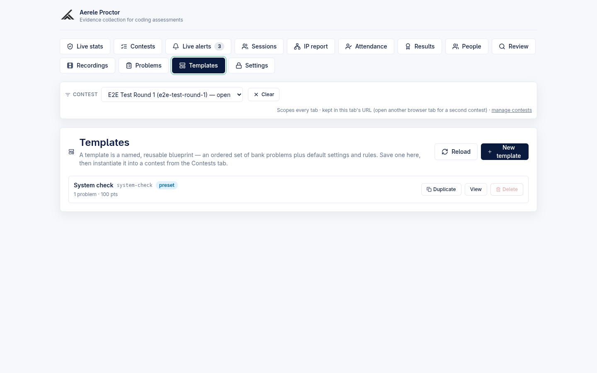
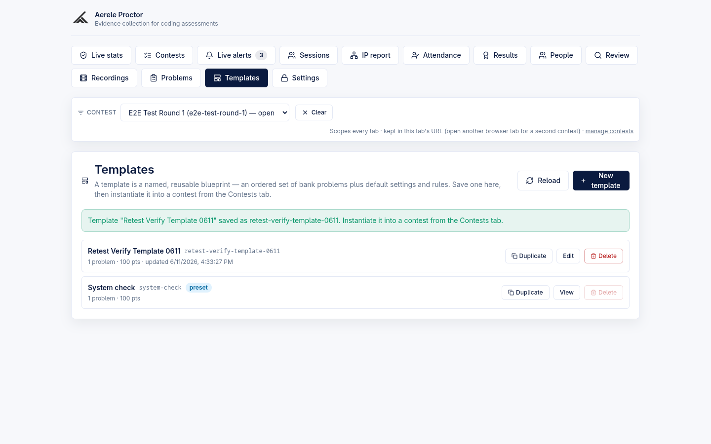
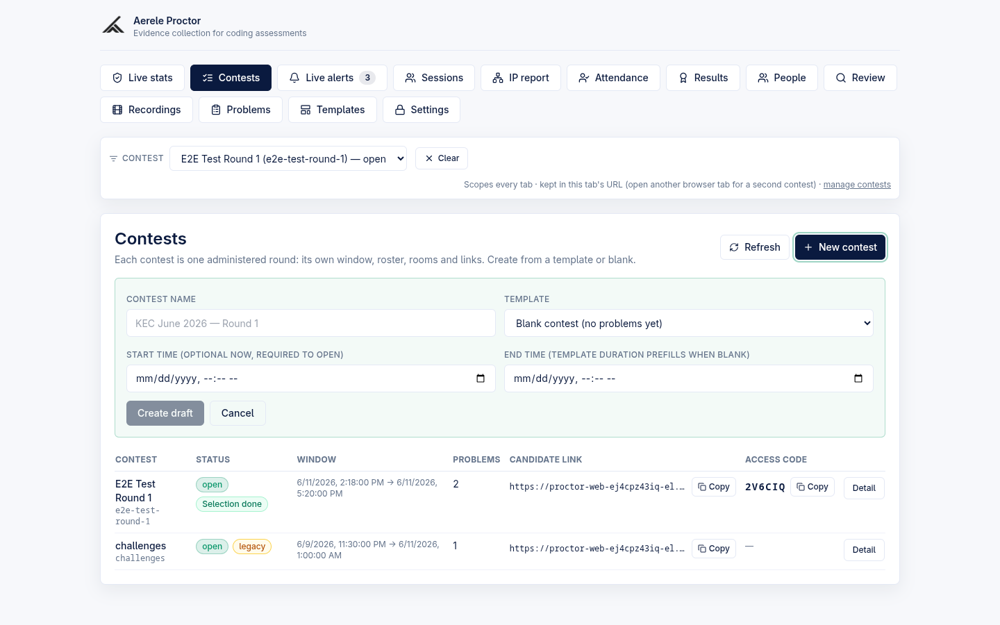
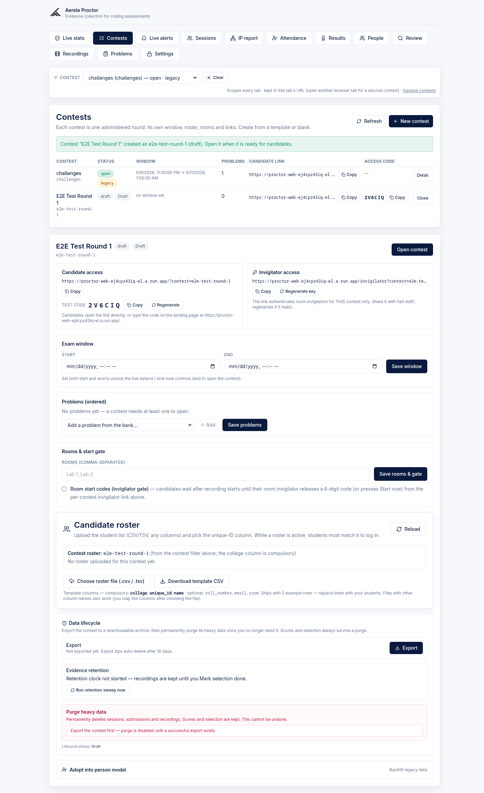
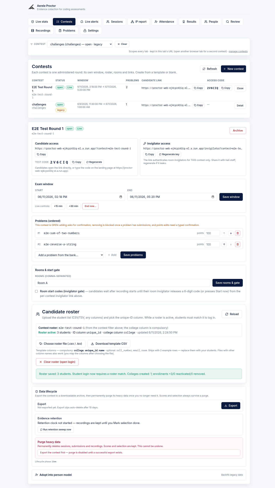
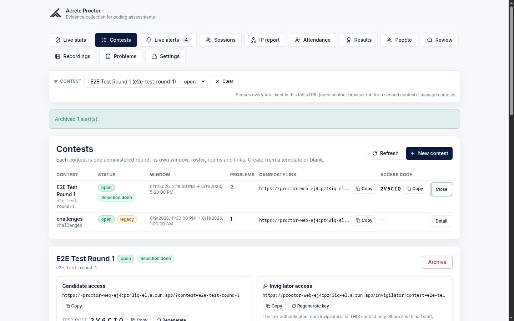

# Admin — Contests and Templates

The **Contests** and **Templates** tabs are where an admin defines and runs an exam. A *template* is a reusable blueprint (an ordered problem set plus default settings and rules); a *contest* is one administered round with its own exam window, roster, rooms, links and access code. Templates are authored once and instantiated into as many contests as you need.

> **Product context.** Aerele Proctor is a standalone own-editor exam platform: candidates solve problems inside the platform's own React + Monaco editor with Judge0-backed Run/Submit. (A separate optional `monitoring/` contest-eval poller can additionally watch an externally-hosted HackerRank contest and emit alerts into the same pipeline; that component is documented separately and is not part of the Contests/Templates flow described here.)

---

## Where this lives in the code

| Surface | Frontend | Backend |
| --- | --- | --- |
| Templates tab | `frontend/src/admin/TemplatesPanel.tsx`, `frontend/src/admin/templateForm.ts` | `backend/src/templates.mjs`, route bodies in `backend/src/handler.mjs` |
| Contests tab + detail | `frontend/src/admin/ContestsPanel.tsx`, `frontend/src/admin/contestAdmin.ts` | `backend/src/contests.mjs`, `backend/src/contestProblems.mjs`, route bodies in `backend/src/handler.mjs` |
| Global selector bar, `?contest=` routing, access-code landing | `frontend/src/App.tsx` (`ContestSelectorBar`, `AccessCodeLanding`) | `backend/src/contests.mjs` (`resolveAccessCode`) |
| Live-reference / live-save guards | `frontend/src/admin/saveGuard.ts`, `frontend/src/admin/ProblemBank.tsx` | `backend/src/handler.mjs` (`enforceContestProblemsEditRules`, `adminSaveProblem`, `adminDeleteProblem`), `backend/src/contestProblems.mjs` (`findProblemReferences`) |

> **Decomposition note (unverified beyond what is named here).** The backend was partially split into `lib/*.mjs`, `routes/invigilator.mjs` and `config.mjs` (B0/B1, behavior-preserving), but that refactor is **paused/partial** — the request dispatch table and most contest/template route bodies still live in `backend/src/handler.mjs`.

---

## Templates tab

The Templates tab lets you author, list, edit, duplicate and delete named reusable blueprints. Each template holds an **ordered list of bank problems** (with optional per-problem points overrides) plus a block of **default settings and rules**. Open the tab from the admin nav (`Templates`).

### Listing

The list (`fetchTemplates` → `GET /api/admin/templates`) shows each template's name, slug, a `preset` chip for the built-in seed, an `archived` chip when archived, and a summary line `"N problems · P pts"` plus the last-updated time. Rows are sorted alphabetically by name in the UI.

Each row has three actions:

| Action | Behavior |
| --- | --- |
| **Duplicate** | Clones the template into a new editable draft (slug cleared, name prefixed `Copy of …`, `preset` cleared) and opens the editor. Reuses the create path — this is how you get an editable copy of the preset. |
| **Edit** / **View** | Opens the editor. The built-in preset opens read-only and the button reads **View**; author-owned templates read **Edit**. |
| **Delete** | Hard-deletes the template doc (`deleteTemplateApi` → `POST /api/admin/template-delete`). Asks for confirmation. The button is **disabled for the preset** — the backend also rejects it with `template_preset_undeletable`. Existing contests already instantiated from the template are unaffected. |

### Built-in System check preset

`backend/src/templates.mjs` ships one seed template, **System check** (slug `system-check`), described in code as the "day-before lab check: instantiate as an always-open no-roster contest and run one trivial problem end-to-end on every machine." It contains one problem (`sum-two`) and is served with `preset: true`. The preset is **read-only** in the editor (a sky-blue banner says so) and cannot be deleted; to customize it, use **Duplicate**. A Firestore doc with the same slug shadows the seed entirely (the list merges seeds + docs, docs win).

The preset's own defaults differ from a blank template (verified in `SEED_TEMPLATES`): 30-minute duration, room gate **off**, camera width 320, retention 1 day.

### Authoring / editing a template

**New template** (or **Edit**) opens the editor (`createTemplateApi` → `POST /api/admin/templates`; `updateTemplateApi` → `POST /api/admin/template-update`). Pure form logic lives in `templateForm.ts`; the backend re-validates and normalizes via `validateTemplateInput`.

Fields:

| Field | Default (new template) | Bounds / notes |
| --- | --- | --- |
| Template name | empty | required; max 120 chars |
| Window duration (min) | `120` | 5–600; "prefills the contest end time at instantiate" |
| Description | empty | max 2000 chars |
| Problems (ordered) | empty | add from the bank, reorder with up/down arrows, remove; per-row points (blank = use the bank problem's points); at least 1 required, max 20; duplicate ids rejected |
| Identity label | `Roll Number` | max 40 chars |
| Evidence retention (days) | `4` | 1–30 |
| Room start gate (invigilator code) | **on** | checkbox |
| Languages | all of python, cpp, java, javascript **on** | at least one required |
| Camera recording — enabled | **on** | checkbox |
| Camera recording — fps | `10` | server clamps 1–15 |
| Camera recording — width | `640` | server clamps 320–1280 |
| Enforcement mode | `Block (hard)` | or `Alert first` |
| Fullscreen re-entry (s) | `20` | server floor 1 |
| Fullscreen exit limit | `2` | server floor 0 |

Saving shows a confirmation message and returns you to the list:

> `Template "<name>" saved as <slug>. Instantiate it into a contest from the Contests tab.`

> Client-side validation (`validateTemplateDraft`) catches the obvious mistakes (missing name, no problems, bad points, no language) before the request; the server is the source of truth and re-validates everything.

### Instantiation = snapshot copy

A template is **not** linked live to the contests it spawns. On instantiate (`instantiateTemplatePayload` in `handler.mjs`), the template's `problems[]` and every `defaults.*` field are **snapshot-copied onto the contest doc as the contest's own fields**. Editing a template afterward changes nothing in already-created contests. The contest keeps `template_slug` only as **display-only provenance** (it cannot be edited; the backend rejects attempts). Instantiation re-validates that every referenced problem exists and is **published right now** (`requirePublishedProblems`; otherwise `400 template_problems_unavailable`).

There are additional template endpoints wired in the handler — `template-archive` and `template-clone` (`POST /api/admin/template-archive`, `POST /api/admin/template-clone`) — but the current Templates UI performs archive-as-list-filter and duplicate via the create path rather than calling clone, so those endpoints are not exercised by this tab *(unverified that the UI ever calls them)*.

---

## Contests tab

Open the tab from the admin nav (`Contests`). The header reads: *"Each contest is one administered round: its own window, roster, rooms and links. Create from a template or blank."* The list loads via `fetchContests` → `GET /api/admin/contests` (with `include_archived` when refreshed).

### Creating a contest

**New contest** reveals an inline form (`createContestApi` → `POST /api/admin/contests`):

| Field | Notes |
| --- | --- |
| Contest name | required; a live **slug preview** appears as you type |
| Template | dropdown — `Blank contest (no problems yet)` (default) or any non-archived template, labelled with its problem count and a `preset` marker. The list excludes archived templates. |
| Start time | "optional now, required to open" |
| End time | "template duration prefills when blank" |

The slug is **auto-derived from the name** (`slugify` in `contests.mjs`: lowercase, spaces→`-`, strip non-`[a-z0-9-]`, collapse/trim dashes — e.g. `"KEC June 2026 — Round 1"` → `kec-june-2026-round-1`). Slug collisions get a `-2`/`-3`… suffix; the synthesized legacy slug and any slug already carrying orphaned data are skipped so a new contest can never absorb an old population.

A contest is always created as **draft**. On success:

> `Contest "<name>" created as <slug> (draft). Open it when it is ready for candidates.`

…and the detail page opens. When a template is chosen, the backend snapshot-copies its problems and defaults; when `end_at` is blank but `start_at` is set, the template's `duration_minutes` prefills the end time.

> New contests are always `identity_mode: "person"` — the per-candidate identity is `person_id = "{college_norm}~{uid_norm}"`, stable across contests. The `legacy_username` mode exists only on the read-only synthesized legacy contest (below) and can never be created.

### The contests list

| Column | Source |
| --- | --- |
| Contest (name + slug) | doc |
| Status | `draft` / `open` / `archived` chip, plus a derived lifecycle-phase badge (or a `legacy` badge on the synth row) |
| Window | `contestWindowLabel` — `start → end`, or "no window set" |
| Problems | count of ordered problems |
| Candidate link | `<origin>/?contest=<slug>` with a **Copy** button |
| Access code | the 6-char code with **Copy**, or `—` |
| (action) | **Detail** toggles the detail panel below |

Rows sort open-first, then draft, then archived; the legacy row sorts after real contests in its group; newest-first within a group.

### Legacy contest (read-only)

`listContests` synthesizes a single **legacy** contest on read from the global Settings doc (it has no contest doc of its own). On the detail page it shows an amber notice — links/codes/edits are **not** available for it, it keeps running exactly as configured on the Settings tab, and every write endpoint returns 404 for it by construction. Do not expect the per-contest controls below to apply to the legacy row.

---

## Contest detail page

Selecting **Detail** opens an in-place panel for that contest. The draft view shows every editable section; an open contest adds the live controls.

### Candidate access — code + link

- **Candidate link:** `<origin>/?contest=<slug>` with **Copy**.
- **Test code:** the 6-character access code (alphabet `A–Z` + `2–9`, no `0/1/O/I` lookalikes; minted once at create) with **Copy** and **Regenerate**. Regenerating asks *"Regenerate the test code? The old code stops working immediately."* (`regenerateContestSecretApi` → `POST /api/admin/contest-regenerate`, `field: access_code`). Candidates open the link directly or type the code on the landing page.

### Invigilator access — key + link

- **Invigilator link:** `<origin>/invigilator?contest=<slug>&key=<invigilator_key>` with **Copy** and **Regenerate key**. The key (18 random bytes, base64url) authenticates room invigilators **for this contest only**; regenerating invalidates every distributed link instantly (confirm dialog, then `POST /api/admin/contest-regenerate`, `field: invigilator_key`).

Both secrets are mint-only — they cannot be set via the update endpoint, only regenerated.

### Exam window

`start` / `end` `datetime-local` inputs with **Save window** (`updateContestApi` → `POST /api/admin/contest-update`). Both must parse and `start < end`. When both are set, **live controls** unlock: **+15 min**, **+30 min**, and a two-click **End now…** → **Confirm end now** (`adjustContestExamTime` → `POST /api/admin/contest-exam-time`, exactly one of `end_at | extend_minutes | end_now`). Until both ends are set, a hint explains that they are required to open the contest and to expose the live controls. The last end-time adjustment timestamp is shown when present.

### Problems (ordered) — guard-aware editing

The ordered problem list supports reorder (up/down), remove, per-problem points (blank = use the bank default), add-from-bank, and **Save problems** (`POST /api/admin/contest-update` with `problems`). The bank dropdown marks draft problems as "(draft — publish first)". A contest needs **at least one problem to open** (`contest_has_no_problems` on the open action).

While the contest is **draft**, problem edits are free. Once **open**, the panel warns and the backend (`enforceContestProblemsEditRules`) enforces three guards — the UI catches each error code and re-submits with the right confirmation:

| Edit while open | Server response | UI handling |
| --- | --- | --- |
| Adding a problem | `409 problem_add_requires_confirm` | `window.confirm("This contest is OPEN. Add the new problem(s) for every candidate now?")` → retry with `confirm: true` |
| Removing a problem that already has stored submissions in this contest | `409 problem_has_submissions` | surfaced verbatim (hard block) |
| Editing a problem's points | `409 points_edit_confirmation_required` | prompts you to type the contest slug to confirm (points apply retroactively); retry with `confirm_points_edit: <slug>` |

### Rooms & start gate

- **Rooms** — comma-separated text → **Save rooms & gate** (`POST /api/admin/contest-update` with `rooms`, `room_gate_enabled`). Labels are sanitized (`[a-zA-Z0-9 ._-]`, 80-char cap, case-insensitive dedupe, max 50).
- **Room start codes (invigilator gate)** — a checkbox. When enabled, candidates wait after recording starts until their room invigilator releases a 6-digit code (or presses Start now) from the per-contest invigilator link.

  **Default:** for a **blank** contest the gate defaults **off** (`room_gate_enabled` defaults to `false` in `createContest`). For a **template-instantiated** contest, the template's default applies (blank templates default the gate **on**; the System check preset has it **off**).

### Evidence retention (days)

Set on the template (`evidence_retention_days`, default 4, range 1–30) and snapshot onto the contest; editable via `POST /api/admin/contest-update`. It drives the evidence-retention countdown in the Data lifecycle section (export → triple-gated purge → tombstone; retention sweep). Those lifecycle controls are documented in the data-lifecycle feature page; the detail panel renders them inline below the roster.

### Roster, lifecycle, adopt

Below the gate the detail page reuses the existing per-contest **roster** section (rooms + college person-identity), the **Data lifecycle** export/purge/retention section, and a one-time **Adopt into person model** action for backfilling a pre-person-layer contest onto cross-round scorecards. These are covered in their own feature pages.

### Status actions

The detail header shows the status-transition button for the current status (`setContestStatusApi` → `POST /api/admin/contest-status`):

| Status | Button | Effect |
| --- | --- | --- |
| draft | **Open contest** | requires ≥1 problem; otherwise `contest_has_no_problems` |
| open | **Archive** | confirm dialog; candidates can no longer start or resume |
| archived | **Reopen** | sets status back to open |

---

## Live-reference guard (problem bank ↔ contests/templates)

Because problem **content** is read live from the bank at serve time, the bank's destructive edits are guarded against breaking a contest or template that references a problem (`findProblemReferences` in `contestProblems.mjs`; enforced in `adminSaveProblem` / `adminDeleteProblem`):

| Bank action | Result |
| --- | --- |
| Delete a problem referenced by any non-archived contest or template | `409 problem_referenced` (no silent unassign) |
| Unpublish a problem referenced by a contest | `409 problem_referenced` (template-only references are allowed — instantiation re-validates) |
| Edit hidden tests while an **open** contest references it | `409 live_edit_confirmation_required` until the request includes `confirm_live_edit: <problem id>` |

### D1 live-save confirm

On top of the server guards, the Problem Bank UI adds a client-side **warn-on-save** dialog (`saveGuard.ts`, used by `ProblemBank.tsx`): saving a problem that an **open** contest references prompts a confirm naming the affected running contests before the request is sent (`"This change affects N running/active contest(s) (slugs…). Candidates sitting … right now will see the edited problem. Continue?"`). "Live" means `contest.status === "open"`; draft/archived references prompt nothing.

> The exact original trigger Karthi agreed to was not recoverable from disk; the shipped interpretation (edit-to-an-open-contest's problem) is documented in `saveGuard.ts` and flagged there for review. *(unverified that this matches the original intent.)*

---

## Global contest selector bar and routing

### Selector bar (scopes every admin tab)

Below the admin nav sits the **`ContestSelectorBar`** (`App.tsx`). It is a single dropdown — `All contests` plus every contest (`name (slug) — status`, `· legacy` on the synth row) — with a **Clear** button and a "manage contests" link that jumps to the Contests tab. Selecting a contest scopes Live stats, Sessions, Alerts, IP report, Attendance, Results and Review to that contest's `contest_slug`; the **People** tab is cross-round by design and ignores the selector.

- The selection is **per browser tab**: it is written to this tab's URL `?contest=<slug>` via `history.replaceState`, so a reload or duplicated tab keeps its scope and two tabs run two parallel drives.
- An initial `?contest=` URL param always wins; with no param, a single open contest auto-selects (else `All contests`) — `defaultContestSelection`.
- A selected slug not in the dropdown (e.g. a deep link to an old/purged slug) renders as a literal `(unknown slug)` option so the URL state is never silently dropped.

### `?contest=` candidate routing + access-code landing

On the candidate side (`App.tsx`):

- **`?contest=<slug>`** pins the student app to that contest and fetches its exam-config (`GET` contest exam-config). A present-but-bad param shows the access-code landing page; an absent param keeps the legacy flow.
- The **access-code landing page** (`AccessCodeLanding`) is the bare entry for lab machines: the candidate types the 6-character test code, which resolves via the public, rate-limited `POST /api/access-code` (`resolveAccessCode`) and redirects to the pinned `?contest=` URL. Codes resolve **only open** contests — a draft/archived/unknown code is indistinguishable (no contest enumeration).

---

## Related

- [Candidate flow](candidate-flow.md)
- [Architecture overview](architecture-overview.md)
