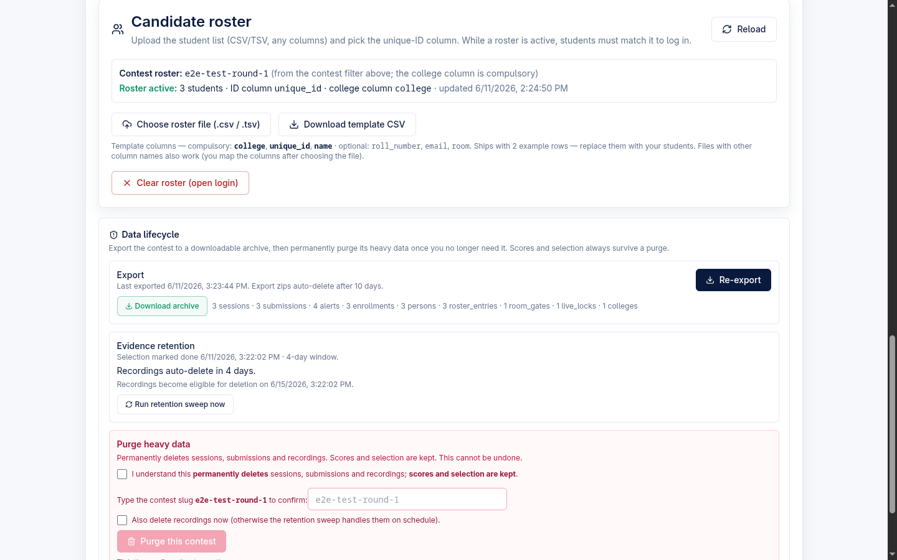

# Admin — Data Lifecycle (export, purge, retention)

This page documents the **Data lifecycle** controls an admin uses to take a finished contest off the platform safely: download a self-contained archive of its data, irreversibly purge the heavy session/submission/recording data behind a triple gate, and let recordings auto-expire on a retention clock. Scores and selection always survive a purge.

> **Product context.** Proctor is a standalone own-editor exam platform: candidates code in our React + Monaco editor with Judge0-backed Run/Submit, and each administered round is a *contest*. The data-lifecycle controls described here apply to these own-editor (person-mode) contests. A separate optional `monitoring/` contest-eval poller (which live-watches an externally-hosted HackerRank contest and emits cheating alerts into the same alerts pipeline) still exists as an independent component — it is not part of this lifecycle surface.

All three flows live in one collapsible **Data lifecycle** section at the bottom of a contest's detail page in the admin **Contests** tab.

---

## Where it lives

| Layer | File | Role |
| --- | --- | --- |
| UI section | `frontend/src/admin/ContestsPanel.tsx` (`DataLifecycleSection`) | Renders Export / Evidence retention / Purge sub-panels and the lifecycle phase line |
| UI pure logic | `frontend/src/admin/dataLifecycle.ts` | `purgeGateState`, `retentionStatus`, `lifecyclePhase` — mirrors the server, unit-tested |
| API client | `frontend/src/api.ts` | `exportContest`, `purgeContest`, `runRetentionSweep` |
| Backend routes | `backend/src/handler.mjs` | `adminContestExport`, `adminContestPurge`, `adminRetentionSweep` (dispatched at lines ~375–377) |
| Backend pure logic | `backend/src/dataLifecycle.mjs` | `buildExportBundle`, `evaluatePurgeGate`, `selectExpiredEvidence`, `selectExpiredExports`, `exportObjectPath` |
| Sweep auth | `backend/src/lib/auth.mjs` (`requireSweepAuth`) | x-api-key **or** admin-password gate |
| GCS lifecycle rules | `backend/gcs-lifecycle.json` | Prefix-scoped age-based deletion (applied by `backend/deploy-gcp.sh`) |

> **Decomposition note.** The backend was partially split into `lib/*.mjs` + `config.mjs` (sweep auth now lives in `lib/auth.mjs`), but that refactor is **paused/partial** — the dispatch table and the export/purge/sweep route bodies still live in `backend/src/handler.mjs`.

Backing routes (all `POST`, all admin-authenticated except as noted):

| Route | Handler | Auth |
| --- | --- | --- |
| `/api/admin/contest-export` | `adminContestExport` | admin (`x-admin-password`) |
| `/api/admin/contest-purge` | `adminContestPurge` | admin (`x-admin-password`) |
| `/api/admin/retention-sweep` | `adminRetentionSweep` | sweep key **or** admin (`requireSweepAuth`) |

---

## 1. Per-contest export

**What the admin sees.** In the **Export** sub-panel, the admin clicks **Export** (or **Re-export** if there is a prior export). The panel then shows *"Last exported &lt;timestamp&gt;"*, a **Download archive** link, and a one-line count summary (e.g. `3 sessions · 3 submissions · 4 alerts · 3 enrollments · 3 persons · …`). The note reads *"Export zips auto-delete after 10 days."*

**What it produces.** `adminContestExport` gathers every per-contest dataset (`gatherContestDatasets`) plus the Results rollup (the same `computeContestResults` the Results tab serves), and `buildExportBundle` assembles a self-describing bundle:

- A `manifest.json` (`schema_version: 1`, `exported_at`, the `contest`, and per-dataset `counts`).
- A `results.json` rollup.
- One file per dataset. **JSONL** (one raw doc per line) for: `sessions`, `submissions`, `alerts`, `submission_events`, `enrollments`, `persons`, `roster_entries`, `reviews`, `review_claims`, `room_gates`, `live_locks`. **Plain JSON** for: `colleges`.

The bundle is written to GCS at `exports/{slug}/{stamp}.zip` (`exportObjectPath`; the ISO stamp's `:`/`.` are stripped for a path-safe key). The handler currently serializes the bundle as one newline-delimited text body (each file as a `=== name ===` section) saved with content type `application/x-ndjson` — i.e. the `.zip`-named object is a self-describing text bundle, not a compressed zip.

The handler then stamps `last_export` (`{ at, gcs_key, counts }`) and `last_export_at` on the contest doc, writes a `contest_export` audit row, and returns a **v4 signed read URL** (expiry = `URL_EXPIRY_SECONDS`, default **900s / 15 min**). A signing failure is logged but does not lose the export — the object is already written.

> Heavy video/recordings are **not** in the archive — they are GCS-native evidence and are governed by the retention clock below.

**Response** (`ContestExportResponse`): `{ ok, gcs_key, signed_url, counts, exported_at }`.

---

## 2. Triple-gated purge

**What the admin sees.** The **Purge heavy data** sub-panel (rose-bordered) warns *"Permanently deletes sessions, submissions and recordings. Scores and selection are kept. This cannot be undone."* The dangerous **Purge this contest** button stays disabled until three gates pass, in order:

| # | Gate | UI control | Backing check |
| --- | --- | --- | --- |
| 1 | A prior successful **export** exists | If none, the panel shows *"Export the contest first — purge is disabled…"* | `contest.last_export_at` present |
| 2 | **Confirm** checkbox ticked | *"I understand this permanently deletes … scores and selection are kept."* | `confirm === true` (strict; no truthy coercion) |
| 3 | Typed **slug** echoes exactly | Free-text field; *"Type the contest slug `&lt;slug&gt;` to confirm"* | `typedSlug.trim() === contest.slug` (case-sensitive) |

There is also a fourth, optional checkbox: **"Also delete recordings now (otherwise the retention sweep handles them on schedule)"** — this maps to `include_evidence` and is **unchecked by default**. When left off, recordings are deleted later by the retention sweep so Recordings Review still works during the window.

The UI gate logic (`purgeGateState` in `dataLifecycle.ts`) **mirrors** the server but is *not* the authority — it only disables the button so the admin can never fire a request the server would reject. `nextStep` drives the inline hint (`export` → `confirm` → `slug` → `ready`).

**Server enforcement.** `adminContestPurge` calls `evaluatePurgeGate` (`dataLifecycle.mjs`), which re-checks all three gates server-side and returns a 400 with a specific code (`export_required`, `confirm_required`, or `slug_mismatch`) on the first failure. An already-tombstoned contest short-circuits to `{ ok: true, already_purged: true }` (idempotent re-purge, no 4xx).

**Data-safety floor (see §5).** Before deleting anything, the handler re-verifies the export object still **lives** in GCS.

**What purge deletes — and what survives.**

| Deleted (heavy Firestore + GCS) | Retained (purge-survivors) |
| --- | --- |
| `sessions`, `submissions`, `submission_events`, `reviews`, `review_claims`, `roster_entries`, `room_gates`, `live_locks`, roster-meta + review-roster docs; evidence/recordings in GCS (when `include_evidence`) | `enrollments` (with refreshed `final_snapshot`), `persons`, `colleges`, every other contest's data |

Before deleting, the handler refreshes each active enrollment's `final_snapshot` from the live Results rollup (via `stampSelectionDone`), so **Results and People scorecards still read from the frozen snapshot** after a purge (vision §2.9 purge-survivor). It then writes a **tombstone scaffold** (stamps `purged_at` / `db_purged_at` and records `evidence_prefixes`) *before* any destructive delete as a crash barrier — a mid-purge crash lands on a tombstoned contest that the idempotent re-purge finishes, and the recorded prefixes let the later sweep finish evidence cleanup. After deletion it finalizes the tombstone with `purge_counts` (and `evidence_purged_at` if evidence was deleted inline). `contest_purge_start` and `contest_purge_done` audit rows bracket the run.

**Response** (`ContestPurgeResponse`): `{ ok, contest, counts, evidence_deleted, evidence_retained, enrollments_retained }` (or `{ ok, already_purged: true, contest }`).

**Purged state in the UI.** A tombstoned contest replaces the whole section with a rose *"Data lifecycle — purged"* card: when it was purged, the deleted counts, and whether evidence was deleted or is still scheduled for the next sweep. It reiterates that *"scores and selection are retained — its Results and People scorecards still read from the frozen snapshot."*

---

## 3. Evidence retention clock + sweep

**Retention countdown (admin POV).** The **Evidence retention** sub-panel formats the recording-deletion story from `retentionStatus` (`dataLifecycle.ts`):

| State | Condition | Label |
| --- | --- | --- |
| Not started | no `selection_done_at` | *"Retention clock not started — recordings are kept until you Mark selection done."* |
| Counting down | mid-window | *"Recordings auto-delete in N days."* (ceil — never reads 0 while evidence lives) plus *"Recordings become eligible for deletion on &lt;date&gt;."* |
| Due | past window, not yet swept | *"Recordings are due for deletion — the next retention sweep will remove them."* |
| Deleted | `evidence_purged_at` set | *"Evidence deleted — recordings have been swept; scores and selection are retained."* |

The clock **starts at `selection_done_at`** and runs `evidence_retention_days`. New contests default to **4 days** (`RETENTION_DAYS_DEFAULT` in `backend/src/contests.mjs`, clamped to **1–30**); a missing/garbage value falls back to **4** at read time on both server (`DEFAULT_RETENTION_DAYS`, `dataLifecycle.mjs`) and UI so the countdown and the sweep agree.

**Manual sweep.** A **Run retention sweep now** button (`runRetentionSweep` → `/api/admin/retention-sweep`, authed by the admin password) runs the same daily job on demand; its tooltip says *"Runs the same daily Cloud Scheduler sweep on demand."*

**What the sweep does** (`adminRetentionSweep` in `handler.mjs`):

1. Reads all real contests (archived included), selects those due via `selectExpiredEvidence` — due means `selection_done_at` is set, `now` is **strictly** past `selection_done_at + retention_days`, and `evidence_purged_at` is unset (idempotent).
2. For each due contest (`sweepContestEvidence`), deletes its evidence GCS objects (from the tombstone `evidence_prefixes` if the DB was already purged, else from live sessions, plus the reconstructed `contests/{slug}/sessions/` prefix as belt-and-braces), then stamps `evidence_purged_at` **only if** a final listing of that prefix comes back empty (resume-safe — a scheduler retry finishes a timed-out run).
3. Deletes **export zips older than 10 days** under `exports/` (`selectExpiredExports`, `EXPORT_RETENTION_DAYS = 10`), and — critically — when it deletes the very zip a contest's `last_export` points at, it **clears that contest's `last_export` / `last_export_at`** so the purge gate can never later pass on a recovery anchor that no longer exists.
4. Writes a `retention_sweep` audit row (`contests_swept`, `exports_deleted`).

**Response** (`RetentionSweepResponse`): `{ ok, swept_at, evidence_purged: [...], exports_deleted }`.

### Sweep authentication & scheduling

`requireSweepAuth` (`lib/auth.mjs`) is **closed-by-default**: it accepts either the admin password (`x-admin-password`, the manual "run now" path) **or** the scheduler key (`x-api-key === RETENTION_SWEEP_API_KEY`). With neither configured, every key-only call is rejected.

| Env var | File | Default | Effect |
| --- | --- | --- | --- |
| `RETENTION_SWEEP_API_KEY` | `config.mjs` | unset | When unset, key-only sweep calls are rejected; the admin password still triggers a manual sweep |
| `URL_EXPIRY_SECONDS` | `config.mjs` | `900` | Signed export-download URL lifetime |

The daily run is intended to be driven by a **Cloud Scheduler** job that sends `RETENTION_SWEEP_API_KEY` as the `x-api-key` header (per `.env.deploy.example` and the F9 spec). **(unverified)** The actual `gcloud scheduler jobs create` command was **not found in `backend/deploy-gcp.sh`** — the deploy script applies the bucket lifecycle and sets env, but the scheduler-job creation is described in docs/spec as a deploy-notes one-liner rather than scripted here.

---

## 4. Evidence GCS lifecycle (backstop)

`backend/gcs-lifecycle.json` (applied by `deploy-gcp.sh` via `gcloud storage buckets update --lifecycle-file=`) has two prefix-scoped age-based delete rules:

| Prefixes | Delete at age | Owner / intent |
| --- | --- | --- |
| `contests/`, `sessions/` | **3 days** | Per-session evidence/recordings |
| `exports/` | **11 days** | Backstop only — the **retention-sweep owns the canonical 10-day** export deletion; the GCS rule fires one day later |

The split is load-bearing: exports are the recovery anchor for an irreversible purge, so a single blanket 3-day rule would delete export archives 7 days early (a Wave-7 review finding). The 11-day GCS rule is a backstop just past the sweep's 10-day window.

---

## 5. Purge re-verifies the export still lives in GCS

This is the **data-safety floor** that makes purge safe. The triple gate only proves a `last_export_at` *stamp* exists — but a stamp is not an artifact. The 10-day sweep (and the 11-day GCS backstop) can delete the export zip, so a stale stamp could outlive the only recovery archive.

So `adminContestPurge` calls `exportObjectExists(contest.last_export.gcs_key)` **before deleting anything**. `exportObjectExists` lists the exact object key as a prefix (`bucket().getFiles`) and requires a name-exact match. It **fails closed**:

- A blank/garbage key (no recorded path) → treated as missing.
- A GCS listing error → treated as missing (a transient error must never green-light deleting the only backup).

If the object is gone, the purge is refused with `400 export_missing`, and the admin must **re-export** to restore a real recovery anchor. (A stricter "≤24h fresh export" freshness window is noted in code as a separate, still-deferred strengthening — this existence check is the floor in the meantime.)

---

## 6. Lifecycle-phase badges

Each contest carries a derived **lifecycle phase badge** (`LifecycleBadge` in `ContestsPanel.tsx`, computed by `lifecyclePhase` in `dataLifecycle.ts`) on both the Contests table row and the detail header. The detail section also prints a *"Lifecycle phase: &lt;label&gt;"* line.

The stored status stays minimal (draft / open / archived); the richer phase is derived "most-progressed wins" and never multiplied into stored state:

| Phase | Derivation | Badge style |
| --- | --- | --- |
| **Purged** | `purged_at` or `db_purged_at` (tombstone — heavy data deleted, Results/People read via `final_snapshot`) | rose, archive icon |
| **Evidence purged** | `evidence_purged_at` | amber |
| **Selection done** | `selection_done_at` | emerald |
| **Draft** | `status === "draft"` | — |
| **Archived** | `status === "archived"` | — |
| **Scheduled / Live / Ended** | `status === "open"` resolved against `start_at` / `end_at` vs now | — |

In the screenshot of the Contests tab above, *"E2E Test Round 1"* shows an `open` + green **Selection done** badge, illustrating the derived phase alongside stored status. Legacy contests show a separate **legacy** badge instead.

---

## Defaults at a glance

| Setting | Default | Where |
| --- | --- | --- |
| `include_evidence` (delete recordings during purge) | **OFF** | UI checkbox / `purgeContest` body |
| Purge confirm checkbox | **OFF** | UI |
| New-contest `evidence_retention_days` | **4** (clamp 1–30) | `contests.mjs` |
| Export-zip retention (sweep) | **10 days** | `dataLifecycle.mjs` `EXPORT_RETENTION_DAYS` |
| GCS evidence delete (`contests/`,`sessions/`) | **3 days** | `gcs-lifecycle.json` |
| GCS export delete (`exports/`, backstop) | **11 days** | `gcs-lifecycle.json` |
| Signed export URL expiry | **900s (15 min)** | `URL_EXPIRY_SECONDS` |
| `RETENTION_SWEEP_API_KEY` | **unset** (closed-by-default) | env |

---

**Related:** [admin-contests-templates.md](./admin-contests-templates.md) · [admin-results-people.md](./admin-results-people.md) · [admin-roster-rooms-identity.md](./admin-roster-rooms-identity.md) · [admin-live-monitoring.md](./admin-live-monitoring.md) · [architecture-overview.md](./architecture-overview.md)
