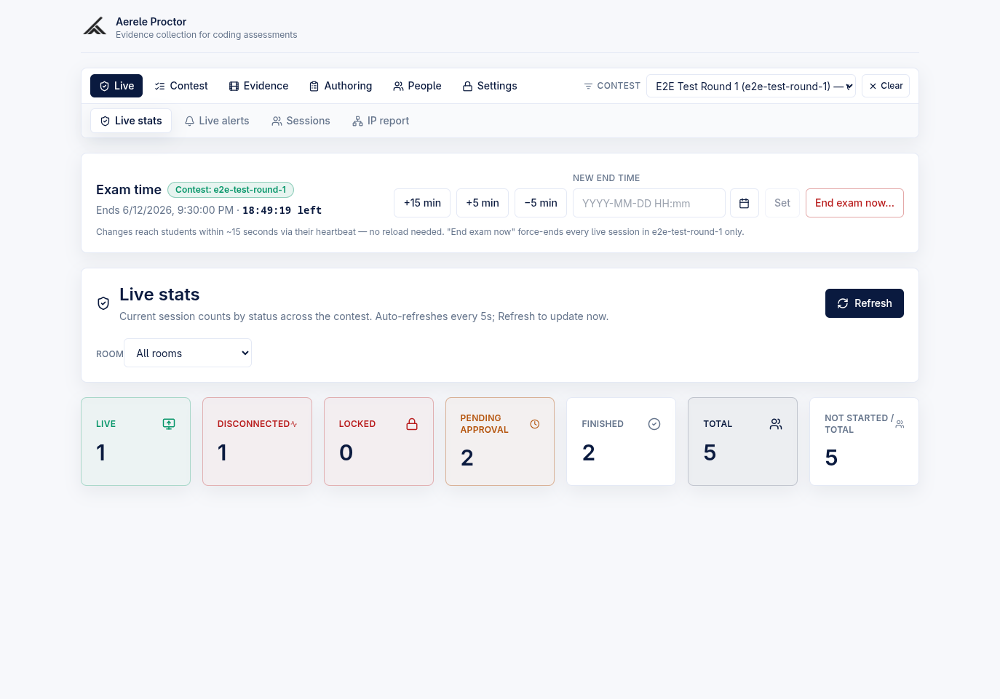
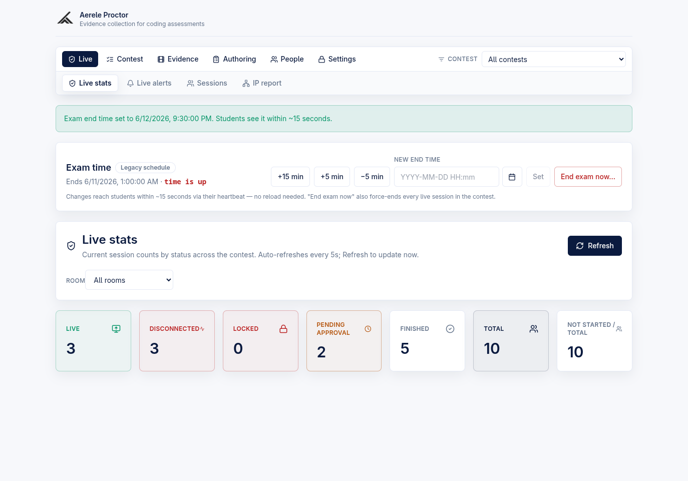
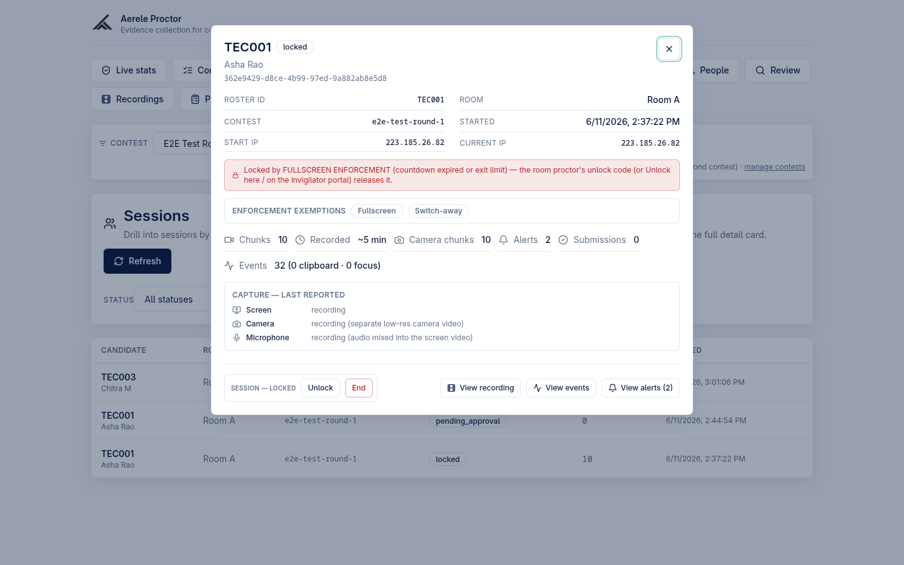
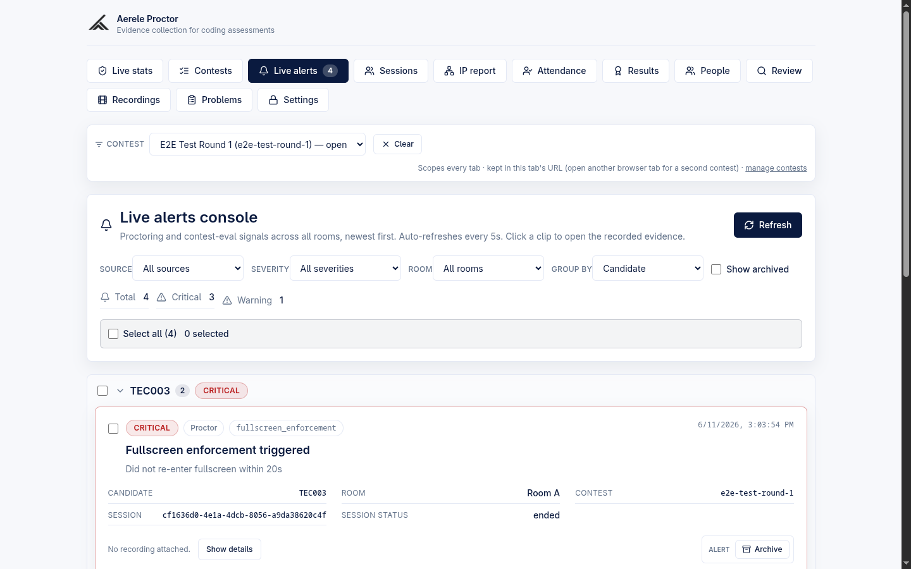
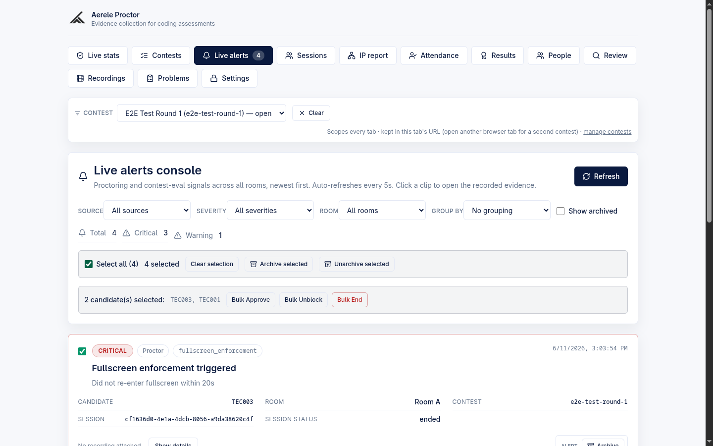
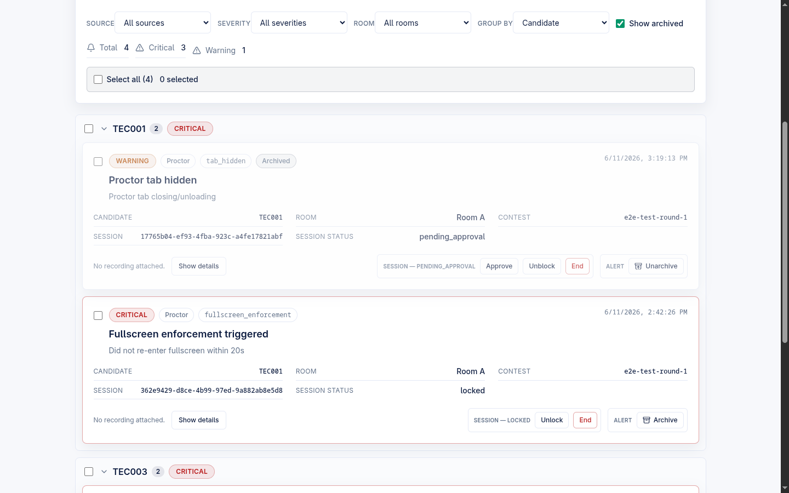
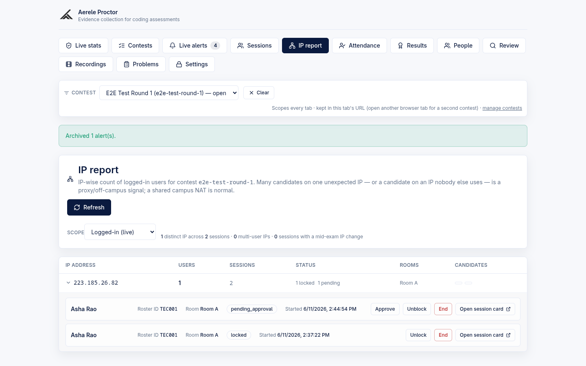
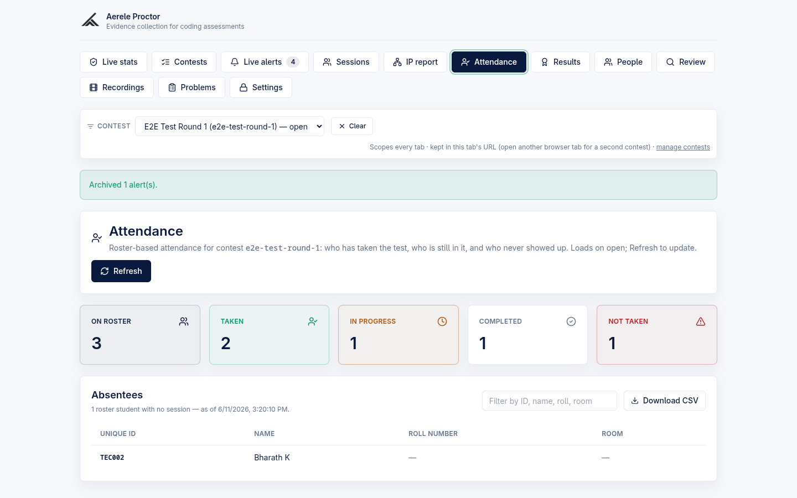

# Admin — Live Stats, Sessions, Alerts Console, IP Report, Attendance

The admin console's **live-monitoring surfaces** let an exam administrator watch a contest in real time: how many candidates are live/locked/pending, drill into any session, triage proctoring and contest-eval alerts, spot proxy/off-campus IP clusters, and reconcile attendance against the roster — all scoped to the globally-selected contest and (where supported) a single room.

> **Product context.** Proctor is a standalone own-editor exam platform: candidates work inside our React + Monaco editor with Judge0-backed Run/Submit, and HackerRank was dropped from the candidate path (F8.2). The monitoring surfaces below watch sessions created by that own-editor flow. Separately, an **optional contest-eval monitoring poller** (`monitoring/`, Python) live-watches an *externally-hosted* HackerRank contest and emits cheating signals into the **same** alerts pipeline; those show up in the Live alerts console with `source: contest-eval`. The poller is an optional add-on, not the primary product.

All surfaces in this page live in the admin frontend (`frontend/src/App.tsx`) and are gated by the admin password (`x-admin-password`, `requireAdmin` on every backing route in `backend/src/handler.mjs`). Backend internals were partially split into `lib/*.mjs`, `routes/invigilator.mjs`, and `config.mjs` (decomp B0/B1), but that refactor is paused/partial — the dispatch table and the handler bodies for every route below still live in `handler.mjs`.

---

## The admin nav — six sections + the contest scope (redesigned 2026-06-12)

The admin header is one card with at most two slim rows, replacing the old 13 flat tabs that wrapped onto two cluttered rows. The grouping is a pure, unit-tested model (`ADMIN_NAV_GROUPS` / `groupOfView()` in `frontend/src/admin/adminNav.ts`); the render lives in `AdminApp` (`App.tsx`).

- **Top row — six section tabs** (ops-first order): **Live** (Live stats / Live alerts / Sessions / IP report), **Contest** (Contests / Attendance / Results), **Evidence** (Review / Recordings), **Authoring** (Problems / Templates), **People**, **Settings**.
- **Contest scope picker, top-right of the same row** (`ContestScopePicker`): it scopes **every** admin screen, so it sits above them all. A single dropdown (`All contests` plus every contest), a **Clear** button, and an `(unknown slug)` literal option so a deep link to an old/purged slug is never silently dropped. The selection persists in this tab's URL `?contest=` param — two tabs run two parallel drives.
- **Second row — the active section's views**, hidden entirely for the single-view People and Settings sections.
- **Per-section last-view memory**: switching sections returns to the view you last used in that section, drill-downs included (`lastViewByGroup` + the view-change effect).
- **Alert badge**: the open-alert count badges the **Live** section tab (and the **Live alerts** view tab inside it).

---

## Live stats

**Admin POV.** The **Live stats** view (the **Live** section's default, and the console's landing view) shows current session counts by status across the selected contest, as clickable cards. It auto-refreshes every 5 seconds and has a manual **Refresh** button. (Both captures in this page's nav and exam-time sections above/below show the full Live stats screen on the current build.)

### Exam-time card — follows the contest scope

Above the status cards sits the **Exam time** card (`ExamTimeCard` in `App.tsx`): the current end time with a live remaining countdown (computed against the **server** clock — skew captured from the stats poll — so the admin display agrees with the students'), **+15 / +5 / −5 min** quick deltas, an absolute **new end time** field (typed-text datetime — see [admin-contests-templates.md](./admin-contests-templates.md)), and a deliberate two-click **End exam now**. Changes reach students within ~15 s via their heartbeat; "End exam now" also force-ends every live session in scope.

Which schedule the card shows **and writes** follows the global contest scope (fixed 2026-06-12 — before that it always read/wrote the legacy Settings schedule, whatever the scope), and an explicit chip names it so the wrong schedule can never be edited on exam day:

| Scope | Chip | Reads / writes |
| --- | --- | --- |
| A real contest selected | **Contest: {slug}** | that contest's window, via `POST /api/admin/contest-exam-time` — the same API as Contests → Detail |
| No scope (or the synthesized legacy row selected) | **Legacy schedule** | the legacy Settings schedule, via `POST /api/admin/exam-time` |
| A scoped slug not in the contests list (deep link / list still loading) | **Unknown contest: {slug} — controls disabled** | display only; every write is disabled |

Server side, a contest-scoped `GET /api/admin/stats` now returns **that contest's** `end_at` (`adminStats` in `handler.mjs`); an unknown slug carries no window and renders the "no schedule" line rather than the wrong clock.

### Status cards

Seven cards (`StatsDashboard` in `App.tsx`), each backed by a count from `GET /api/admin/stats` (`adminStats` in `handler.mjs`):

| Card | Source field | Meaning |
| --- | --- | --- |
| Live | `stats.live` | Sessions with `status === "active"` |
| Disconnected | `stats.disconnected` | Active sessions whose latest liveness signal has gone stale (derived — see [Near-live disconnection](#near-live-disconnection)) |
| Locked | `stats.locked` | Sessions with `status === "locked"` |
| Pending approval | `stats.pending_approval` | Sessions with `status === "pending_approval"` (second-device / conflict block) |
| Finished | `stats.finished` | Sessions with `status === "ended"` |
| Total | `stats.total` | Every session doc in scope |
| Not started / total | `stats.not_started_or_total` | Falls back to total — with no roster the backend cannot know who hasn't started, so it reports total session docs |

The "Disconnected" count is a *derived* signal: it counts sessions that are still `active` on the doc but whose newest liveness stamp is older than the staleness threshold. It is not a stored status.

### Room filter

A **Room** dropdown (`RoomFilter`) scopes the counts to a single room. The list of rooms comes back in the `rooms` array of the stats response, computed over the **full contest scope before** the room filter is applied (`distinctRooms` in `handler.mjs`), so the dropdown always lists every room even while one is selected. Selecting a room re-fetches with `?room=`. The room list is capped at `ROOMS_LIST_LIMIT` (200).

### 5-second auto-poll

While the admin is on **Live stats** or **Live alerts**, a `setInterval` at `ADMIN_POLL_INTERVAL_MS` (5000 ms) re-fetches in addition to the manual Refresh button (the auto-poll effect in `App.tsx`). The Sessions, IP report, and Attendance tabs are **not** auto-polled (each requires a manual Refresh) — confirmed by their own load-on-open-only effects.

### Clickable cards → Sessions drill-down

Each card (except "Not started / total") is a button (`StatCard` with `onClick`). Clicking it switches to the **Sessions** tab pre-filtered to that status: Live → `active`, Disconnected → `disconnected`, Locked → `locked`, Pending approval → `pending_approval`, Finished → `ended`, Total → all statuses.

---

## Sessions view + session detail card

**Admin POV.** The **Sessions** tab (`SessionsView` in `App.tsx`) is a lightweight, GCS-free table of session rows from `GET /api/admin/sessions-list` (`adminSessionsList` in `handler.mjs`). It lists **every** session doc — including zero-chunk pending sessions that the recordings picker would hide — classified server-side by the **same** rules as the stat cards so the row counts match the cards exactly. Rows are scoped to the global contest filter and a room, and a **Status** dropdown re-fetches server-side.

Columns: Candidate (+ name), Room, Contest, Status, Chunks, Started; plus an **Action** column (an Approve quick-action) only when filtered to `pending_approval`.

When the status filter is `disconnected`, a note explains it is a derived liveness state (the server classifies these as active sessions whose latest liveness signal has gone stale). If the `sessions-list` endpoint is not deployed, the view shows an "endpoint not deployed yet" warning and Live stats still works.

Clicking any row opens the **session detail card** (`SessionDetailCard`), backed by `GET /api/admin/session-detail` (`adminSessionDetail`).

### What the detail card shows

- **Identity & context** — candidate ID, name, session id, status badge; Roster ID, Room, Contest, Started, **Start IP** and **Current IP**. An IP-changed-mid-exam warning appears when `ip_change_count > 0`.
- **Locked-by-enforcement banner** — when `status === "locked"` and `locked_reason === "fullscreen_enforcement"`, a banner explains the candidate self-locked via the fullscreen ladder and points to the room's unlock code / the Unlock action.
- **Enforcement exemptions** — toggles for `fullscreen` and `switch_away` (shown when the detail is loaded and status is not ended). Toggling sends the `exempt` action with a one-key payload; the backend merges so the other toggle is untouched (`applySessionAction` "exempt" branch). Exemptions are **off by default** (a session carries no exemptions until toggled).
- **Stats row** — **Chunks** (30 s each), **Recorded** ≈ chunks × 30 s (`approxRecordingSeconds` / `formatApproxDuration` in `sessionDetail.ts`), **Camera chunks** (only shown when `camera_chunk_count > 0`), **Alerts** (joined from the already-fetched alerts list via `alertsForSession`, no extra backend read), **Submissions**, and **Events** (`event_count` with clipboard/focus breakdown).
- **Capture — last reported** — per-source state for Screen / Camera / Microphone (`captureSourceLabel` in `sessionDetail.ts`), shown only once a composite heartbeat reported it. The recorded `.webm` is the **screen stream with microphone audio mixed in**; the camera is **live-monitor only and NOT in the recorded video unless the session uploaded camera chunks** (`camera_chunk_count > 0`), in which case the camera row reads as a separate low-res recording.
- **Submissions list** — newest-last, capped at 8 with a "+N more" note (from `GET /api/admin/submission-events`).

### Status-valid actions + deep links

The card renders **only** the session actions valid for the current status (`validSessionActionsFor` in `admin/alertActions.ts`):

| Status | Valid actions |
| --- | --- |
| `active` / `disconnected` | Lock, End |
| `locked` | Unlock, End |
| `pending_approval` | Approve, Unblock (bypass), End |
| `ended` / unknown / missing | none (view-only) |

Deep links: **View recording** (disabled with a tooltip when there are no chunks, or in demo mode for un-seeded candidates — `viewRecordingAffordance`), **View events** (works even with zero chunks — `viewEventsAffordance`), and **View alerts** (opens Live alerts filtered to this candidate). The card's detail projection is least-privilege: no email, no storage keys, no signed URLs.

---

## Session actions: approve / lock / unlock / bypass / end

**Admin POV.** Session actions change a candidate's live state. They are issued from the session detail card, the alerts console rows, the alerts bulk bar, the Sessions Approve quick-action, and the IP-report drill-down. All route through `POST /api/admin/session-action` (`adminSessionAction` → `applySessionAction` in `handler.mjs`). The frontend validity table (`admin/alertActions.ts`) **mirrors the backend exactly**.

| Action | Wire name | UI label | Effect |
| --- | --- | --- | --- |
| Approve | `approve` | Approve | Activate a `pending_approval` session and **end** the conflicting session it waited behind (exactly one stays live). Re-points the live-slot lock. |
| Lock | `lock` | Lock | Freeze a live session; candidate is blocked until unlocked. (destructive) |
| Unlock | `unlock` | Unlock | Re-activate a locked session; also clears `locked_reason` and resets the server-side fullscreen exit ladder. |
| Unblock | `bypass` | **Unblock** | Clear a second-device/conflict block **without** ending the other session (clears `blocked_by_session_id`). |
| End | `end` | End | End any non-ended session permanently. (destructive) |

> Note: the wire action name `bypass` is surfaced in the UI as **"Unblock"** (`SESSION_ACTION_INFO` in `admin/alertActions.ts`).

The separate `exempt` action carries an exemptions payload and is surfaced only as the dedicated toggles on the session detail card and the invigilator portal — never as a plain action button.

### Single vs batch

- **Single** — the request carries `session_id`; the backend acts on exactly that doc.
- **Batch** — the request carries `usernames[]` (optionally `contest_slug`). For each username the backend resolves the candidate's **latest live (non-ended)** session and applies the action there, skipping candidates with no live session (`resolveActionTargets`). Ended sessions take no action.

Bulk buttons in the alerts console show the **union** of valid actions across the selected candidates' latest live sessions (`bulkSessionActionsFor`), and destructive bulk actions prompt a `window.confirm` (`BulkActionButtons`).

---

## Live alerts console

**Admin POV.** The **Live alerts** tab (`AlertsConsole` in `App.tsx`) shows proctoring and contest-eval signals across all rooms, **newest first**, auto-refreshing every 5 s (the same poll as Live stats). It is backed by `GET /api/admin/alerts` (`adminAlerts` in `handler.mjs`). Each row can carry a recorded evidence clip.

### Filters

| Filter | Options | Side | Notes |
| --- | --- | --- | --- |
| Source | All / Proctor / Contest-eval | server (`?source=`) | `contest-eval` rows come from the optional monitoring poller |
| Severity | All / Critical / Warning / Info | server (`?severity=`) | |
| Room | All rooms / each room | server (`?room=`) | room list comes from session docs (`listSessionRooms`) so it matches Live stats |
| Group by | No grouping / Candidate / Alert type | client | grouping only (`alertGrouping.ts`) |
| Show archived | checkbox, **default OFF** | server (`?include_archived=`) | archived alerts are hidden unless ticked |
| Contest | the scope picker top-right of the nav header | server | the per-console contest input was removed (A1) — one source of truth |

Backend caveat: at most **one** equality filter (`contest_slug`) is pushed to Firestore to stay index-free; severity, source, and room are filtered in memory over an `ALERTS_QUERY_LIMIT` (500) scan, ordered newest-first.

### Grouping (client-side)

The **Group by** control groups the visible list by **candidate** (normalized identity) or **alert type** (`groupAlerts` in `alertGrouping.ts`). Groups keep newest-first order, show a count badge and a worst-severity pill, and are collapsible. Grouping operates on the already-filtered list, so room/severity/candidate filters scope the groups too.

### Selection + bulk archive

Selection is a `Set` of alert ids that **survives the 5 s auto-refresh** (`alertSelection.ts`). The **Select all (N)** checkbox is a *select-over-filter*: it adds every currently-filtered id to the selection (`addAllToSelection`), keeping any off-screen ids that were selected under a different filter; un-checking removes only the currently-filtered ids (`removeFromSelection`). **Clear selection** is the explicit clear-everything action. Group headers have their own select-all-for-group checkbox (with an indeterminate state) feeding the same selection model.

**Archive selected** / **Unarchive selected** act on **all** selected ids (not just the visible ones) via `POST /api/admin/alert-action` (`adminAlertAction`), which toggles the `archived` flag with `merge:true` and reports back `updated` + any `missing` ids. Archived alerts are hidden from the default list and reachable via **Show archived**.

### Per-row session actions + video deep-link

Each row (`AlertRow`) joins the alert to the session its actions would target — the alert's own live `session_id`, else the candidate's latest live session (`sessionForAlert` in `admin/alertActions.ts`) — and renders only the status-valid session actions. **Approve** in a row also archives that alert (frontend orchestrates approve → archive via `onApproveArchive`). A separate **Archive / Unarchive** alert action always shows.

The status-join degrades safely (`alertJoinState`):

- **joined** — a usable sessions list is in hand → contextual action set.
- **fallback** — no list yet, endpoint 404, or a *truncated* sessions page mapped to null (`joinableSessions`) → the **full** action set renders, so incomplete data never costs admin capability (the backend resolves the real target per action).
- **unavailable** — the sessions-list fetch failed (non-404) with nothing kept → rows degrade to **archive-only** with a "session status unavailable" note, retried on the next refresh.

When a row carries `download_url` (a signed read URL the backend resolves for `video_key`), an **Open evidence clip** link opens the recorded evidence in a new tab; otherwise the row reads "No recording attached."

---

## IP report

**Admin POV.** The **IP report** tab (`IpReportView` in `App.tsx`) is the proxy/off-campus detection surface: one row per IP, **biggest clusters first**, backed by `GET /api/admin/ip-report` (`adminIpReport` → `buildIpReport` in `backend/src/ipReport.mjs`). The interpretation stays with the admin — the report never auto-flags.

### How clustering works

A session is grouped under its most-recent observed IP: `current_ip` (refreshed by every heartbeat), falling back to `start_ip`, then `"unknown"` for legacy docs (`reportIp`). Per IP the report counts distinct users (`username_norm`), per-status session counts, distinct rooms, and a bounded newest-first candidate sample. Rows are sorted users-desc → sessions-desc → ip-asc so the largest clusters lead.

- **Off-campus / proxy reading.** On campus, rooms collapse to a few NAT IPs each carrying many users. A solo IP nobody else uses (an off-campus candidate) or an unexpected cluster (many candidates through one box) stands out. Rows with **2+ distinct users** get a warning tint; a candidate whose IP changed mid-exam (`ip_change_count > 0`) gets a warning icon. None of this is a verdict — it is data.

A summary line reports distinct IPs, total sessions, **multi-user IPs** (`users >= 2`), and sessions with a mid-exam IP change. Caps: `IP_REPORT_IPS_LIMIT` (200 groups) and `IP_REPORT_CANDIDATES_LIMIT` (25 candidate rows per IP); over-cap is flagged via `ips_truncated` / `candidates_truncated`.

### Scope filter

A **Scope** dropdown: **Logged-in (live)** (default — non-ended sessions, the "logged-in users" reading) vs **All sessions** (adds ended sessions for after-the-exam forensics). A room filter and the global contest filter also apply.

### Clickable drill-down + per-user actions (F8.1)

Clicking an IP row expands it into the candidate sessions on that IP (`IpCandidateRow`). Each candidate shows name, roster ID, room, a status badge, the start time, an IP-changed badge if applicable, the **status-valid session actions** (same `validSessionActionsFor` table — Approve/Unlock/Lock/Unblock/End as appropriate), and an **Open session card** deep link that jumps to the Sessions tab with that candidate's detail card open. (The screenshot above shows a `pending_approval` row offering Approve / Unblock / End and a `locked` row offering Unlock / End.)

---

## Attendance

**Admin POV.** The **Attendance** tab (`AttendancePanel` in `App.tsx`) reconciles the roster against session docs, backed by `GET /api/admin/attendance` (`adminAttendance` in `handler.mjs`). It loads on tab-open and when the global contest filter changes, with a manual **Refresh** — **no auto-poll** (each call scans the whole roster + session set). Math is mirrored in `attendance/computeAttendance.ts` for the demo branch and tests.

### Counts

| Card | Field | Definition |
| --- | --- | --- |
| On roster | `roster_total` | Active-version roster entries |
| Taken | `taken.total` | Roster student has ≥1 matching session (any status) |
| In progress | `taken.in_progress` | At least one of their sessions is non-ended |
| Completed | `taken.completed` | All of their sessions are ended |
| Not taken | `not_taken` | Roster students with no matching session — the **absentees** |

A session matches a roster student when its `roster_unique_id`, normalized (trim + lowercase + strip all whitespace, so `21 CS 001 ≡ 21CS001`), equals an active-roster `unique_id_norm`. Sessions that can't be tied to the active roster (legacy pre-roster, blank id, replaced-roster ids) are surfaced as **unmatched_sessions** in a warning note — never silently dropped, never counted as attendance.

If no roster is configured, the response is `{ configured: false }` and the UI says to upload a roster in **Settings → Candidate roster** first. If the endpoint is not deployed, a "not deployed yet" warning shows.

### Absentees table + CSV

The **Absentees** table lists each absentee's Unique ID, Name, Roll number, Room (PII-minimized — those four mapped fields only, no email). A client-side filter narrows by ID/name/roll/room, and **Download CSV** exports `absentees.csv` (`buildAbsenteesCsv`, with spreadsheet formula-injection guarding on candidate-supplied fields). When everyone has a session it reads "Full house."

---

## Near-live disconnection

**How it works.** A candidate going away is detected near-live by two cooperating mechanisms — there is no live socket; the admin learns of it within one 5 s stats poll.

1. **Tab-close beacon (candidate POV).** The exam shell registers `visibilitychange` and `pagehide` listeners (in `StudentApp`, `App.tsx`) that fire `navigator.sendBeacon` to `POST /api/session/beacon` (`recordBeacon` in `handler.mjs`). `visibilitychange → hidden` sends `kind:'hidden'`, `pagehide` sends `kind:'closing'`, and returning to the foreground sends `kind:'visible'`. The beacon survives unload and is gated only by the session token (no admin auth — `sendBeacon` allows no custom headers). Each beacon stamps `last_seen_at`; the away signals (`hidden`/`closing`) also raise a `tab_hidden` warning alert **if the `tab_hidden` alert type is enabled** in settings (per-day dedupe so a flurry collapses to one alert per session per day).

2. **Heartbeat staleness (server-derived).** The exam shell heartbeats roughly every `heartbeat_interval_seconds` (15 s — `recordHeartbeat`). An active session is classified **disconnected** when its newest liveness stamp — `last_heartbeat_at` or `last_seen_at` (the beacon), whichever is newer — is older than `DISCONNECTED_STALENESS_MS`. Only when neither liveness stamp exists does it fall back to `created_at`, so a session that started but never heart-beat still ages into disconnected instead of looking permanently fresh (`isStaleSession` in `handler.mjs`).

The "Disconnected" stat card and the Sessions `disconnected` filter both read this derived state; it is never a stored doc status. The threshold and interval defaults:

| Constant | Default | Env override | Where |
| --- | --- | --- | --- |
| `DISCONNECTED_STALENESS_MS` | 45000 (45 s) | `DISCONNECTED_STALENESS_MS` | `config.mjs` |
| heartbeat interval | 15 s | *(not env — server-set in the start/heartbeat response)* | `handler.mjs` |
| `ADMIN_POLL_INTERVAL_MS` | 5000 (5 s) | *(frontend constant, not env)* | `App.tsx` |

---

## Limits & defaults reference

| Constant | Default | Meaning |
| --- | --- | --- |
| `ALERTS_QUERY_LIMIT` | 500 | Max alert docs scanned/returned per console fetch |
| `SESSIONS_QUERY_LIMIT` | 2000 | Max session docs scanned for stats/sessions/ip/attendance |
| `SESSIONS_LIST_PAGE_LIMIT` | 500 | Max rows in a sessions-list page (live rows kept first) |
| `ROOMS_LIST_LIMIT` | 200 | Max distinct room labels in a dropdown |
| `IP_REPORT_IPS_LIMIT` | 200 | Max IP groups per IP report |
| `IP_REPORT_CANDIDATES_LIMIT` | 25 | Max candidate rows per IP group |
| `DISCONNECTED_STALENESS_MS` | 45000 | Disconnected-staleness threshold (env-overridable) |
| `ADMIN_POLL_INTERVAL_MS` | 5000 | Live stats / Live alerts auto-poll cadence |
| Chunk length | 30 s | Each recorded `.webm` chunk; drives the "Recorded ≈" estimate |
| Show archived | **OFF** | Archived alerts hidden by default |
| Enforcement exemptions | **OFF** | Sessions carry no exemptions until toggled |

`SESSIONS_QUERY_LIMIT`, `SESSIONS_LIST_PAGE_LIMIT`, `ALERTS_QUERY_LIMIT`, `ROOMS_LIST_LIMIT` are module constants in `handler.mjs`; the IP-report caps are exported from `backend/src/ipReport.mjs`; `DISCONNECTED_STALENESS_MS` comes from `config.mjs` (env-overridable).

---

## Related

- [Candidate flow](./candidate-flow.md)
- [Candidate enforcement ladder](./candidate-enforcement-ladder.md)
- [Admin — Contests & Templates](./admin-contests-templates.md)
- [Admin — Problems, stubs & autocomplete](./admin-problems-stubs-autocomplete.md)
- [Admin — Roster, rooms & identity](./admin-roster-rooms-identity.md)
- [Architecture overview](./architecture-overview.md)
