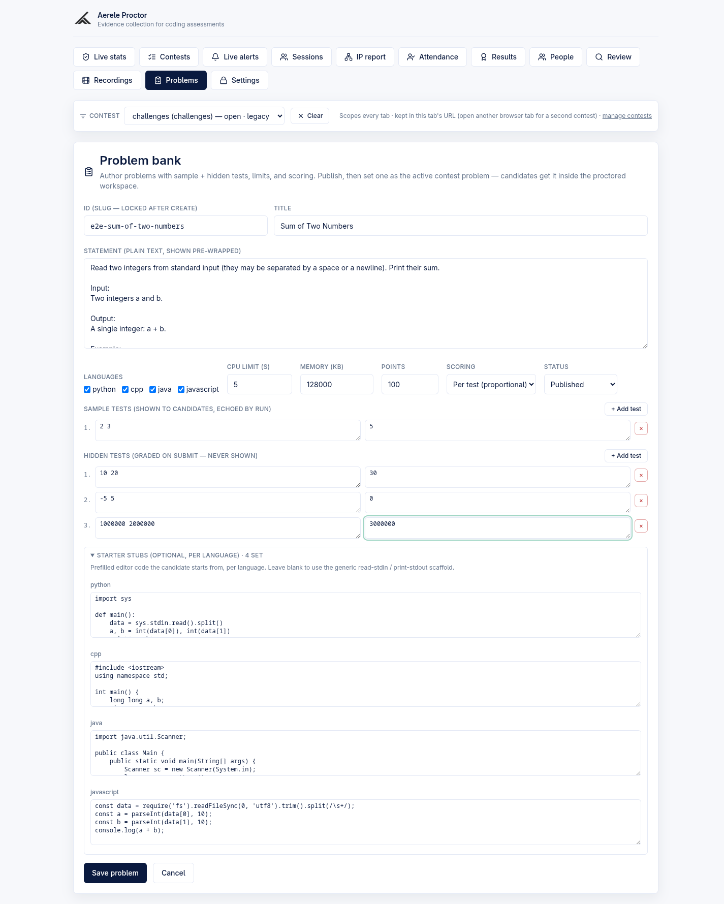
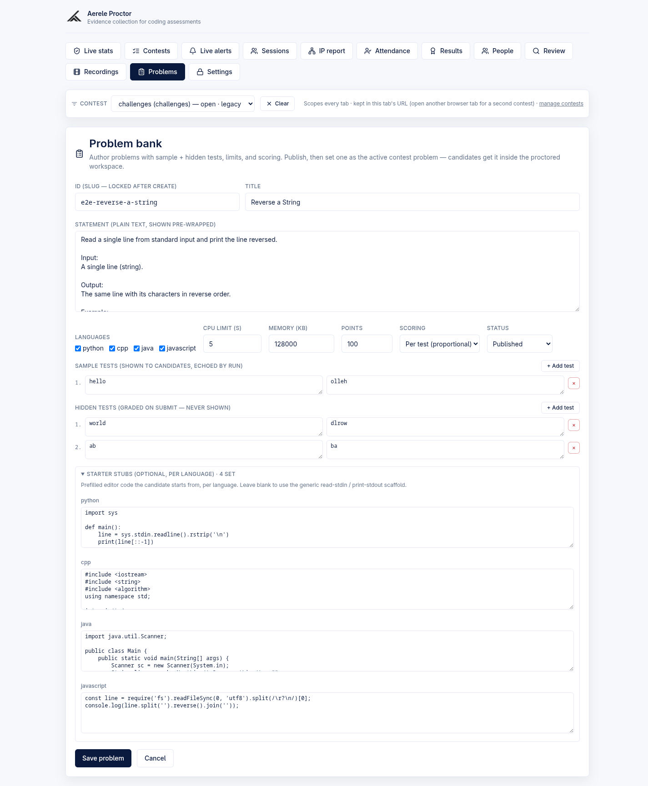
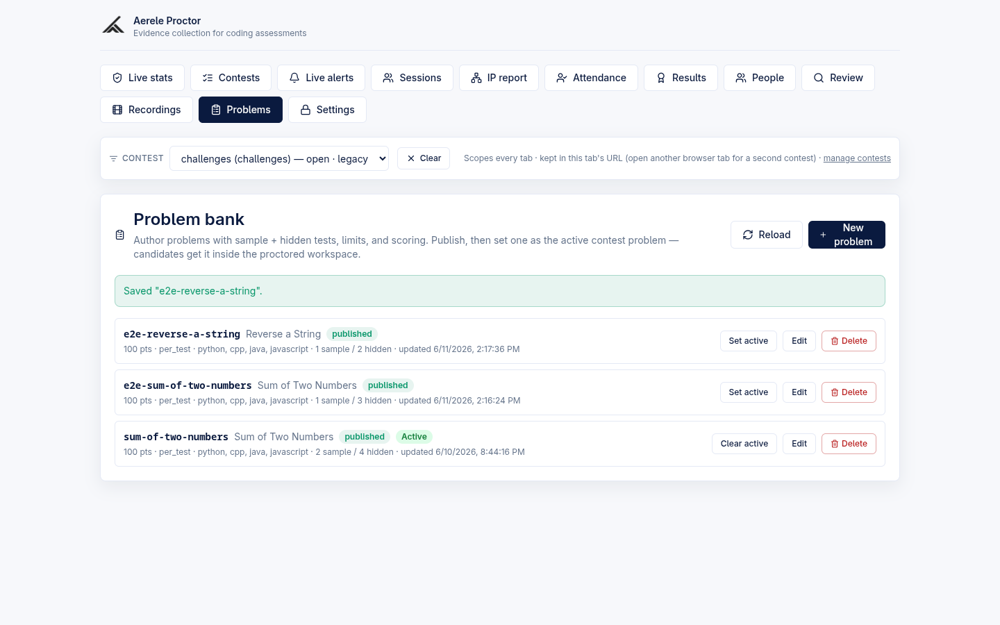

# Admin — Problem Bank, hidden tests, per-language stubs, editor autocomplete

The Problem Bank is where an admin authors the coding problems candidates solve inside the Aerele proctor platform's own React + Monaco workspace — statement, sample/hidden tests, time/memory limits, points, and scoring — then publishes one or more and assigns them to a contest. This page documents authoring, the per-language starter stubs candidates begin from, the curated editor autocomplete, and the guards that protect a contest that is already running.

> Product context: Aerele proctor is a **standalone, own-editor exam platform**. Candidates write and run code in our Monaco editor with Judge0-backed Run/Submit; the legacy HackerRank candidate path was dropped (F8.2). A separate, **optional** contest-eval monitoring poller (`monitoring/`, Python) still exists to live-watch an externally-hosted HackerRank contest and emit cheating alerts into the same alerts pipeline — that component is documented elsewhere and is not part of the Problem Bank flow described here.

---

## Where it lives

| Concern | File / route |
| --- | --- |
| Admin UI section | `frontend/src/admin/ProblemBank.tsx` (`ProblemBankSection`) |
| Draft form-state + client validation | `frontend/src/problems/problemDraft.ts` |
| Live-save confirm logic (client) | `frontend/src/admin/saveGuard.ts` |
| API client calls | `frontend/src/api.ts` (`fetchProblems`, `fetchProblemDetail`, `saveProblem`, `deleteProblem`) |
| Backend bank + validation | `backend/src/problems.mjs` (`validateProblemInput`, `cleanStubs`, `getProblem`, `getBankProblem`, `scoreSubmission`) |
| Backend routes + guard | `backend/src/handler.mjs` (`adminListProblems`, `adminGetProblem`, `adminSaveProblem`, `adminDeleteProblem`, `contestProblemsPublic`, `publicStubsFor`) |
| Candidate stub fallback + autocomplete | `frontend/src/coding/CodingWorkspace.tsx` (`STARTERS`, `starterFor`), `frontend/src/coding/completionProviders.ts`, `frontend/src/coding/MonacoEditor.tsx` |

Backend routes (registered in `handler.mjs`, all require the admin password header `x-admin-password`):

| Method | Path | Handler |
| --- | --- | --- |
| GET | `/api/admin/problems` | `adminListProblems` — bank list (summaries) |
| GET | `/api/admin/problem?id=…` | `adminGetProblem` — full doc incl. hidden tests + references |
| POST | `/api/admin/problems` | `adminSaveProblem` — create/update |
| POST | `/api/admin/problem-delete` | `adminDeleteProblem` |

---

## Problem authoring

In the admin console, open the **Problems** tab. The section lists existing problems and offers **New problem** / **Reload**.

Each list row shows the slug, title, a status pill (`draft` or `published`), an **Active** pill when it is the assigned contest problem, and a metadata line: `{points} pts · {scoring} · {languages} · {sample_count} sample / {hidden_count} hidden`, plus the last-updated time. Row actions are **Set active** / **Clear active** (published only), **Edit**, and **Delete**.

Clicking **New problem** opens the authoring form.

### Fields

| Field | Notes | Validation (client mirrors backend) |
| --- | --- | --- |
| **ID (slug)** | Lowercase URL-safe slug. **Locked after create** (the input is disabled when editing an existing problem). | `^[a-z0-9][a-z0-9-]{0,63}$` — 1–64 lowercase letters/digits/hyphens |
| **Title** | Free text. | Required, max 200 chars |
| **Statement** | Plain text, shown pre-wrapped (`whitespace-pre-wrap`) to candidates. | Required, max 20000 chars |
| **Languages** | Checkboxes for `python`, `cpp`, `java`, `javascript`. | At least one required |
| **CPU limit (s)** | Per-test Judge0 CPU limit. | 0.5–15 seconds |
| **Memory (KB)** | Per-test Judge0 memory limit. | Integer 16000–512000 KB |
| **Points** | Problem weight. | Integer 0–1000 |
| **Scoring** | `Per test (proportional)` or `All or nothing`. | One of `per_test`, `all_or_nothing` |
| **Status** | `Draft (hidden from candidates)` or `Published`. | One of `draft`, `published` |
| **Sample tests** | stdin / expected-stdout pairs, **shown to candidates and echoed by Run**. | 1–10 tests; each input/expected ≤ 10000 chars |
| **Hidden tests** | stdin / expected-stdout pairs, **graded on Submit, never shown**. | 1–50 tests; each input/expected ≤ 10000 chars |
| **Starter stubs** | Optional per-language prefilled editor code (collapsed `
`). See [Per-language starter stubs](#per-language-starter-stubs-f122). | Each stub ≤ 20000 chars; only supported-language keys |

### Defaults

A new draft (`emptyProblemDraft()` in `problemDraft.ts`) opens with:

| Field | Default |
| --- | --- |
| Languages | all four selected (`python`, `cpp`, `java`, `javascript`) |
| CPU limit | `5` seconds |
| Memory | `128000` KB |
| Points | `100` |
| Scoring | `per_test` |
| Status | `draft` |
| Sample / Hidden tests | one empty row each |

Backend defaults in `validateProblemInput` align with these: when omitted, `points` → 100, `scoring` → `per_test`, `status` → `draft`.

### Scoring semantics

Submit-time scoring is computed by `scoreSubmission(problem, passedCount, total)` in `problems.mjs`:

- **`per_test`** (default) → `floor(points * passed / total)` — partial credit proportional to hidden tests passed.
- **`all_or_nothing`** → full `points` only if every hidden test passed, otherwise `0`.

### Draft → Published lifecycle

- **Draft** problems are hidden from candidates. The candidate/exec read path `getProblem(id)` returns a doc only when `status === "published"`; a draft doc returns `null` and also **shadows** any same-id built-in seed.
- The admin/guard read path `getBankProblem(id)` returns the doc at any status (used by templates and the reference guard), and is never candidate-facing.
- A built-in seed problem `sum-two` exists as a zero-config fallback (`SEED_PROBLEMS` in `problems.mjs`); a Firestore doc with the same id fully shadows it.

Filled-out examples from an end-to-end run:

After saving and publishing, the list shows the published status pill:

---

## Per-language starter stubs (F12.2)

Stubs are optional, per-language prefilled editor code the candidate starts from. In the authoring form they live in a collapsed **Starter stubs (optional, per language)** `
` block; the summary shows a count (`· N set`) when any are filled. Only the languages selected for the problem render a stub textarea.

How they flow end to end:

1. **Authoring** — blank stub textareas are dropped on serialize (`stubsToDoc` / `draftToDoc`), so a stub-less problem is stored byte-identical to today (no `stubs` field). The backend mirrors this in `cleanStubs`: an empty/absent map is treated as absent and omitted from storage.
2. **Backend validation** — `cleanStubs` allow-lists keys to supported languages, requires string values, and bounds each at 20000 chars (`STATEMENT_MAX`). A bad shape is a hard 400, never a silent drop.
3. **Candidate session payload** — when a contest's problems are projected for candidates (`contestProblemsPublic` → `publicStubsFor` in `handler.mjs`), the live bank doc's stubs ride the per-problem payload (omitted when none). Because the bank doc is read at serve time via `getProblem`, an edited stub reaches new candidate loads without re-instantiating the contest.
4. **Candidate editor initial code** — `starterFor(problem, language)` in `CodingWorkspace.tsx` is the single source of truth: an author-supplied stub for that language wins; otherwise the generic read-stdin/print-stdout scaffold (`STARTERS`) is used. The same resolver drives the "is the code still the untouched starter?" check on language switch (`nextCodeOnLanguageSwitch`), so switching languages only replaces code that was never touched.

> Note (corrects a common assumption): stubs are **not** snapshot-copied into templates. Proctor templates store only `{problem_id, points, order}` references (`backend/src/templates.mjs`); stubs live on the bank problem doc and are resolved live at serve time. Documenting them as "carried in the template snapshot" would be inaccurate.

---

## Hidden-test edits against a running contest

Editing a problem that candidates may be sitting **right now** is a foot-gun: it changes the statement/tests/limits mid-exam. Two layers guard this — one client warning and one server enforcement. (They are intentionally distinct mechanisms and, in the current code, are **not** wired to each other — see the verification note below.)

### Client warn-on-save (`saveGuard.ts`)

When the admin clicks **Save problem**, `ProblemBank.tsx` calls `shouldConfirmLiveSave(draft.id, contests)`. If any **open** contest references the problem, a `window.confirm()` dialog appears with `liveSaveConfirmMessage`:

> `This change affects N running/active contest(s) (slug, …). Candidates sitting it/them right now will see the edited problem. Continue?`

"Live" means `contest.status === "open"`. Draft and archived contests never trigger the prompt, and a brand-new draft (blank id) is always safe. This client check fires on **any** save to a problem an open contest references — it is not limited to hidden-test changes.

### Server enforcement (`adminSaveProblem`)

The backend independently re-checks references (`findProblemReferences`) and enforces, in `handler.mjs`:

| Condition | Result |
| --- | --- |
| Unpublishing (published → draft) while a **contest** references it | `409 problem_referenced` (template-only references allow it; instantiation re-validates) |
| **Hidden tests changed** while an **open** contest references it, and `body.confirm_live_edit !== problem.id` | `409 live_edit_confirmation_required` (with the open-contest slugs) |
| Delete while any contest/template references it | `409 problem_referenced` |

The server's typed-confirm key is `body.confirm_live_edit`, which must equal the problem id to override. Guard error bodies carry structured `contests` / `templates` slug lists merged into the standard JSON error shape (`handler.mjs` error handler).

> (unverified / discrepancy worth flagging) The current `saveProblem` API client (`frontend/src/api.ts`) sends the problem doc only and does **not** include `confirm_live_edit`. So a hidden-test edit against an open contest would still receive `409 live_edit_confirmation_required` from the backend after the user accepts the client `window.confirm()` dialog. The two guards exist but are not connected end-to-end in this repo; treat "typed confirm flows through on accept" as unverified.

---

## Problem assignment to a contest

A published problem becomes a candidate-visible problem two ways:

- **Per-row Set active** (legacy single-problem path): `setActive(id)` in `ProblemBank.tsx` patches the proctor settings doc's `problem_id`. It first requires the proctoring schedule (`start_at` / `end_at`) to be configured, otherwise it surfaces: "Configure the proctoring schedule (Settings tab) before assigning a problem." Backend `POST /api/admin/exam-config` (settings save) rejects a `problem_id` that is not currently servable (`getProblem` must return it) with "problem_id must reference a published problem". **Clear active** sets it back to empty (candidates fall back to the contest link). Only one problem can be active this way.
- **Multi-problem contests** (the primary path): problems are attached as ordered entries on a contest (Contests tab), each with an optional per-entry points override. See the [Contests & Templates](./admin-contests-templates.md) doc.

### Live-reference guard (recap)

Because problem content is read live at serve time, the bank protects referenced problems: you cannot delete a problem a contest or template references, and you cannot unpublish one a contest references — both return `409 problem_referenced`. `adminGetProblem` additionally returns a `references` object (`contests` / `templates` slugs) so the editor can pre-warn before destructive edits. The synthesized legacy settings-doc assignment keeps its older silent-clear behavior on delete (the assignment is cleared) rather than throwing.

---

## Curated Monaco autocomplete (F12.3)

Inside the candidate editor, typing surfaces a hand-picked list of common competitive/stdlib symbols per language — **plus Monaco's built-in word suggestions**, which stay on alongside it.

The screenshot shows the Python set in action — typing `in` surfaces `inf` (with detail `math.inf — positive inf…`), `input`, `insort`, `int`.

### How it is wired

- `completionProviders.ts` holds static curated tables (`getCompletions(language)` is a pure, testable function) and `registerCuratedCompletions(monaco)` registers a Monaco completion-item provider per language.
- `MonacoEditor.tsx` calls `registerCuratedCompletions(monaco)` on mount. Registration is **idempotent** (a `WeakMap` keyed by the monaco instance prevents duplicate providers across pane re-mounts).
- This is v1 by design: **no language server, no pyright/clangd/LSP, no web-workers** — just a static curated list. The intent is to test problem-solving, not memory.

### Curated symbol sets

| Language | Curated coverage |
| --- | --- |
| **Python** | builtins (`input`, `print`, `sorted`, `enumerate`, `range`, `map`, `zip`, …); `math` (`sqrt`, `gcd`, `lcm`, `factorial`, `ceil`, `floor`, `inf`, …); `collections` (`deque`, `Counter`, `defaultdict`, `OrderedDict`); `itertools` (`permutations`, `combinations`, `product`, `accumulate`, `chain`); `heapq` (`heappush`, `heappop`, `heapify`, `nlargest`, `nsmallest`); `bisect` (`bisect_left`, `bisect_right`, `insort`); `sys` (`stdin`, `setrecursionlimit`); `string` (`ascii_lowercase`, `ascii_uppercase`, `digits`) |
| **C++** | STL containers (`vector`, `map`, `unordered_map`, `set`, `pair`, `queue`, `stack`, `priority_queue`, `string`, …); `<algorithm>` (`sort`, `lower_bound`, `upper_bound`, `max_element`, `accumulate`, `__gcd`, `max`, `min`, …); member ops (`push_back`, `begin`, `end`, `size`, `find`, `top`, `front`, …); IO (`cin`, `cout`, `endl`, `getline`) |
| **Java** | `java.util` (`Scanner`, `ArrayList`, `HashMap`, `HashSet`, `TreeMap`, `PriorityQueue`, `ArrayDeque`, `Collections`, `Arrays`, …); `StringBuilder`, `Integer`, `Long`, `Math`; IO (`System.out.println`, `BufferedReader`, `InputStreamReader`); common methods (`add`, `get`, `put`, `containsKey`, `poll`, `offer`, `nextInt`, `nextLine`, `hasNext`, …) |
| **JavaScript** | `Array` methods (`push`, `pop`, `map`, `filter`, `reduce`, `sort`, `slice`, `splice`, `includes`, `find`, `flat`, …); `Math` (`max`, `min`, `floor`, `ceil`, `round`, `abs`, `sqrt`, `pow`); string methods (`split`, `charCodeAt`, `padStart`, `repeat`, `trim`, `toUpperCase`, …); globals (`console.log`, `parseInt`, `parseFloat`, `Number`, `String`, `Array.from`) |

Each suggestion carries a one-line `detail` (e.g. `math.gcd(a, b)`) and inserts the bare symbol name (`insertText`); unknown languages return an empty list so the editor never crashes on a surprise value.

---

## Related

- [admin-contests-templates.md](./admin-contests-templates.md) — Contests + Templates: assigning problems, ordered entries, per-entry points
- [candidate-flow.md](./candidate-flow.md) — candidate onboarding through the multi-problem Monaco workspace, Run/Submit
- [candidate-enforcement-ladder.md](./candidate-enforcement-ladder.md) — fullscreen-enforcement ladder
- [architecture-overview.md](./architecture-overview.md) — platform components and decomposition status
