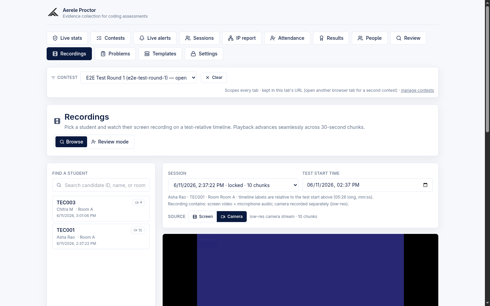
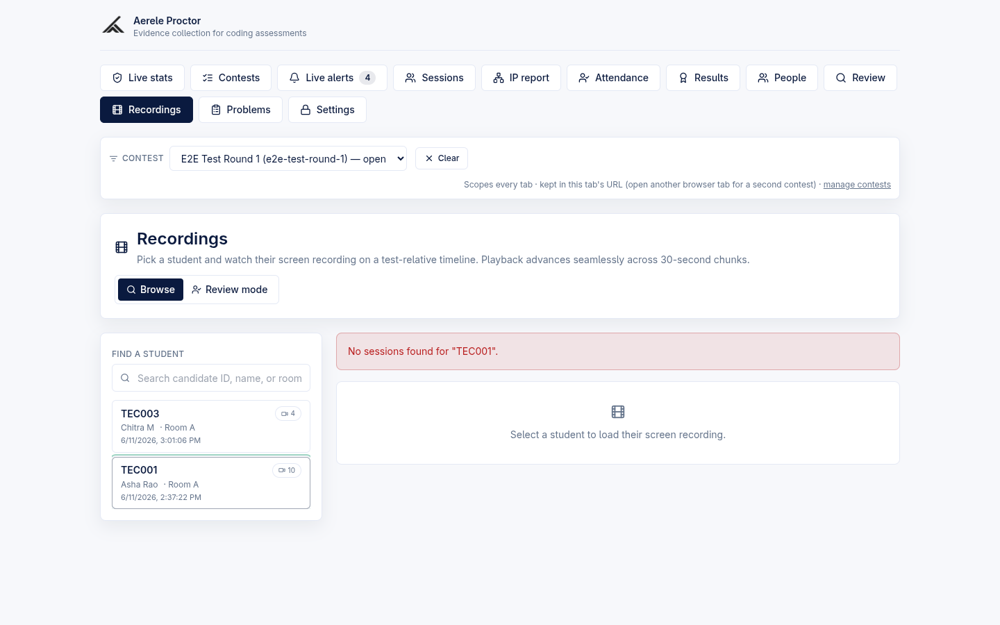
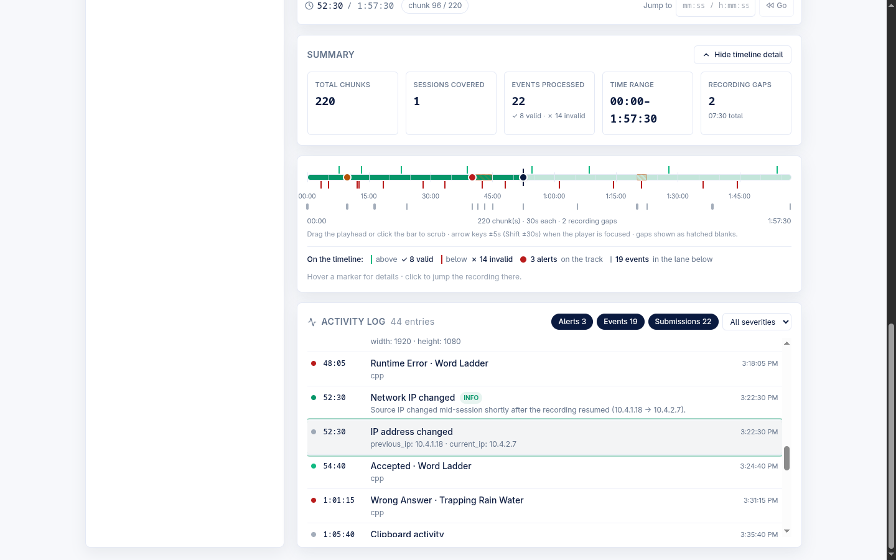
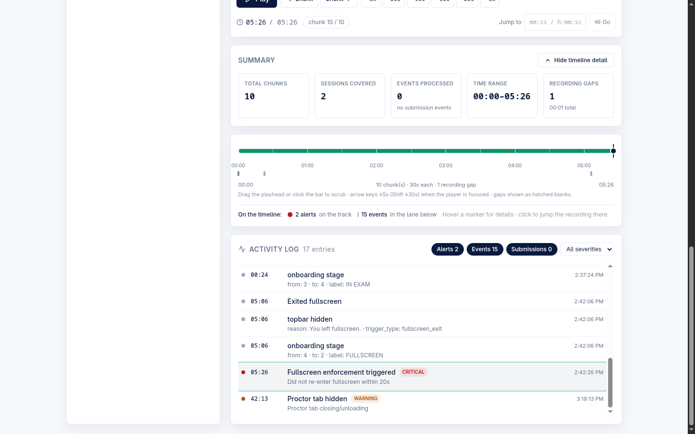
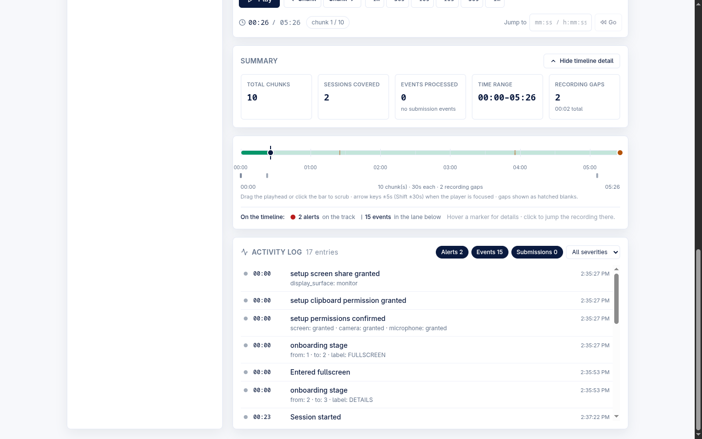
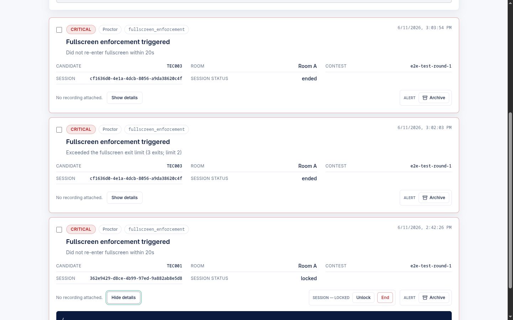

# Admin — Recording Review (screen + camera playback, events/alerts timeline)

The **Recordings** tab of the admin console lets a proctor pick a candidate, watch their captured screen (and, where present, camera) recording on a **test-relative timeline**, and read a merged **activity log** of proctor events, alerts, and submission times — with click-to-jump seeking from any log row or timeline marker. It is the post-exam review surface for the evidence the candidate's session uploaded during the exam.

> **Product context.** Aerele Proctor is now a standalone own-editor exam platform: candidates code in our React + Monaco workspace with Judge0-backed Run/Submit. The recording-review surface plays back the screen/camera chunks those candidate sessions uploaded. An optional separate **contest-eval monitoring poller** (`monitoring/`) can still watch an externally-hosted HackerRank contest and POST submission events into the same pipeline — those become the **submission-time markers** described below — but it is not required for recording review to work.

Primary code: `frontend/src/RecordingReview.tsx` (the whole surface), with the pure, vitest-covered helpers `frontend/src/recordingPlaylist.ts` (chunk parsing + playlist) and `frontend/src/recordingTimeline.ts` (merged activity log, clustering, filters). The FIX-B1 person-mode lookup is **inline** in `RecordingReview.tsx` (`loadUser` / `refreshUrls`), not a separate module.

---

## Where it lives

The **Recordings** tab is one of the admin console's surfaces (alongside Live stats, Contests, Live alerts, Sessions, IP report, Attendance, Results, People, Review, Problems, Templates, Settings). The page header offers two modes — **Browse** (free student search) and **Review mode** (one-by-one verdict workflow) — toggled top-right.

The global **Contest** selector at the top scopes the picker (and every other tab) to one contest; **Clear** widens it back to all contests. The selector slug is threaded through every recording lookup so a person who recurs across rounds is never interleaved (`RecordingReview.tsx` `contestSlug` prop → `adminRecordingSessions` / `adminSessions` `contestScopeOf`).

---

## Recordings picker and deep-links

### Browse-mode picker (left column)

The left **Find a student** panel lists sessions that actually recorded chunks. Search is case-insensitive over candidate ID, name, and room. Each row shows the candidate ID, name, room, created-at, and a screen-chunk count badge. Clicking a row loads that candidate's sessions into the player.

- Backing route: `GET /api/admin/recording-sessions` (handler `adminRecordingSessions`, `handler.mjs:2949`). It returns a lightweight list — **no GCS listing, no signed URLs** — preferring docs with `chunk_count > 0`, sorted newest-first, capped at 500. If no doc reports a positive `chunk_count` (legacy data), it falls back to listing all sessions so the picker is never empty.
- Frontend fetch: `fetchRecordingSessions` (`api.ts`). A 404 (endpoint not deployed) degrades to a manual **Candidate ID** entry box instead of the search list — `endpointAvailable` flips false.

### Sessions "View recording" deep-link

The admin **Sessions** detail card has **View recording** / **View events** buttons that jump straight here with the candidate (and exact session) preloaded — a one-shot state deep-link (`deepLink` prop, consumed via `onDeepLinkConsumed`). "View recording" is disabled when the session has zero recorded chunks; "View events" stays enabled because the activity log is chunk-independent (`frontend/src/admin/sessionDetail.ts` `viewRecordingAffordance` / `viewEventsAffordance`).

### FIX-B1: person-mode resolution by stored `username_norm`

Picker rows and the Sessions deep-link both carry the session's **exact stored** `username_norm`, and the player resolves by it — **not** by re-normalizing the display candidate ID.

This matters because of the identity model: a person-mode session stores `username_norm = person_id = "{college_norm}~{uid_norm}"`, which the candidate ID can never re-normalize back to. Before FIX-B1, the player keyed on `normalize(candidate_id)`, so person-mode sessions resolved to nothing — screen+camera playback, the event/alert timeline, and the review queue all showed empty, and every alert read "No recording attached".

- Loading a candidate calls `loadUser(displayLabel, …, lookupNorm)` (`RecordingReview.tsx`), which passes the exact key to `GET /api/admin/sessions?username_norm=<key>` (handler `adminSessions`, `handler.mjs:2874`). When both `username_norm` and `username` are sent, the exact `username_norm` wins; the re-normalizing `?username=` path is kept for back-compat / manual entry.
- Signed evidence URLs expire ~1h; `refreshUrls` re-resolves by the **same** stored key (`loadedNormRef`), so an in-place URL refresh never changes which session is shown.

Before the fix, browsing a person-mode candidate produced an empty player:

---

## The player: screen + camera playback

After a student is loaded, the right column shows a **Session** dropdown (newest-first, each labeled with created-at · status · screen-chunk count), a **Test start time** anchor (`datetime-local`, defaults to the session's `created_at`), a contents line, and the `<video>` player.

### Playlist built from `chunk-*.webm`

Playback is assembled from the session's evidence objects. Each recorded chunk is a fixed **30-second** `.webm` (`CHUNK_SECONDS = 30`, `recordingPlaylist.ts`). The two chunk series live under the session's storage prefix as `screen/chunk-*.webm` and `camera/chunk-*.webm` (each 1-based). `buildPlaylist` filters to the active source, sorts by index, and places each chunk on the timeline by **real time**: a chunk finalizes when its 30s window closes, so its start offset is `(last_modified − 30s − testStart)`. When `last_modified` is missing it falls back to index-based contiguous placement anchored on `created_at`. This is what correctly handles late-joiners and **recording gaps**.

Playback **auto-advances** across chunks (the next chunk is warmed in a hidden `<video>` for a near-seamless handoff), with transport controls: Play/Pause, Prev/Next chunk, ±10s/±1m/±30s skip, a **Jump to** box (accepts `mm:ss`, `h:mm:ss`, or bare minutes), and a `chunk N / total` readout. Keyboard: arrow keys nudge ±5s (Shift ±30s) and Space toggles play when the player area is focused.

### Screen / Camera source toggle

A **Source** toggle (Screen / Camera) appears **only when the loaded session uploaded camera chunks** (`cameraChunkCount > 0`, derived from the signed evidence list — the authoritative signal, not a setting). Switching source keeps the playhead position; both sources share the **same** test-relative timeline and every overlay marker, because a camera chunk and its simultaneous screen chunk compute the same offset. A session with no camera chunks always plays the screen series, and picking a different session resets the toggle to Screen.

| Toggle state | Shown when | Plays |
|---|---|---|
| Screen | always | `screen/chunk-*.webm` series |
| Camera | session has ≥1 `camera/chunk-*.webm` | low-res camera chunk series |

The contents line under the dropdown ("Recording contains: …") is derived from the session's last-reported capture state plus the camera-chunk count (`describeRecordingContents`, `sessionDetail.ts`). With camera chunks present and mic granted it reads e.g. *"screen video + microphone audio; camera recorded separately (low-res)"*; a session with no composite capture-state heartbeat degrades to *"screen video — capture detail not reported for this session"*.

The Camera source selected, with its low-res chunk count and the "camera recorded separately" contents wording, is shown in the [Browse-mode screenshot above](../assets/e2e/retest/02-camera-source-active.png).

---

## Test-relative timeline (scrubber)

Below the **Summary** card sits the continuous timeline scrubber (a drill-down behind the **Show / Hide timeline detail** toggle, which defaults **ON / expanded**). All labels are relative to the **Test start time** anchor, so `00:00` is exam start.

The scrubber renders:

- **Continuous track** — a single base bar (the full recorded span) with a played-portion fill. It is **not** one div per chunk, so it stays cheap at 200+ chunks.
- **Recording-gap hatching** — spans where consecutive chunks leave a blank (recording stopped / chunks missing, computed where `nextStart − prevEnd > 0.5s`) render as distinct **amber hatched** blanks. Only the (few) gaps get a div.
- **Adaptive ticks + labels** — the labeled (major) interval is chosen from total span so labels never crowd (≤10min→1min, ≤30min→5min, ≤90min→10min, else 15min), with lighter unlabeled minor ticks between. Labels use `h:mm:ss` past an hour.
- **Submission-time markers** — thin 2px ticks: **valid (green) above** the track, **invalid (red) below**, so the two classes never overlap even at density. Each has a widened invisible hit-area; hover shows the challenge/status/lang/time, click seeks there. These are only present when submission events exist for the candidate (see the optional poller note below); the screenshots from the own-editor E2E run show "0 events processed / no submission events".
- **Severity-colored alert dots** — F6.7 alert markers ride the track center as white-ringed dots colored by severity (critical = `bg-danger`, warning = `bg-warning`, info = `bg-accent`). Hover gives the headline + time (+ "during blackout" when the alert lands inside a recording gap); click jumps the recording there.
- **Event lane** — the candidate's proctor events as subdued ticks on a slim strip under the bar; near-coincident events **cluster** into one slightly-wider tick (within ~0.8% of span, min 2s) whose tooltip lists them and whose click seeks to the first.
- **Draggable playhead** — drag the handle or click the bar to scrub. During a drag only a cheap time preview updates; the actual `<video>` seek happens once on release, so a 2-hour scrub stays smooth.
- **Marker legend** — a footer summarizing the overlaid counts (valid/invalid submissions, alerts on the track, events in the lane), hidden entirely when nothing is overlaid.

Seeking math: a click/drag/jump computes a test-relative time, then `chunkPosForTestTime` **binary-searches** the sorted offsets to find the containing (or nearest, when in a gap) chunk and seeks to `(testTime − chunkOffset)` within it — O(log n) per interaction.

---

## Activity log — click-to-jump (events + alerts + submissions)

The **Activity log** card lists the three per-candidate streams merged onto the same test-relative scale, time-ordered, each row click-to-jump. It renders **outside** the timeline-detail toggle, so the log keeps working with the scrubber collapsed.

- **Three streams merged** (`buildTimelineLog`, `recordingTimeline.ts`):
  - **Alerts** — the candidate's proctor alerts (per `alertsForCandidate`, matched on `username_norm`), severity-badged, archived included so a reviewer sees the full history.
  - **Events** — the session's proctor event stream (visibility/focus, clipboard, fullscreen enter/exit, IP changes, recording lifecycle, camera/mic lifecycle, screen-share-stopped, etc.) with friendly labels and a compact scalar detail summary. Pure recording-machinery noise (`chunk_uploaded`, preview/upload errors) is filtered out so the recording itself doesn't drown the log.
  - **Submissions** — green (Accepted/valid) / red (Failed/invalid) rows with challenge + language.
- Each row carries the **test-relative clock**, the absolute wall time, a one-line label + detail, the alert severity badge where applicable, and a **"during blackout"** tag when the moment lands inside a recording gap. Clicking a row seeks the player to that offset.
- **Filters** (header chips + a severity select) default with **everything ON**: Alerts / Events / Submissions toggles plus an alert-severity narrowing (All / Critical / Warning / Info; the severity narrows alerts only). `DEFAULT_LOG_FILTERS` = all true, severity "".

### Capped-event note when the stream is truncated

The backend caps the per-session event listing at **2000** events (`SESSION_EVENTS_LIMIT`, `adminSessionEvents`, `handler.mjs:3140`). When the stream is truncated, the log shows an amber note — *"Showing the first N events — the event log was truncated server-side"* — instead of presenting a partial log as the whole story (`sessionEventsTruncated` → `ActivityLogPanel`).

A submission marker selected in the log, jumping the scrubber, is visible in this verified run:

Backing routes:

| Stream | Route | Handler |
|---|---|---|
| Events | `GET /api/admin/session-events?session_id=` | `adminSessionEvents` (`handler.mjs:3140`) — parses `events/*.jsonl` under the session GCS prefix; projects each to `{type, timestamp, small scalar detail}`; returns `{events, truncated}` |
| Alerts | `GET /api/admin/alerts` (contest-scoped, `include_archived`) | filtered client-side to the candidate via `alertsForCandidate` |
| Submissions | `GET /api/admin/submission-events?username=&contest_slug=` | `adminSubmissionEvents` (`handler.mjs:3300`) |

All three degrade to empty on failure/404 and **never block playback**.

---

## Summary-stats card

Always shown above the scrubber, the **Summary** card is the first-class readout of the loaded recording (the continuous scrubber below it is the drill-down). Five cells:

| Cell | Value | Hint |
|---|---|---|
| Total chunks | playlist length (active source) | — |
| Sessions covered | number of this candidate's loaded sessions | — |
| Events processed | submission-event count | `✓ N valid · ✗ N invalid`, or "no submission events" |
| Time range | `start–end` clock of the recorded span | — |
| Recording gaps | gap count | `mm:ss total` gap duration, or "no gaps" |

---

## Review mode (one-by-one verdict workflow)

The **Review mode** toggle layers a multi-reviewer verdict workflow over the same player. A name gate (persisted in `localStorage` so a refresh keeps the reviewer in) leads to a header strip (reviewer name · N done · "Your reviews" re-watch list) and big **Yes (1)** / **No (0)** verdict buttons (keyboard `Y` / `N`). The server serves students one at a time; the left picker is hidden because the server chooses who you watch next. When no recording is found for a served student, the panel says so but still allows scoring (or Skip).

Backing routes: `POST /api/admin/review-next`, `POST /api/admin/review-verdict`, `GET /api/admin/review-mine` (handlers `adminReviewNext` / `adminReviewVerdict` / `adminReviewMine`, `handler.mjs:4913+`). A 404 on any of these degrades to a "review workflow not deployed yet" notice (`reviewUnavailable`).

---

## Caveats and known limitations

These are deliberately flagged so the docs match reality.

- **No video-worker deployed → raw-chunk playback, not merged video.** There is no deployed worker that stitches the 30-second `.webm` chunks into one continuous file; the player plays the **raw chunks** in sequence and auto-advances between them. Playback is seamless-ish via preloading, but it is chunk playback, not a single merged video. (Verified: no `video-worker` / merged-video producer exists in `backend/src/`; a `merged.webm` path appears only in an old planning doc. Tracked as a pending follow-up — "deploy video-worker", task #61.)
- **Person-mode reviewer-WORKFLOW QUEUE is deferred (E2E #1a).** FIX-B1 fixed the **player** for the two browse entry points (picker + Sessions deep-link). The **reviewer queue** (`serveNext` / `rewatchReview`) still calls `loadUser` with no exact-norm key, and the whole roster→claims→verdicts pipeline is candidate-norm-keyed end-to-end — so a person-mode roster's review queue does not resolve. This is **not** a B1 regression (the queue was never person-aware); it is a deferred follow-up pending a scope decision (E2E-FINDINGS.md #1a; task #59).
- **Person-mode submission-time markers are a small follow-up (unverified for person mode).** `adminSubmissionEvents` keys on `normalizeUsername(username)`, so submission markers for a person-mode candidate are **(unverified)** — they may not align until the person key is threaded through the submission-events lookup (task #60). For own-editor exams with no poller, submission markers are simply absent (the E2E run shows "0 events processed").
- **Submission markers depend on the optional contest-eval poller.** Markers only appear when the `monitoring/` poller (or another emitter) has POSTed submission events for that user/contest. The own-editor candidate path does not, by itself, populate them — hence "no submission events" in the screenshots above.
- **Alert → recording deep-link does not yet fall back to the chunk player.** In the **Live alerts** console, alerts whose session has no resolvable recording show **"No recording attached"** rather than linking into this surface. (This is a Live-alerts behavior, tracked as task #61, shown below for context — it is not the recording-review surface itself.)

---

## Routes at a glance

| Route | Method | Handler | Purpose |
|---|---|---|---|
| `/api/admin/recording-sessions` | GET | `adminRecordingSessions` | Lightweight picker list (chunk-bearing sessions, contest-scoped) |
| `/api/admin/sessions` | GET | `adminSessions` | Resolve a candidate's sessions + signed evidence (by exact `username_norm` or `username`) |
| `/api/admin/sessions-list` | GET | `adminSessionsList` | All-docs Sessions drill-down (carries `username_norm` for the deep-link) |
| `/api/admin/session-events` | GET | `adminSessionEvents` | Per-session proctor event stream (`{events, truncated}`, cap 2000) |
| `/api/admin/submission-events` | GET | `adminSubmissionEvents` | Submission-time markers for one user (poller-sourced) |
| `/api/admin/review-next` | POST | `adminReviewNext` | Review mode: serve the next student |
| `/api/admin/review-verdict` | POST | `adminReviewVerdict` | Review mode: record a Yes/No verdict |
| `/api/admin/review-mine` | GET | `adminReviewMine` | Review mode: this reviewer's own verdicts |

All require admin auth (`requireAdmin`). Signed evidence URLs expire ~1h and are transparently refreshed in-place by the player.

---

## Related

- [admin-live-monitoring.md](./admin-live-monitoring.md) — Live stats, Sessions, Alerts console, IP report, Attendance
- [admin-results-people.md](./admin-results-people.md) — Results + People cross-round scorecards
- [admin-roster-rooms-identity.md](./admin-roster-rooms-identity.md) — roster, rooms, and the `person_id` identity model
- [admin-contests-templates.md](./admin-contests-templates.md) — Contests + Templates
- [candidate-flow.md](./candidate-flow.md) — what the candidate session records and uploads
- [candidate-enforcement-ladder.md](./candidate-enforcement-ladder.md) — the fullscreen-enforcement events/alerts surfaced on the timeline
- [architecture-overview.md](./architecture-overview.md) — backend route map and storage layout
