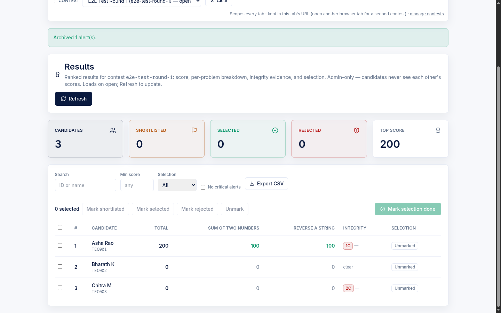
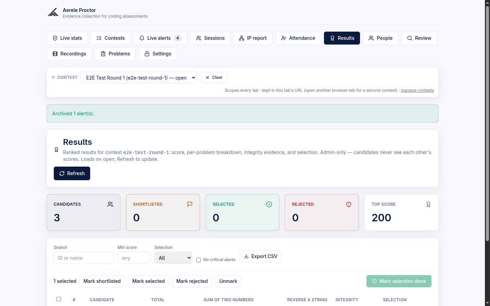
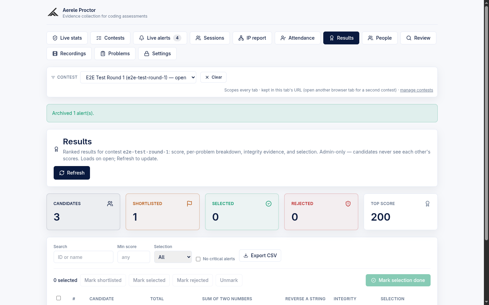
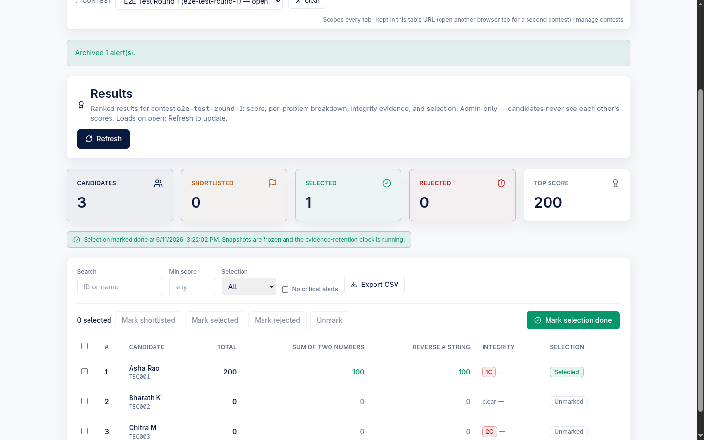
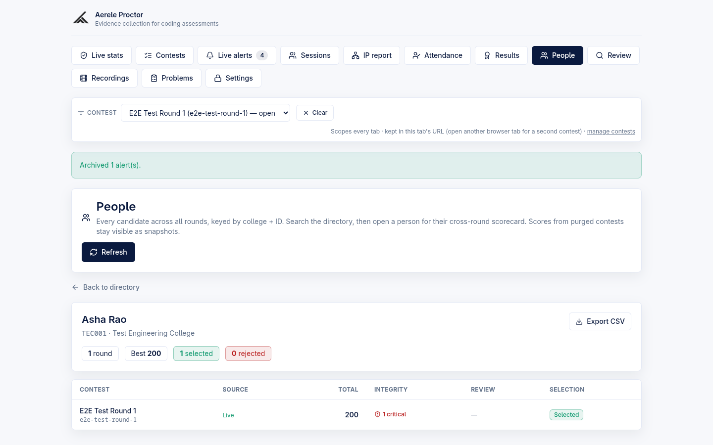

# Admin — Results and People (cross-round scorecards)

The **Results** tab ranks every candidate in one contest — score, per-problem
breakdown, integrity evidence and a hiring selection workflow — and the
**People** tab follows the *same person* across every round they have attempted.
Both are **admin-only** (candidates never see each other's scores), and both are
designed for the standalone own-editor exam platform: scores come from the
candidate's in-browser Monaco workspace and live Judge0 Run/Submit, joined to the
proctoring integrity signals. (An optional `monitoring/` contest-eval poller can
also feed cheating alerts into the same integrity pipeline for an
externally-hosted contest; those alerts show up here the same way native alerts
do.)

> **Product framing.** Proctor's primary surface is the own-editor platform.
> HackerRank was removed from the candidate path (F8.2). The Results/People
> tabs are part of the admin console and read native platform data.

---

## Where this lives

| Concern | File |
| --- | --- |
| Results tab UI | `frontend/src/admin/ResultsPanel.tsx` |
| People tab UI | `frontend/src/admin/PeoplePanel.tsx` |
| Results pure helpers (filter / CSV / counts / gate) | `frontend/src/results/computeResults.ts` |
| People pure helpers (directory filter / summary / CSV / source label) | `frontend/src/people/computePeople.ts` |
| Scoring rollup + Results JOIN + integrity fold | `backend/src/scoreboard.mjs` |
| Cross-round scorecard JOIN + directory filter | `backend/src/people.mjs` |
| Routes, handlers, selection + snapshot + adopt | `backend/src/handler.mjs` |
| Enrollment store: selection transition, snapshot freeze, adopt | `backend/src/identity.mjs` |
| Admin auth guard | `backend/src/lib/auth.mjs` (`requireAdmin`) |

Backend internals are partially split into `lib/*.mjs` / `routes/*.mjs` /
`config.mjs` (decomposition B0/B1, behavior-preserving). That refactor is
**paused/partial** — the dispatch table and the Results/People route bodies still
live in `handler.mjs`. Routes are registered around `handler.mjs:371-379`.

### Auth

Every Results/People endpoint calls `requireAdmin(req)`, which timing-safe
compares the `x-admin-password` header against `ADMIN_PASSWORD`. It is
**closed-by-default**: if `ADMIN_PASSWORD` is unset, every admin request rejects
with `401` (`backend/src/lib/auth.mjs:17-24`). The admin console sends the
password it was unlocked with on every call.

---

## Results tab

The Results tab is scoped by the **global contest selector** at the top of the
admin console (`App.tsx` passes the selected `contestSlug` into
`ResultsPanel`). It loads on open and re-fetches on **Refresh**.

### Backing route

`GET /api/admin/contest-results?contest=<slug>` →
`adminContestResults` → `computeContestResults`
(`handler.mjs:3743-3806`). The handler:

1. resolves the contest **as a person-mode contest** (`personContestForFilter`).
   If the selected scope is legacy/unknown/global — i.e. has no enrollment spine
   — it returns `{ configured: false }` and the UI shows
   *"Results are available for person-mode contests with a roster."* rather than
   erroring.
2. does one contest-scoped scan each of enrollments, submissions, alerts and
   reviews, then joins them purely in `buildResultsRows`
   (`scoreboard.mjs:135-215`).

If the endpoint is not deployed at all, the panel shows a warning banner *"The
results endpoint is not deployed yet."* (`ResultsPanel.tsx:180-184`).

### The ranked table

Row spine = the contest's **active enrollments** (the results denominator;
`status === "removed"` rows are dropped). A rostered candidate who never
submitted still gets a 0-score row. Columns:

| Column | Source / meaning |
| --- | --- |
| Checkbox | Per-row bulk-selection toggle; header checkbox selects all *visible* (filtered) rows |
| `#` (rank) | `total` desc → earlier `last_improvement_at` → `person_id` asc (deterministic). Computed at read time, never stored (`scoreboard.mjs:206-213`) |
| Candidate | `name` on top; the **label-driven id** (`display_id`) in mono below. `display_id` = the unique id, and gains `· <college>` **only when the contest is multi-college** (`scoreboard.mjs:196`) |
| Total | Sum of per-problem **best** scores in contest scope |
| One column per problem | Per-problem **best** score, in contest problem order; full-marks cells render in the accent colour. Header shows the problem title (`title` attr carries `problem_id`) |
| Integrity | Alert counts by severity — `<n>C` critical (red), `<n>W` warning, `<n>I` info — plus a review verdict badge. `clear` when no alerts and no review; verdict is **Flagged** if any reviewer marked cheating, **Cleared** if reviews exist but none flagged, else `—` (`scoreboard.mjs:94-112`) |
| Selection | The enrollment's `selection_status` chip: Unmarked / Shortlisted / Selected / Rejected |

**Stat cards** above the table: Candidates, Shortlisted, Selected, Rejected, Top
score (`selectionCounts`, `computeResults.ts:80-84`).

> Identity model: `person_id = "{college_norm}~{uid_norm}"`, stable across
> contests — this is what links a Results row to the same person's People
> scorecard.

### Filters

All filters are **client-side and AND-composed** over the already-ranked rows
(`filterResultRows`, `computeResults.ts:65-76`). The table re-filters instantly
without a re-fetch.

| Filter | Behaviour | Visible when |
| --- | --- | --- |
| **Search** | Case-insensitive substring over candidate id **and** name | always |
| **College** | Exact `college_norm` match | only if the contest spans **more than one** college (`ResultsPanel.tsx:214`) |
| **Room** | Exact room match | only if any row carries a room value (`ResultsPanel.tsx:223`) |
| **Min score** | Drops rows with `total < minScore` | always |
| **Selection** | Exact selection-status match (All / Unmarked / Shortlisted / Selected / Rejected) | always |
| **No critical alerts** | Hides rows with ≥1 critical alert. **Default OFF** (unchecked) | always |

(In screenshot `07a` the College and Room filters are absent because the test
contest is single-college with no rooms — expected per the conditional rendering.)

### Bulk selection (shortlisted / selected / rejected)

Select one or more rows, then click a bulk-action button. Buttons are disabled
when nothing is selected.

| Button | New `selection_status` |
| --- | --- |
| Mark shortlisted | `shortlisted` |
| Mark selected | `selected` |
| Mark rejected | `rejected` |
| Unmark | `none` |

Backing route: `POST /api/admin/contest-selection` → `adminContestSelection`
→ `applySelectionTransition` (`handler.mjs:3843-3854`, `identity.mjs:717-758`).
The transition carries an optional **`from_status` race guard**: a row whose
current status no longer matches `from_status` is skipped (reported in
`skipped[]`) rather than overwritten. Each update stamps `selection_updated_at`
and `selection_by`, and writes an audit row.

### Mark selection done — freeze a final-score snapshot

The accent **"Mark selection done"** button (top-right of the toolbar) freezes
each active enrollment's `final_snapshot` and stamps the **evidence-retention
clock**.

- **Gate.** Disabled until at least one candidate is persisted as **Selected or
  Rejected**. *Shortlisted* and *Unmarked* do **not** count as a final decision
  (`canMarkSelectionDone`, `computeResults.ts:91-93`). The disabled tooltip
  states the precondition: *"Mark at least one candidate Selected or Rejected
  first."*
- **Confirmation.** A `window.confirm` explains it freezes a snapshot that
  survives a later data purge and starts the retention clock
  (`ResultsPanel.tsx:123-138`).
- **What it does.** `POST /api/admin/contest-selection-done` →
  `adminContestSelectionDone` → `stampSelectionDone`
  (`handler.mjs:3856-3885`, `identity.mjs:766-793`):
  - it snapshots **the exact numbers the Results table shows** (single source of
    truth): per-person `total_score`, per-problem best, integrity
    (`alerts_by_severity` + `review_verdict`), unique id and name, written to
    `enrollment.final_snapshot`;
  - it stamps `selection_done_at` on the **contest** doc (one clock per contest).
- **Survives purge.** After a data purge the live submissions are gone, so
  Results materializes rows from `final_snapshot` and tags each `from_snapshot`
  (the row shows a small `snapshot` chip; `scoreboard.mjs:152-188`).
- **Idempotent.** Re-running refreshes the snapshots (the purge path refreshes
  them the same way).
- **Banner.** Once stamped, the panel shows *"Selection marked done at …
  Snapshots are frozen and the evidence-retention clock is running."*

> The retention **sweep** that actually deletes evidence
> `evidence_retention_days` after `selection_done_at` is **not** built in this
> module — only the clock field is stamped. *(unverified — flagged as a
> `TODO(Wave-7 S-H)` in `identity.mjs:781-783`; do not assert the auto-purge
> runs.)*

### CSV export

**Export CSV** downloads exactly the **currently-visible (filtered) rows**
client-side (`ResultsPanel.tsx:140-152`, `buildResultsCsv`,
`computeResults.ts:97-116`). Filename: `results-<slug>.csv`. Columns:
`rank, candidate_id, name, college, total, <one per problem title>,
critical_alerts, warning_alerts, info_alerts, review_verdict, selection_status`.

There is also a server-side CSV path: `GET /api/admin/contest-results?...&format=csv`
returns `{ csv }` via the identical backend builder (`scoreboard.mjs:240-263`).
Both use a spreadsheet **formula-injection guard** — cells starting with
`= + - @` (or tab/CR) are prefixed with `'`.

---

## People tab

The People tab is the cross-round person view. It is **deliberately not scoped
to the global contest selector** — it spans every round by design
(`App.tsx:2930-2932`, `PeoplePanel.tsx:5-8`).

### Directory

`GET /api/admin/people?search=&college=` → `adminPeople`
(`handler.mjs:4378-4414`). Returns the (capped) person directory plus the
college options for the dropdown. Each person row carries a **rounds attempted**
count (active enrollments across all contests).

- **Search** by id or name, **filter** by college. The backend filters
  (`filterDirectory`, `people.mjs:120-132`) and the frontend **re-filters
  client-side** for instant typeahead, so the admin doesn't round-trip per
  keystroke (`filterDirectoryRows`, `computePeople.ts:63-71`). **Refresh**
  re-fetches a fresh population from the server.
- Columns: ID (mono), Name, College, Rounds, and a **Scorecard** action.
- Clicking a row opens that person's scorecard.
- Empty state: *"No people yet. Upload a person-mode contest roster, or adopt a
  legacy contest from its detail page."*

The directory is bounded by `PEOPLE_DIRECTORY_LIMIT = 500`
(`handler.mjs:148`) — the filtered set is capped to 500 before the per-person
enrollment counts fan out.

### Per-person cross-round scorecard

`GET /api/admin/person?person_id=<id>` → `adminPerson` →
`computePersonScorecard` (`handler.mjs:4416-4496`). One row per contest the
person attempted (active enrollments). Header chips: rounds, best total, selected
count, rejected count, and a flagged count when > 0 (`scorecardSummary`,
`computePeople.ts:75-94`).

| Scorecard column | Meaning |
| --- | --- |
| Contest | Contest name + slug (mono); appends `· carry-over` when the enrollment `source === "carry_over"` |
| **Source** | `Live` (accent) when numbers come from live data; `Snapshot` when from a `final_snapshot`; `Purged · snapshot` when the contest's DB data was purged (`rowSourceLabel`, `computePeople.ts:99-102`) |
| Total | Best total for that round |
| Integrity | `<n> critical` (red) if any, else `<n> warning`, else `clean` |
| Review | Flagged / Cleared / `—` verdict badge |
| Selection | The round's selection chip |

**Live-vs-snapshot fallback** (`buildScorecardRows`, `people.mjs:46-115`): for
each contest, read **live** score + integrity where they exist; otherwise fall
back to the frozen `final_snapshot`. A contest is treated as purged when its doc
carries `db_purged_at`; the handler then skips per-contest reads entirely and the
pure builder reads the snapshot (`handler.mjs:4464`). This is the §10.2
purge-survivor rule: **kept scores stay visible and are clearly attributed to a
purged/archived contest.** Rows are ordered by `selection_done_at` then slug
(Round 1 before Round 2 in the common case).

If the People endpoint is not deployed, the panel shows *"The People endpoint is
not deployed yet."* (`PeoplePanel.tsx:133-137`).

### Scorecard CSV export

**Export CSV** on the scorecard downloads `scorecard-<person_id>.csv`
client-side (`PeoplePanel.tsx:98-110`, `buildScorecardCsv`,
`computePeople.ts:106-125`). Columns: `contest, contest_name, status, total,
critical_alerts, warning_alerts, review_verdict, selection_status` (`status` =
live / snapshot / purged). Same formula-injection guard. A matching server-side
path exists at `GET /api/admin/person?...&format=csv` (`people.mjs:138-154`).

---

## Adopt into person model — legacy backfill

A contest run **before** the person model (bare `username_norm`, no college
component, no `person_id`) does not appear in People/Results until it is
**adopted**. The action is surfaced on the **contest detail page**
(`ContestsPanel.tsx:583-860`), not on the Results/People tabs — the People empty
state points there.

Backing route: `POST /api/admin/contest-adopt` → `adminContestAdopt` →
`adoptContestIntoPersonModel` (`handler.mjs:3887-3908`,
`identity.mjs:536-637`). The one-time backfill:

1. **Re-upload the roster with a college column.** This runs the full
   person-mode upload pipeline, minting persons + colleges + enrollments
   (`source: "csv"`, the multi-round spine). If the upload introduces new college
   names it returns `needs_college_confirmation` and the admin maps-or-creates
   each college, then re-posts (*"Confirm & adopt"*).
2. **Stamp the existing sessions/submissions.** It matches each legacy doc to a
   person via the contest's own identity lookup (typed id → `identityNorm` =
   the legacy `username_norm`) and **merges** `person_id` + `college_norm` onto
   those docs. `username_norm` and every other key stay **frozen** — adoption
   adds fields, it never rewrites identity.
3. Stamps `adopted_into_person_model_at` on the contest and writes an audit row
   returning `sessions_stamped` / `submissions_stamped` counts.

Because docs are stamped (not deleted), the adopted contest then shows up on
person scorecards with its **live** score and can seed a carry-over Round 2.
Re-running is safe and idempotent (*"Re-uploading refreshes the link"*).

---

## Defaults at a glance

| Setting / behaviour | Default |
| --- | --- |
| "No critical alerts" filter | **OFF** (unchecked) |
| Selection filter | **All** |
| "Mark selection done" button | **Disabled** until ≥1 candidate is Selected or Rejected |
| Admin auth (`ADMIN_PASSWORD`) | Closed-by-default — unset ⇒ all admin calls `401` |
| People tab contest scoping | Not scoped — spans all rounds |
| Results tab contest scoping | Scoped to the global contest selector |
| Selection status (new enrollment) | `none` (Unmarked) |

### Relevant limits

| Constant | Value | Where |
| --- | --- | --- |
| `SUBMISSIONS_RESULTS_LIMIT` | `50000` | `handler.mjs:140` |
| `PEOPLE_DIRECTORY_LIMIT` | `500` | `handler.mjs:148` |
| `ALERTS_QUERY_LIMIT` | `500` | `handler.mjs:134` |
| `ENROLLMENTS_QUERY_LIMIT` | `20000` | `identity.mjs:43` |

---

## Related

- [Roster, rooms and identity](./admin-roster-rooms-identity.md)
- [Contests and templates](./admin-contests-templates.md)
- [Problems, stubs and autocomplete](./admin-problems-stubs-autocomplete.md)
- [Architecture overview](./architecture-overview.md)
- [Candidate flow](./candidate-flow.md)
- [Candidate enforcement ladder](./candidate-enforcement-ladder.md)
