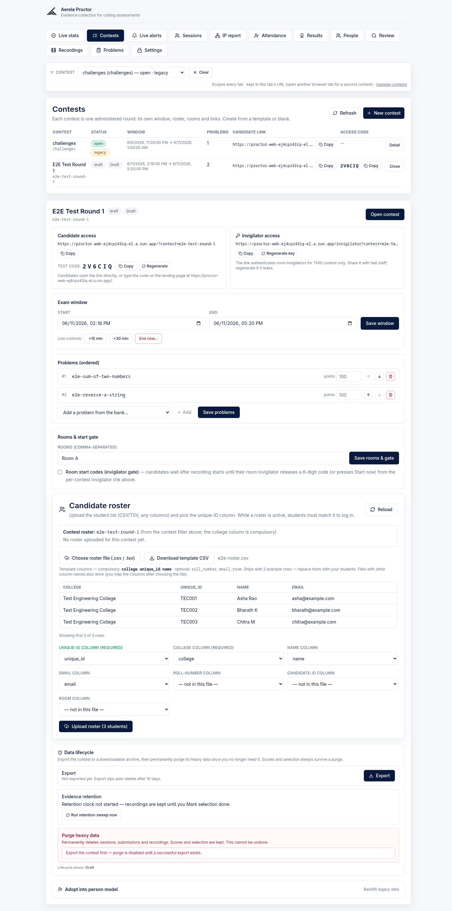
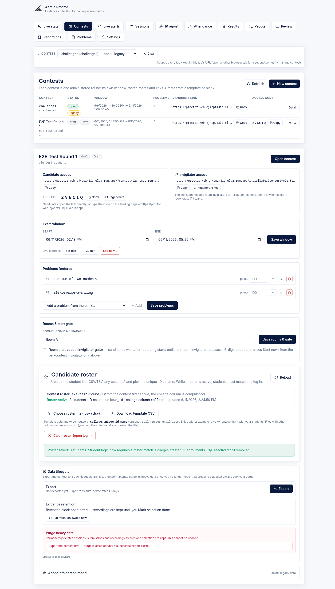
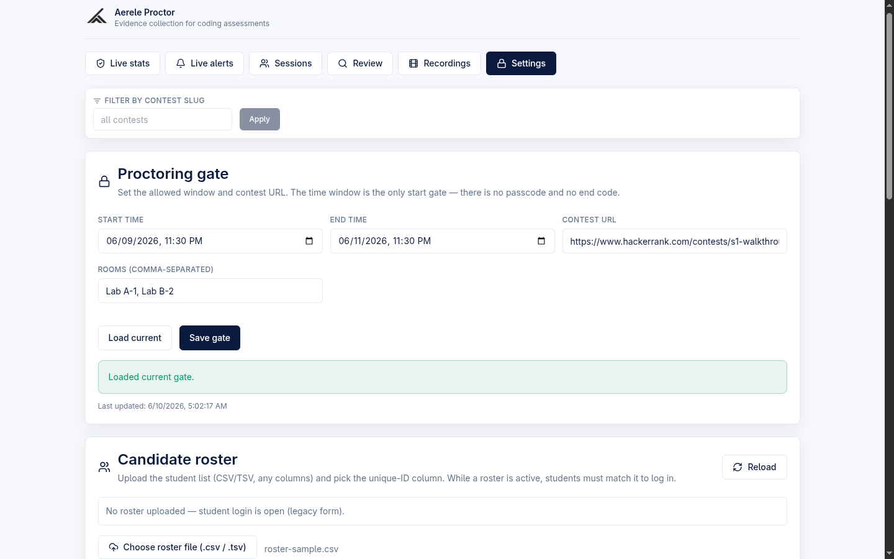
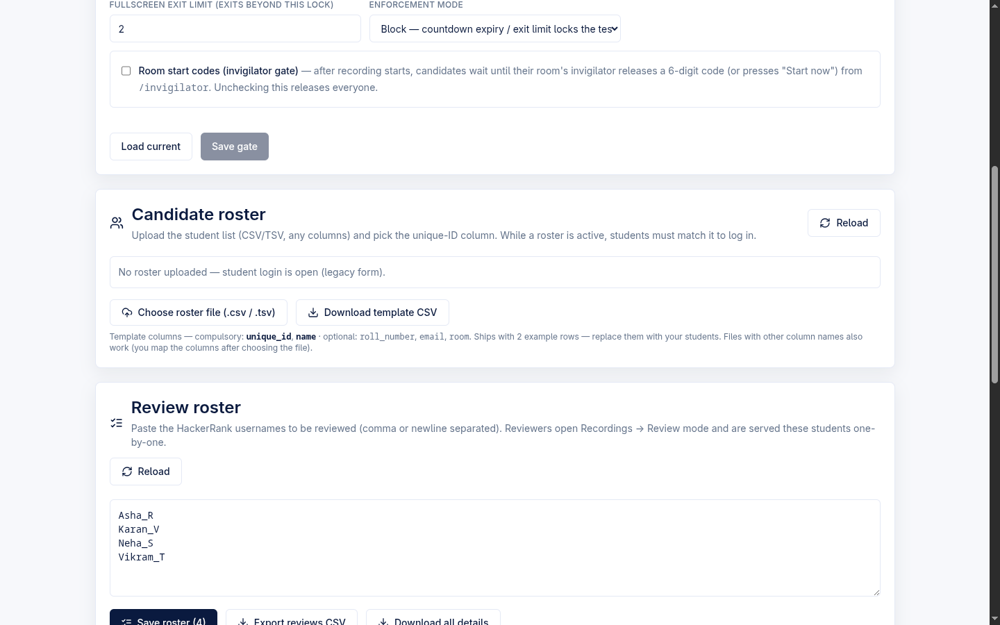
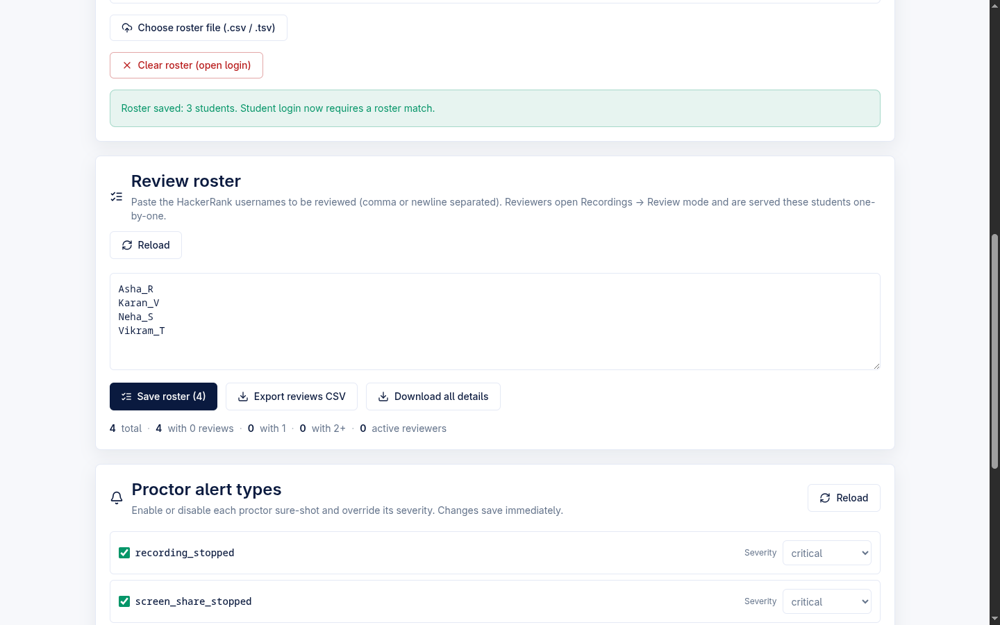
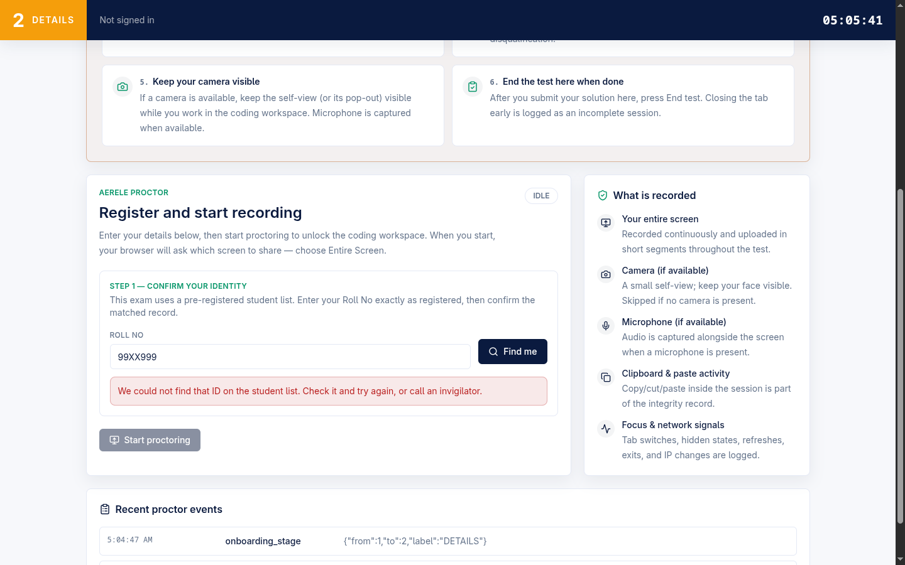
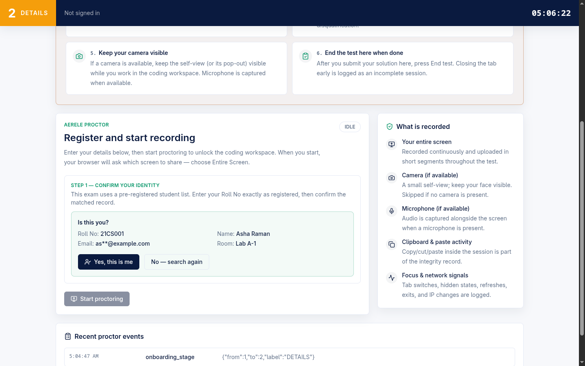

# Admin — Roster, Rooms, College + Person Identity

How an admin loads the official candidate list, names the rooms, and ties every candidate to a **durable person identity** that survives across contests — and how a candidate confirms that identity at login.

> **Where this sits in the product.** Aerele Proctor is a standalone own-editor exam platform: candidates code in our React + Monaco workspace with Judge0-backed Run/Submit, and identity is established by a roster the admin uploads here. (A separate, optional `monitoring/` contest-eval poller can live-watch an *externally hosted* HackerRank contest and feed cheating alerts into the same alerts pipeline; it is not part of the roster/identity flow documented on this page.)

---

## Two roster paths (read this first)

The same upload UI drives **two backends**, chosen by whether the admin has a contest selected in the global contest filter:

| Path | When | Backend | College column | Identity |
| --- | --- | --- | --- | --- |
| **Legacy / global** | No contest selected (or the synthesized legacy contest) | `handler.mjs` `adminSaveRoster` → global roster | not required | `username_norm` = normalized unique id (no college) |
| **Per-contest / person** | A real `identity_mode:"person"` contest is selected | `identity.mjs` `saveContestRoster` | **compulsory** | `person_id = "{college_norm}~{uid_norm}"`, stable across contests |

`adminSaveRoster` (`backend/src/handler.mjs`) dispatches: if the upload names a real person-mode contest it routes to `saveContestRoster` (`backend/src/identity.mjs`); otherwise it keeps the legacy global-roster path bit-for-bit. A `?contest=` param that names anything other than a real person contest is a hard `400 per_contest_roster_requires_person_contest` — uploads never silently fall back to the global roster when the admin asked for a contest.

Component: `CandidateRosterSection` in `frontend/src/App.tsx` (rendered both on the per-contest detail page and in the legacy Settings tab).

---

## Flexible-column CSV/TSV roster upload

**Admin POV.** Click **Choose roster file (.csv / .tsv)**, pick any file. The browser parses it client-side and shows a preview table (first 5 rows) plus column-mapping dropdowns. No fixed schema is required — any columns work; you map them after choosing the file.

- **Parser:** `frontend/src/roster/parseRoster.ts`. Delimiter is auto-detected per file (`,`, tab, or `;` — whichever splits the header into the most cells; ties keep comma). Quoted cells with embedded delimiters and `""` escapes are handled (embedded newlines inside quotes are *not* — such a row surfaces as a ragged-row error, not silent data loss). A leading UTF-8 BOM is stripped, blank/duplicate header names are filled and de-duped, and fully-empty rows are skipped.
- **Column-mapping suggestions:** `suggestMapping()` pre-fills the dropdowns from header-name heuristics (e.g. `/mail/i` → email, `/roll|regist|reg no|admission/i` → roll number, `/room|lab|hall|venue/i` → room, `/college|institut|campus|school/i` → college, `/name/i` → name). Order matters: specific patterns claim their column before the broad `/name/` pattern, so "College Name" maps to *college*, not *name*. Every suggestion is overridable in the UI.
- **Unique-ID column (required):** chosen by `suggestMapping()` — an explicit `unique_id`/whole-word `id`/`uid` header wins, then roll/register number, then email, then the first column. The admin can override it via the **Unique-ID column (required)** dropdown.
- **The label drives the candidate prompt.** The chosen unique-ID column name becomes `unique_id_label` (legacy) — that is exactly the field label the candidate sees at login. For person contests the label comes from the contest's `identity_label` instead (see below).

**Backend bounds** (both paths): max 5000 rows, max 30 columns kept, 200 chars/cell. `unique_id_column` must be one of the uploaded columns or the request is rejected `400`.

---

## Compulsory college column (person contests)

For a person-mode contest the **college column is compulsory** (`college` is part of `PERSON_MAPPABLE_FIELDS` in `identity.mjs`, and the **College column** dropdown is labelled *(required)*).

The backend resolves the college column from, in order: an explicit `college_column`, the mapped `college` field, or a column literally named `college` (case-insensitive). If none is found the whole upload is rejected `400 college_column_required`; the UI shows: *"This contest requires a college column — map one under 'College column' (or add a 'college' header to the file)."*

If the college column exists but **any cell is blank**, the *whole file* is rejected `400 college_required` with the offending 1-based data-row numbers, surfaced as: *"The college cell is blank on row(s) … — every row needs a college. Nothing was saved."* (Validation order is locked in `saveContestRoster`.)

---

## Two-stage college canonicalization (map-or-confirm)

The single enforceable moment to stop spelling drift from forking one student across many "colleges." Distinct CSV college strings are grouped by their **final normalized form** (`identityNorm` = trim + lowercase + strip whitespace, then a doc-id-safe charset) and matched against the `proctor_colleges` collection:

1. **Exact-norm match** → linked silently to the existing college.
2. **Anything else** → the upload **blocks** and returns `needs_college_confirmation` with `new_colleges` (preview: the raw name variants + row counts) and `known_colleges`. **Nothing is written yet.**

**Admin POV.** A *map-or-confirm* panel appears: for each new college name, a dropdown offers **Create new college "…"** or **Use existing "…"**. The admin re-posts with `college_resolutions` (built by `buildCollegeResolutions` in `frontend/src/roster/personRoster.ts`: `""` = create, otherwise the target `college_norm` to map onto). Only after every new college is resolved does the upload proceed and persist.

The college canonicalization dropdowns are visible inline in the per-contest roster section (see the contest detail screenshot above, under "Candidate roster").

---

## Duplicate unique-id → whole file rejected with line numbers

After college resolution and after blank-id rows are skipped, the backend checks for duplicate **`(college_norm, unique_id_norm)`** pairs on the *final* normalized form. Any duplicate **hard-rejects the entire upload** — `400 duplicate_unique_ids` with `{ row, college, unique_id, conflicts_with_row }` rows (1-based data rows).

**Admin POV.** A red *"Duplicate candidates — whole file rejected"* table lists each duplicate row and the row it conflicts with: *"Duplicate candidates in the file — fix the rows below and re-upload. Nothing was saved."* Rationale (in code): silently keeping the first row would pre-fill the *wrong* student's identity.

> Note: the **legacy** global path is gentler — it *skips* duplicate-id rows (`reason: "duplicate_unique_id"`) and reports them as skips rather than rejecting the file. The hard-reject-with-line-numbers behavior is the **person-contest** path.

**Same unique-id under *different* colleges is allowed** (not a duplicate) — it is reported as a non-fatal `ambiguous_ids` warning: *"… id(s) exist under multiple colleges — those candidates pick their college at login."* Those candidates get a college picker at login (see "candidate-side" below).

---

## person_id, and the persons / colleges / enrollments model

`person_id = "{college_norm}~{uid_norm}"`. The separator `~` is deliberately **outside** the sanitized component charset `[a-zA-Z0-9._-]`, which makes `personIdOf` injective by construction — no `(college, unique_id)` pair can forge the separator and alias another person. (`PERSON_ID_SEPARATOR` in `identity.mjs`; mirrored in `personRoster.ts`.) Composite ids are never parsed back apart; their components are always stored as fields alongside them.

A person-mode upload writes to three collections (`identity.mjs`):

| Collection | Doc id | Role |
| --- | --- | --- |
| `proctor_colleges` | `college_norm` | canonical college (display name + `source`) |
| `proctor_persons` | `person_id` | durable identity; profile fields **latest-wins**, identity components immutable |
| `proctor_enrollments` | `{contest_slug}::{person_id}` | the person × contest row (status, selection, final snapshot) |

**Stable across contests = the multi-round spine.** Because `person_id` is deterministic, any *future* CSV with the same `(college, unique_id)` resolves to the **same person** doc — that is how a candidate's Round-1 and Round-2 sessions land on one cross-round scorecard. Cross-round profile renames leave an audit trail (`person_profile_updated` in `proctor_admin_audit`). Write order is entries → persons → enrollments → **meta last**, so a crashed upload never activates a half-written roster version.

**Re-upload reconciliation:** persons/enrollments missing from a new upload are marked `removed` (kept, never deleted); re-added persons reactivate the same enrollment doc. A removal that hits a *live* session does **not** auto-kick — it raises a `roster_removed_mid_exam` warning alert for a human to decide.

**Success summary (admin POV).** *"Roster saved: N students … Colleges created: X; enrollments +created/reactivated/removed. Student login now requires a roster match."*

---

## Rooms list + "Other" free option; room-gate enable/disable

**Rooms** are admin-configured labels. On the legacy Settings tab they are a comma-separated field; on a person-mode contest they live on the contest doc. Either way the backend normalizes them (`normalizeRooms`): each label sanitized, empties dropped, de-duped case-insensitively (first-seen casing kept), capped at `CONFIGURED_ROOMS_LIMIT`.

The room list is served to candidates via `GET /api/exam-config` (legacy) or `?contest=` (`contestExamConfig`).

**Candidate POV** (`RoomField`, `frontend/src/App.tsx`): if rooms are configured the candidate gets a **dropdown** ("Select your room…", the configured rooms, then **Other…** which reveals a free-text box). If **no** rooms are configured the field falls back to a plain free-text "Room number" input.

**Room-gate (room start codes).** A separate opt-in: when enabled, candidates wait after recording starts until their room's invigilator releases a 6-digit code (or presses "Start now") from `/invigilator`.

| Setting | Default | Field |
| --- | --- | --- |
| `room_gate_enabled` | **OFF** | legacy: `Boolean(settings?.room_gate_enabled)`; contest create: `body.room_gate_enabled === true` |

The screenshot below (legacy Settings tab) shows the **Rooms (comma-separated)** field and the Candidate roster panel in its empty state.

---

## Downloadable roster template CSV

**Admin POV.** A **Download template CSV** button next to the file picker downloads `roster-template.csv` client-side (`buildRosterTemplateCsv` in `frontend/src/roster/rosterTemplate.ts`). Headers are exactly the parser's accepted field names, compulsory-first, so a filled template re-uploads with every column auto-mapped and `unique_id` pre-picked as the ID column. It ships with **2 example rows** (KEC sample students) to show the expected shape.

**Current template columns** (`ROSTER_TEMPLATE_COLUMNS`):

| Column | Required |
| --- | --- |
| `college` | yes |
| `unique_id` | yes |
| `name` | yes |
| `roll_number` | no |
| `email` | no |
| `room` | no |

> **Screenshot drift (unverified against current build):** `wave2-15-admin-roster-template-button.png` (below) shows the helper text as *compulsory: unique_id, name · optional: roll_number, email, room* — i.e. **before** `college` was added as a compulsory template column. The button and download behavior are current; the listed compulsory set in that older screenshot predates the compulsory-college change in `rosterTemplate.ts`.

### Multi-round roster linking to existing persons

There is no separate "link" action — linking is automatic. Because `person_id` is deterministic, re-uploading a roster for a later round (with the same college + unique_id columns) resolves each row to the **existing** `proctor_persons` doc and mints/reactivates that person's enrollment for the new contest (`upsertPerson` + `reconcileEnrollments` in `identity.mjs`). That is the documented mechanism for carrying a person across rounds.

---

## Download-all-details CSV (batch, GCS-free)

**Admin POV** (Settings tab → **Review roster** section → **Download all details** button). Paste a list of Candidate IDs, then export a CSV with **one row per input ID** (blank cells when a candidate was not found, so the operator can see who is missing).

- Frontend: `downloadDetailsCsv` + `buildDetailsCsv` (`frontend/src/App.tsx`). CSV header: `candidate_id,name,email,roll_number,room`. File: `candidate-details.csv`.
- Backend: `POST /api/admin/session-details` (`adminSessionDetails`). Each row is projected **straight from the session doc with zero GCS access** (bounded Firestore fan-out, concurrency 12) — deliberately GCS-free so a large list never triggers the Cloud Run GCS/IAM fan-out storm. Input order is preserved one-to-one; up to `REVIEW_ROSTER_LIMIT` (5000) IDs per request.

> This pulls details from **session docs** (candidates who have started), so it surfaces who actually showed up — distinct from the contest **Results/People** export and the full **contest-export** archive (`POST /api/admin/contest-export`).

---

## Candidate-side roster lookup + identity confirm

While a roster is active, candidate login **requires** a roster match — the server re-enforces this at `/api/session/start` regardless of client state (`roster_id_required` / `not_on_roster`).

**Legacy path (unique-ID confirm flow).** Component `IdentityLookupPanel` (`frontend/src/App.tsx`), backend `POST /api/roster/lookup` (`rosterLookup`):

1. *Step 1 — confirm your identity.* The candidate types their unique ID (labelled with `unique_id_label`) and presses **Find me**.
2. **Match found:** an *"Is this you?"* card shows the matched record — unique id, name, roll number, **masked email** (e.g. `as**@example.com`), candidate id, room — with **Yes, this is me** / **No — search again**. Confirming prefills the form from the roster (roster is the source of truth; mapped fields are server-overridden at session start) and the panel collapses to *"Identity confirmed"* with a **Not you? Re-enter ID** reset.
3. **No match:** *"We could not find that ID on the student list. Check it and try again, or call an invigilator."* (`404 not_on_roster`).

`/api/roster/lookup` is public and ID-enumerable, mitigated by a best-effort **per-IP rate limit** (60 misses/min; successful found-id lookups are *refunded* so a NAT'd hall of real logins is never throttled). The limiter is per-instance/in-memory — documented as best-effort, not a global guarantee.

**Person path (server-resolved identity).** For a person contest the candidate just types their ID; the server resolves it against the *contest* roster (`resolvePersonRosterIdentity` in `handler.mjs` → `findContestRosterEntries`):

- 0 matches → `403 not_on_roster`.
- 1 match → that person.
- 2+ colleges carry the same id → `409 college_choices`; the candidate sees a **"Select your college"** radio picker, and the next Start retries with the pick as `college`.

Name/roll/email are taken from the roster (the source of truth), never re-typed — the candidate's form shows *"Your name and details come from the official list — type your … exactly as registered."*

---

## Quick reference — routes & components

| Concern | Route / function | File |
| --- | --- | --- |
| Save roster (dispatch) | `POST /api/admin/roster` → `adminSaveRoster` | `backend/src/handler.mjs` |
| Per-contest/person save | `saveContestRoster` | `backend/src/identity.mjs` |
| Roster summary (meta only) | `GET /api/admin/roster` → `adminGetRoster` / `getContestRosterSummary` | `handler.mjs` / `identity.mjs` |
| Public exam config (label + rooms + gate) | `GET /api/exam-config` → `publicExamConfig` / `contestExamConfig` | `backend/src/handler.mjs` |
| Candidate roster lookup (legacy) | `POST /api/roster/lookup` → `rosterLookup` | `backend/src/handler.mjs` |
| Person identity resolve (login) | `resolvePersonRosterIdentity` / `findContestRosterEntries` | `handler.mjs` / `identity.mjs` |
| Download-all-details | `POST /api/admin/session-details` → `adminSessionDetails` | `backend/src/handler.mjs` |
| Upload UI | `CandidateRosterSection`, `IdentityLookupPanel`, `RoomField` | `frontend/src/App.tsx` |
| CSV parse + mapping | `parseRoster`, `suggestMapping` | `frontend/src/roster/parseRoster.ts` |
| Template CSV | `buildRosterTemplateCsv`, `ROSTER_TEMPLATE_COLUMNS` | `frontend/src/roster/rosterTemplate.ts` |
| Person-roster client logic | `evaluatePersonRosterUpload`, `buildCollegeResolutions` | `frontend/src/roster/personRoster.ts` |
| Identity core | `personIdOf`, `identityNorm`, `PERSON_ID_SEPARATOR` | `backend/src/identity.mjs` |

> **Decomposition note.** The backend has been *partially* split into `lib/*.mjs` + `routes/invigilator.mjs` + `config.mjs` (behavior-preserving), but that refactor is paused/partial — the route dispatch table and most route bodies still live in `backend/src/handler.mjs`, which is where the roster/rooms routes above are found.

---

## Related

- [Admin — Contests & Templates](./admin-contests-templates.md)
- [Candidate flow](./candidate-flow.md)
- [Candidate enforcement ladder](./candidate-enforcement-ladder.md)
- [Architecture overview](./architecture-overview.md)
