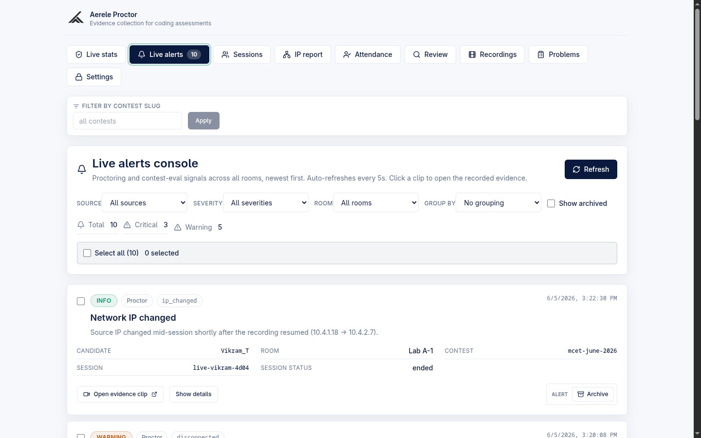
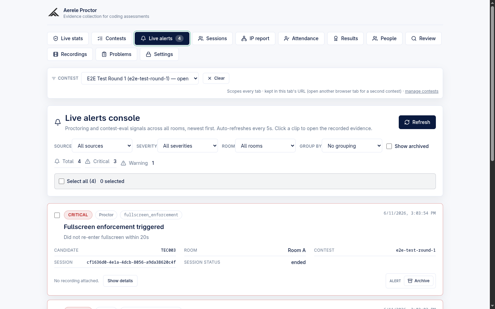
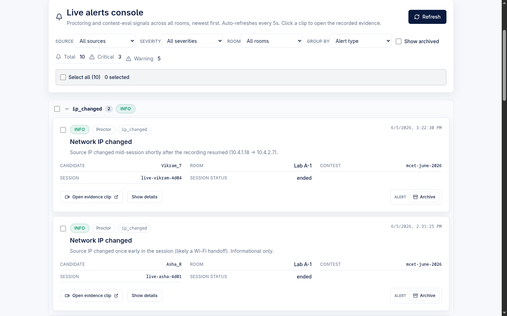

# Alert Taxonomy and the shared Alert pipeline

Every integrity signal in Aerele proctor — whether it comes from a candidate's own browser session or from the optional contest-eval poller — lands as one **Alert** in a single Firestore-backed pipeline that the admin console reads. This page documents the shared Alert JSON contract, the proctor and contest-eval alert catalogs, the ingest/read routes, and how enforcement violations feed the lock ladder.

## Product context

The proctor platform is now a **standalone own-editor exam platform**: candidates do everything inside our React + Monaco editor with Judge0-backed Run/Submit. (The old README that calls this a "HackerRank companion" is stale.) Alongside the primary platform there is **one optional component** — the `monitoring/` contest-eval poller — which live-watches an externally-hosted HackerRank contest and emits cheating alerts into the **same** alerts pipeline. So there are two alert sources, and both write through the same contract:

| Source | What it is | Where it runs |
| --- | --- | --- |
| `proctor` | Signals derived from the candidate's own browser session (recorder/heartbeat/events) | The proctor backend itself |
| `contest-eval` | Deterministic cheating analysis over an externally-hosted contest | The optional `monitoring/` Python poller |

## The shared Alert JSON contract

All three parties (proctor backend, contest-eval poller, admin console) agree on one `Alert` shape. The TypeScript type is `Alert` in `frontend/src/types.ts`; the backend validators live in `backend/src/handler.mjs`; the Python mirror is `_alert()` / `validate_alert()` in `monitoring/alerts.py`.

### Required-on-ingest fields

On `POST /api/alerts` the backend (`normalizeAlert` in `handler.mjs`) **rejects with HTTP 400** any alert missing one of these:

| Field | Notes |
| --- | --- |
| `source` | Must be `proctor` or `contest-eval` (`ALERT_SOURCES`). |
| `type` | Free string; the catalogs below are the known types. |
| `severity` | Must be `critical`, `warning`, or `info` (`ALERT_SEVERITIES`). |
| `timestamp` | Must parse as ISO 8601 (`Date.parse`). |
| `hackerrank_username` | The display identity. `candidate_id` is accepted as an alias and copied into this field when it is the only one supplied (S-C dual-field). |
| `title` | Short headline. |

### Other contract fields

| Field | Meaning |
| --- | --- |
| `id` | Stable, idempotent doc id. Convention: `<source>:<type>:<username_norm>:<contest_slug>:<dedupe>`. If absent on ingest the backend derives `<source>:<type>:<username_norm>:<contest_slug>:<timestamp>` rather than minting a random UUID, so retries stay idempotent. |
| `candidate_id` | Display id under the new identity model; backend stores it alongside `hackerrank_username` (same value under both names). |
| `username_norm` | Lowercased/sanitized identity (`normalizeUsername`: trim, lowercase, non-`[a-z0-9._-]` → `_`, sliced to 120). |
| `contest_slug`, `session_id`, `room` | Optional context; `session_id` is the candidate's write-endpoint bearer token and is therefore stripped before any invigilator sees an alert. |
| `detail` | Human-readable explanation (truncated server-side to 2000 chars). |
| `data` | Structured payload (cluster members, IPs, similarity, etc.), sanitized server-side. |
| `video_key` / `download_url` | `video_key` is a GCS object key; the backend resolves it to a signed `download_url` on **read** only (never stored). |
| `verdict` | `{ status, reason?, by? }` where status ∈ `pending | real | false_positive | inconclusive` (`AlertVerdict`). New alerts default to `{status:"pending"}`. |
| `archived` / `archived_at` | Archive flag; archived alerts are hidden from the default list. |

### Idempotent merge on `id`

The pipeline is **idempotent on `id`**. On ingest the backend does `alertRef(alert.id).set(alert, { merge: true })` for each alert, so a re-delivered batch (or a re-run poll cycle) merges into the existing document instead of duplicating it. The proctor-side `upsertProctorAlert` uses the same id convention and the same merge, so repeated heartbeats reporting the same condition collapse to one document.

## Proctor alerts (`source: proctor`)

Proctor alerts are **server-derived** from the candidate's session: the heartbeat, the event stream, the liveness beacon, and the enforcement ladder all raise them. The full catalog of admin-configurable proctor types and their defaults is `DEFAULT_PROCTOR_ALERT_SETTINGS` in `handler.mjs`.

### Catalog and defaults

| Type | Default severity | Raised when | Backing code |
| --- | --- | --- | --- |
| `recording_stopped` | critical | A heartbeat reports the recorder's core capture is no longer recording (`isRecordingStopped`). Deduped per day. | `recordHeartbeat` |
| `screen_share_stopped` | critical | A `screen_share_stopped` client event arrives via `/api/events`. | `raiseSureShotAlertsFromEvents` (`SURE_SHOT_EVENT_TYPES`) |
| `recording_error` | critical | A `recording_error` client event arrives via `/api/events`. | `raiseSureShotAlertsFromEvents` |
| `ip_changed` | warning | A heartbeat's client IP differs from the session's start IP (only on the newly-changed transition). Deduped per new IP. | `recordHeartbeat` |
| `tab_hidden` | warning | The liveness beacon reports the proctor tab hidden/closing. | `recordBeacon` |
| `tab_away` | warning | A `switch_away_episode` event whose duration ≥ the configured `threshold_seconds` **or** whose count ≥ 3 (frequent). Suppressed by a per-session `switch_away` exemption. | `raiseSwitchAwayAlerts` |
| `disconnected` | warning | (config catalog type) An active session whose newest liveness signal is stale. The console also derives a live `disconnected` count from session staleness. | `DEFAULT_PROCTOR_ALERT_SETTINGS`; staleness via `isStaleSession` |
| `fullscreen_enforcement` | critical | The fullscreen-enforcement ladder trips (countdown expiry or exit-limit exceeded). See "Enforcement violations" below. | `applyEnforcementViolation` |

Every type defaults to **enabled: true**. Severity defaults are critical for the recorder/enforcement signals and warning for IP/tab/disconnect signals. `tab_away` is the only type that carries a numeric `threshold_seconds` (default **12**), which is the source of truth for the monitoring tab-away detector's `--min-gap-seconds`.

> Note: `recording_stopped`, `screen_share_stopped`, and `recording_error` are the "sure-shot" types in `SURE_SHOT_EVENT_TYPES`. Everything else a client emits (focus/blur/raw visibility/clipboard) is intentionally **not** surfaced as an alert — it is treated as noise.

### Admin configuration: `/api/admin/alert-settings`

The admin console **Settings → Proctor alert types** panel reads `GET /api/admin/alert-settings` and saves through `POST /api/admin/alert-settings` (admin-authed; handlers `adminGetAlertSettings` / `adminSaveAlertSettings`; UI in `App.tsx`, header "Proctor alert types", "Changes save immediately"). Per type the admin can:

- **Enable / disable** the type (checkbox by the type name). Disabling hides the alert; for `fullscreen_enforcement` it hides the alert only — the block-mode lock itself is policy governed by `enforcement_mode`, not by this toggle.
- **Override severity** (critical / warning / info dropdown).
- **Share with invigilator** (per-type visibility — see below).
- For `tab_away` only: a **Threshold (seconds)** number input.

The settings doc stores only deltas; `mergeAlertSettings` always merges stored values over the defaults so the API returns the complete per-type set and a partial/invalid payload can never persist an unknown type or invalid severity.

### `invalid_share_surface` was removed from the catalog

There is no `invalid_share_surface` in `SURE_SHOT_EVENT_TYPES` or `DEFAULT_PROCTOR_ALERT_SETTINGS`. The recorder now **refuses to record on a non-monitor share surface** (a tab/window instead of the whole monitor), so the event can never fire. It is no longer raised and no longer configurable. Existing stored alerts of that type still **display** in the console for backward compatibility; because it has no opt-in switch in the catalog, such a legacy alert is never shared with invigilators (`isAlertShownToInvigilator` returns false for catalog-unknown types).

### Per-type "Share with invigilator" visibility (default OFF)

`show_to_invigilator` gates whether each proctor alert type appears on the **invigilator** room dashboard's alert feed. The filter is applied **server-side** in `routes/invigilator.mjs` (`isAlertShownToInvigilator`), so a hidden type never leaves the backend.

- **Default: OFF for every type.** Nothing is shared with invigilators until the admin explicitly ticks "Share with invigilator" for a type.
- A settings doc saved before this flag existed has no `show_to_invigilator` key, which merges to the default `false` — so no historical config silently leaks alerts to invigilators.
- When **no** type is shared, the invigilator response carries `alerts_shared: false` (`anyAlertSharedWithInvigilator`) so the portal can say "no alert types are shared" rather than a bare empty feed.
- Even for shared alerts, the invigilator projection keeps only `type / severity / title / timestamp / hackerrank_username` — `detail` is dropped (the `ip_changed` detail embeds candidate IPs) and `session_id` is dropped (it is the candidate's bearer token).

## Contest-eval alerts (`source: contest-eval`, optional poller)

When the optional `monitoring/` poller is run against an externally-hosted contest, it builds Alert objects with `build_alerts()` in `monitoring/alerts.py` and POSTs them to `/api/alerts` (`post_alerts` in `monitoring/poller.py`, header `x-api-key`). These flow into the exact same pipeline and console as proctor alerts. The catalog and per-type toggles live in `monitoring/alert-config.json`.

| Type | Default severity (shipped config) | Fires when |
| --- | --- | --- |
| `peer_copy_cluster` | critical | 2+ distinct users share identical (skeleton) code on the same MED/HARD problem. One alert per cluster member. |
| `recurring_pair` | critical | A pair shares identical code on 2+ problems or 1+ hard problem (conclusive collusion). One alert per participant. |
| `web_paste` | warning | Accepted code carries strong web/editorial provenance signatures (smart quotes, NBSP, zero-width, BOM, etc.). |
| `first_attempt_solve` | info | A candidate got a **normal** problem accepted on their first attempt (zero prior wrong attempts). Metadata corroborator, not a standalone flag. |
| `tough_first_attempt` | critical | A first-attempt accepted solve on a **tough** problem (a slug in the operator-marked `tough_questions` list, or — only when that list is empty — data-derived hard). This is the real "solved a tough question on attempt #1" flag. |

Configuration semantics (from `alert-config.json` and `alerts.py`):

- Each type's `enabled` gates whether the poller builds that type at all (disabled → silently skipped, never POSTed).
- `severity` (when non-null) **overrides** the dynamically computed default. Setting it `null`/absent keeps the dynamic mapping. Because severity also drives the poller's verdict-seam routing, forcing a severity can change whether a type is routed for human review.
- A **missing** `alert-config.json` means every type enabled with dynamic severity (legacy behavior); a **malformed** file fails loud (`ValueError`).
- `tough_questions`: when non-empty it is authoritative (only those slugs are tough; the noisy ≤10-solver data rule is ignored). When empty, the data-derived rule applies.
- `fast_solve` is a deprecated alias of `first_attempt_solve`, still accepted in the config; no alert is emitted under that type anymore.

The Python `_alert()` builds the same idempotent id (`<source>:<type>:<username_norm>:<slug>:<dedupe>`) and seeds `verdict: {status: "pending"}`, matching the contract above.

## Ingest API: `POST /api/alerts`

| Property | Value |
| --- | --- |
| Auth | `x-api-key` header, compared timing-safe against `ALERTS_INGEST_API_KEY`. |
| Closed by default | If `ALERTS_INGEST_API_KEY` is unset, **every** ingest request is rejected (`requireApiKey` in `lib/auth.mjs`) and a one-time warning is logged. |
| Body | A single alert object, or `{ "alerts": [ ... ] }`. |
| Batch limit | **≤ 500** alerts per request (`alerts.length > 500` → 400 "Too many alerts in one request (max 500)"). |
| Behavior | Each alert is validated + normalized, then `set(..., { merge: true })` on its `id` — idempotent. Response: `{ ok, ingested, ids }`. |

This same `x-api-key` mechanism authenticates the related `POST /api/submission-events` poller ingest.

## Admin read: `GET /api/admin/alerts`

The admin **Live alerts console** (`App.tsx`, "Live alerts console", auto-refresh every 5s) reads `GET /api/admin/alerts` (handler `adminAlerts`, admin-authed). The console shows every alert from both sources, newest first, and resolves a signed `download_url` for any alert that has a `video_key` so a reviewer can open the recorded clip.

Supported query filters (`AlertFilters`):

| Filter | Effect |
| --- | --- |
| `contest_slug` | Scopes to one contest (the only equality filter pushed to Firestore, to stay index-free). |
| `severity` | `critical` / `warning` / `info` (filtered in memory). |
| `source` | `proctor` / `contest-eval` (filtered in memory). |
| `room` | Matches the alert's stored room label. |
| `include_archived` | Default excludes archived alerts; set true to include them. |

The console also supports a client-side **Group by** control — `none` (flat), `candidate`, or `type` — implemented by `groupAlerts` in `frontend/src/alertGrouping.ts`; group headers show the worst severity in the group.

Archiving is handled by `POST /api/admin/alert-action` (`{ action: "archive" | "unarchive", ids }`, handler `adminAlertAction`), which toggles the `archived` flag on the listed alert docs and reports back any ids that did not exist (so a stale id never fails the whole batch).

## Enforcement-violation events feeding the lock ladder

The fullscreen-enforcement ladder is where an **event** becomes both an alert and a session lock. The candidate client reports a tripped ladder to `POST /api/session/enforcement-violation` (auth = the unguessable session token, handler `sessionEnforcementViolation`). The server — never the client — decides the consequence:

1. **Exempt session** (`enforcement_exemptions.fullscreen === true`) → no-op (`{ ok, locked:false, exempt:true }`).
2. Otherwise `applyEnforcementViolation` runs:
   - If the `fullscreen_enforcement` alert type is enabled, it upserts a **critical** `fullscreen_enforcement` proctor alert (title "Fullscreen enforcement triggered"), deduped per minute so a violate→unlock→violate sequence stays visible as distinct alerts.
   - If `enforcement_mode` is `block`, the session is locked (`status: "locked"`, `locked_reason: "fullscreen_enforcement"`; released via a room code on `/api/session/unlock-gate`, or an admin/invigilator unlock).
   - If `enforcement_mode` is `alert_first`, the alert is raised but the session is **not** locked.

The same consequence is reached server-side without trusting the client: `recordEvents` counts unexpected `fullscreen_exit` events and `recordHeartbeat` closes the re-entry countdown, so a client that blocks the violation POST or clears its local ladder state is still reconciled (`reconcileFullscreenEnforcement` / `reconcileEnforcementCountdown`). Disabling the `fullscreen_enforcement` alert hides the alert only — it does not disable the block-mode lock, which is policy governed by `enforcement_mode`.

## Defaults at a glance

| Setting | Default |
| --- | --- |
| Every proctor alert type | enabled |
| Recorder + enforcement alert severities | critical |
| IP / tab / disconnected alert severities | warning |
| `tab_away` threshold | 12 seconds |
| Per-type "Share with invigilator" | **OFF** for every type |
| Alert list archived visibility | excluded (until `include_archived=true`) |
| `POST /api/alerts` without `ALERTS_INGEST_API_KEY` | rejected (closed by default) |
| `POST /api/alerts` batch size | ≤ 500 |
| Contest-eval shipped severities | `peer_copy_cluster` critical, `recurring_pair` critical, `web_paste` warning, `first_attempt_solve` info, `tough_first_attempt` critical |

## Related

- [Live monitoring console (stats, sessions, alerts, IP report, attendance)](./admin-live-monitoring.md)
- [Recording review (screen + camera playback, events & alerts timeline)](./admin-recording-review.md)
- [Candidate fullscreen-enforcement ladder](./candidate-enforcement-ladder.md)
- [Architecture overview](./architecture-overview.md)
