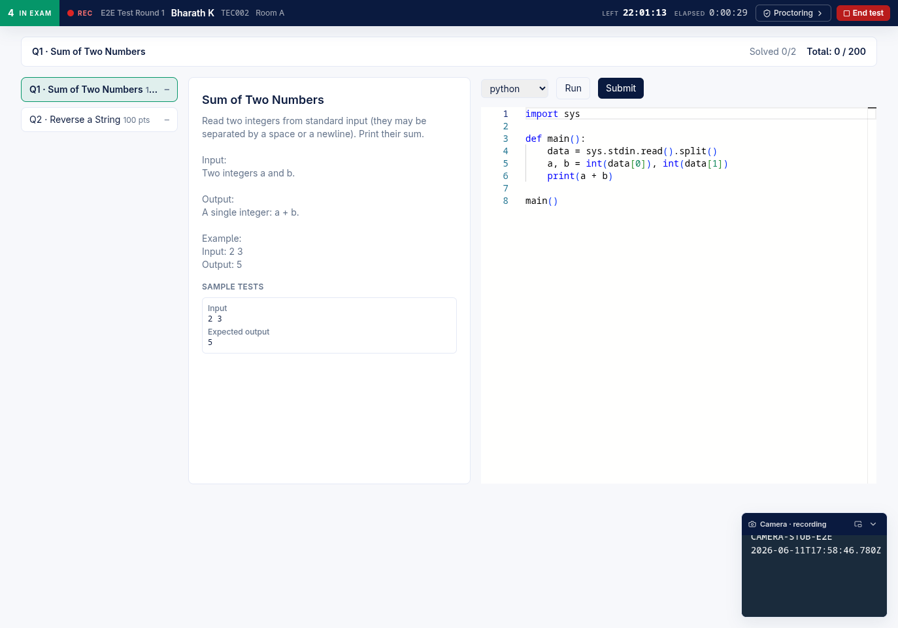
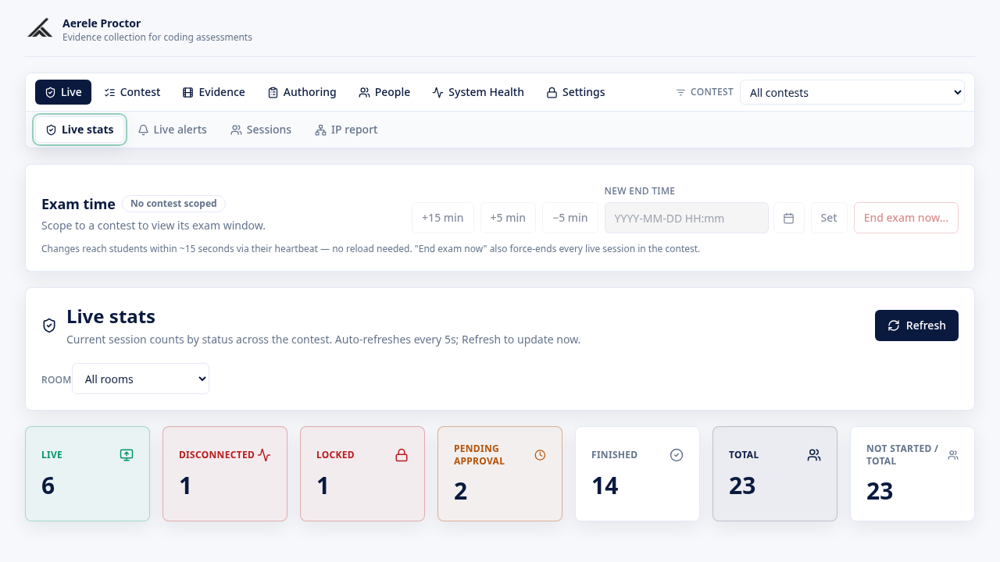

# Architecture Overview — standalone own-editor platform + optional contest-eval poller

Aerele Proctor is a **standalone own-editor exam platform**: candidates register, share their screen, and solve coding problems entirely inside our own React + Monaco workspace with Judge0-backed Run/Submit, while admins and invigilators monitor live and review the recorded evidence. A separate, **optional** Python "contest-eval" poller can additionally live-watch an externally-hosted HackerRank contest and feed cheating alerts into the same pipeline.

> **Note.** Everything below tracks the code in this repo (`backend/src/*.mjs`, `frontend/src/*.tsx|*.ts`). Anything not confirmed is marked **(unverified)**.

---

## 1. Product reframing — what this is now

Proctor began life as a "HackerRank companion proctor" where students kept the proctor tab open beside a HackerRank contest. **That framing is stale for the candidate path** (and the root `README.md` has since been rewritten to the own-editor framing). HackerRank was dropped from the candidate experience under **F8.2** (see task #29, "remove HackerRank dependency codebase-wide"). The product today is two things:

| | Component | Role | Status |
|---|---|---|---|
| **Primary** | Own-editor exam platform | Candidates do *everything* in our React + Monaco workspace; Run/Submit run against **Judge0**; evidence (screen video + events) streams to GCS. | Built and deployable to Cloud Run (see `docs/DEPLOY.md`). |
| **Secondary / optional** | `monitoring/` contest-eval poller | Live-watches an **externally-hosted** HackerRank contest and emits `source:"contest-eval"` cheating alerts into the **same** alerts pipeline the platform reads. | Still present; a separate, optional component. The "easily-startable adapter" follow-up (F8.5 / task #32) is **pending**. |

The HackerRank-companion lineage survives only as **legacy code paths** kept for backward compatibility — for example `frontend/src/studentCopy.ts` still has an `ownEditor:false` variant ("End the proctoring session only after submitting HackerRank…") that renders only in the legacy external-HR mode. The wire field is still named `hackerrank_username` (frozen for compatibility, per the F9 D1 note in `types.ts`), but the candidate-facing identity input is labelled **"Candidate ID"** (`StudentForm.candidate_id` in `frontend/src/types.ts`).

---

## 2. Three frontend surfaces (path-routed)

The frontend is a single React + Vite + TypeScript + Tailwind app. It picks a surface from `window.location.pathname` — there is no router library; the selection is a literal prefix check.

`frontend/src/App.tsx` is now a ~21-line pathname router (post-decomposition): it imports the three surface roots and dispatches on the path. The surface UI lives under per-area folders (`candidate/`, `admin/`, `invigilator/`, plus shared `ui/`, `shell/`, `coding/`, `roster/`, `results/`, `people/`, `problems/`, `markers/`, `attendance/`):

```
if (window.location.pathname.startsWith("/invigilator")) return <InvigilatorApp />;
const isAdmin = window.location.pathname.startsWith("/admin");
return isAdmin ? <AdminApp /> : <CandidateRouter />;
```

| Path | Surface | Top-level component | What it is |
|---|---|---|---|
| `/` | **Candidate** | `CandidateRouter` (`frontend/src/candidate/CandidateRouter.tsx`) → `StudentApp` recorder + Monaco workspace | Onboarding, screen-share recorder, multi-problem coding workspace. |
| `/admin` | **Admin console** | `AdminApp` (`frontend/src/admin/AdminApp.tsx`) | Contests, Templates, Problem bank, Roster/People, Live stats/Sessions/Alerts/IP/Attendance, Results, Recording review, Data lifecycle. |
| `/invigilator` | **Invigilator portal** | `InvigilatorApp` (`frontend/src/InvigilatorApp.tsx`) | Tokenized, name-only room console for a single room/contest. |

`?contest=<slug>` on any candidate URL routes the candidate into a specific contest; a typed 6-char access code resolves to the same (`/api/access-code`).

---

## 3. Candidate experience (`/`)

The candidate flow is a gated state machine (`StudentGate = "form" | "pending_approval" | "locked" | "ended" | "running"`, `frontend/src/candidate/StudentApp.tsx`). As experienced by a candidate, in order:

1. **Permissions-first onboarding** (F5.1) — before anything else, the app requires the **screen share** to be live and confirmed ("stage 1, before fullscreen"). The recorder **refuses anything but Entire Screen** — sharing a tab, window, or browser is rejected and recording will not start (`frontend/src/studentCopy.ts`: *"choose Entire Screen — not a tab, window, or browser. Tab/window sharing is rejected and recording will not start."*). Clipboard permission is requested but is **optional and never blocks onboarding** (FIX-B3 #1).
2. **Fullscreen-first** — the enforcement shell holds the candidate in fullscreen; exits trigger the enforcement ladder (see §3.1).
3. **Roster unique-ID identity confirm** — when the contest has a roster, the candidate types their unique ID (label is contest-configured, e.g. "Candidate ID"); the backend re-verifies it (`POST /api/roster/lookup`, then `POST /api/session/start` which re-checks `roster_unique_id`). For **person-mode** contests a `409 college_choices` response presents a college picker (`types.ts` `CollegeChoice`).
4. **Room start gate** (optional, S3) — if `room_gate_enabled`, the candidate waits at a room-code screen until the invigilator releases a 6-digit code or presses "Start now" (`POST /api/session/room-gate`).
5. **Multi-problem Monaco workspace** (S-I) — the start/resume response carries an **ordered `problems[]`**; each problem has a statement, sample tests, languages, and optional **per-language starter stubs** (`stubs`, F12.2; falls back to a generic scaffold when absent). The editor ships a **curated autocomplete** (F12.3 / task #52). Languages: `python | cpp | java | javascript` (`ExecRequest` in `types.ts`).
6. **Run / Submit against live Judge0** — `POST /api/exec/run` (sample tests, visible results) and `POST /api/exec/submit` (hidden tests; response is verdict + pass/fail counts only, **no per-test array** — `SubmitResult` in `types.ts`). Per-`(session, problem)` cooldowns and a submit budget apply (see §7 config).

During the exam itself (own-editor session, recording, released) **the workspace is the page** (redesigned 2026-06-12): a slim ~40 px proctoring strip on top (stage block, pulsing REC, identity, time left/elapsed, Proctoring-panel toggle, End test), a collapsible always-mounted proctoring panel, and a floating bottom-right camera dock. The cue is flipped — healthy = the slim strip; an anomaly episode = a big fixed full-width red banner; the locked screen owns the viewport (`shellHeaderMode()` in `frontend/src/shell/examShell.ts`). Pre-start/waiting/resume/legacy screens keep the classic layout. See [candidate-flow.md](./candidate-flow.md).



A browser reload **resumes** the same session verbatim without re-collecting details (`POST /api/session/resume`), restoring per-problem submit history (`submissions_summary`).

### 3.1 Fullscreen-enforcement ladder (F5.3/F5.5)

Server-validated knobs. The defaults live in `backend/src/templates.mjs` (where `normalizeTemplateEnforcement` allow-lists and defaults the enforcement object on every template/contest); the runtime reads them off the resolved `enforcement` object in `backend/src/enforcement.mjs`:

| Knob | Default | Source |
|---|---|---|
| `enforcement.fullscreen_reentry_seconds` | **20** | `FULLSCREEN_REENTRY_DEFAULT_SECONDS` (`templates.mjs`) |
| `enforcement.fullscreen_exit_limit` | **2** | `FULLSCREEN_EXIT_LIMIT_DEFAULT` (`templates.mjs`) |
| `enforcement.mode` | **`block`** | `normalizeTemplateEnforcement` defaults the mode to `"block"` (`templates.mjs`); other modes are `alert_first` |

The server decides lock vs alert on `POST /api/session/enforcement-violation`. In `block` mode a violation locks the session (`locked_reason: "fullscreen_enforcement"`); per-session **exemptions** (`fullscreen`, `switch_away`) can be granted by an admin (`session-action "exempt"`) or invigilator, and apply live within one heartbeat. An invigilator can release a single fullscreen lock with an unlock code (`POST /api/session/unlock-gate` + the invigilator unlock routes).

### 3.2 What is recorded

The recorded screen `.webm` is the **direct screen stream + mixed microphone audio**. The camera is **never mixed into that video**: when enabled (F10.1 — **default ON**, 10 fps, 640 px wide, `CAMERA_RECORDING_DEFAULTS = { enabled: true, fps: 10, width: 640 }`) it records as a **separate low-res, video-only chunk series** (`kind: "camera"`) with its own upload chain, alongside the live self-view; per-source capture states are tracked (`CaptureState` in `types.ts`). Since the 2026-06-12 fix wave, chunk indexes for both series are **monotonic across recording restarts** (sessionStorage + server high-water marks, plus a server-side bump in `/api/upload-url`), so a restarted stint can never overwrite a prior stint's chunks.

---

## 4. Admin console (`/admin`)

A single password-gated console (`x-admin-password` vs `ADMIN_PASSWORD`, timing-safe — `lib/auth.mjs` `requireAdmin`). The frontend ships only a **sha256 hash** (`VITE_ADMIN_PASSWORD_HASH`) and hashes the typed password to compare.

Navigation (redesigned 2026-06-12) is one header card: six **section tabs** — Live (Live stats/Live alerts/Sessions/IP report), Contest (Contests/Attendance/Results), Evidence (Review/Recordings), Authoring (Problems/Templates), People, Settings — with the **contest scope picker top-right** (it scopes every screen; the selection persists in the tab's URL `?contest=`), a second row for the active section's views, per-section last-view memory, and an open-alert badge on Live (`frontend/src/admin/adminNav.ts`; see [admin-live-monitoring.md](./admin-live-monitoring.md)).



Surfaces, each with its backing routes:

| Admin surface | What the admin does | Backing route(s) |
|---|---|---|
| **Contests** | Create/update/archive contests, regenerate access code + invigilator key, set exam window, rooms. | `GET/POST /api/admin/contests`, `contest-update`, `contest-status`, `contest-regenerate`, `contest-exam-time` |
| **Templates** | Author/store reusable contest blueprints; instantiate a contest from one (snapshot-copies problems + defaults). | `GET /api/admin/templates`, `template`, `POST templates`, `template-update`, `template-archive`, `template-clone`, `template-delete` |
| **Problem bank** | Author problems with statement, sample + **hidden tests**, languages, limits, scoring, tags, starter stubs. | `GET /api/admin/problems`, `problem`, `POST problems`, `problem-delete` |
| **Roster + rooms + colleges/persons** | Upload per-contest roster (compulsory college column → canonicalization gate → person identity); read roster meta. | `GET/POST /api/admin/roster`; identity pipeline in `identity.mjs` |
| **Live stats** | Counts by status (live/locked/pending/finished + derived disconnected) with a room dropdown; console auto-polls. | `GET /api/admin/stats` |
| **Sessions** | List sessions, lightweight recording picker, one-session detail card, candidate event stream, bulk session actions, per-user detail CSV. | `GET /api/admin/sessions`, `recording-sessions`, `sessions-list`, `session-detail`, `session-events`; `POST session-action`, `session-details` |
| **Alerts console** | List alerts newest-first with room/severity/source filters, archive/unarchive, video deep-links; per-type alert config. | `GET /api/admin/alerts`, `POST alert-action`, `GET/POST alert-settings` |
| **IP report** | IP-wise clusters of logged-in users (proxy-detection signal) with drill-down. | `GET /api/admin/ip-report` |
| **Attendance** | Roster-based taken / not-taken counts. | `GET /api/admin/attendance` |
| **Exam time** | Live end-time control (absolute, extend delta, or force-end-now); the Live-stats card follows the contest scope and reads/writes the scoped contest's own window. | `POST /api/admin/contest-exam-time` |
| **Results + People** | Per-contest scoreboard (rank / per-problem / integrity), bulk selection + "selection done"; cross-round person scorecards. | `GET /api/admin/contest-results`, `POST contest-selection`, `contest-selection-done`; `GET /api/admin/people`, `person` |
| **Evaluation** | Run the deterministic integrity + talent evaluation over a contest's sessions (batched); read scorecards / poll batch status. The Evaluation tab page itself is `/eval-ui`, served by `eval-server.mjs` (see §11). | `POST /api/admin/contest-evaluate`, `GET contest-evaluations`, `contest-evaluate-status` |
| **Recording review** | Screen + camera chunk playback with an events/alerts/submission timeline; multi-reviewer YES/NO queue. | `GET /api/admin/submission-events`, `session-events`; `review-roster`, `review-next`, `review-verdict`, `review-mine`, `reviews`; component `frontend/src/RecordingReview.tsx` |
| **Pre-test health check** | Admin pre-flight canary that probes the live stack with real auth (config/signing/Judge0/bundle reachability) before a round. | `POST /api/admin/health-check` |
| **Data lifecycle** | Export → triple-gated purge → tombstone; retention sweep. | `POST /api/admin/contest-export`, `contest-purge`, `retention-sweep` |

> **Caveat:** the distributed reviewer **queue** (review-roster/claims/verdicts) is still candidate-norm-keyed, so person-mode review-queue serving does not resolve (the recording **player** does). Person-mode submission-timeline markers are also a pending follow-up.

---

## 5. Invigilator portal (`/invigilator`)

A tokenized, name-only room console (`InvigilatorApp.tsx`). Auth is `x-invigilator-password` checked by `requireInvigilatorFor` (`lib/auth.mjs`): the credential is accepted when it is (a) the admin password, (b) the **named contest's `invigilator_key`**, or (c) the global `INVIGILATOR_PASSWORD` (demoted to an Aerele-staff fallback). A contest key never authenticates another contest. The portal identifies candidates by **name/roll/username — never by `session_id`** (the session_id is the candidate's write-endpoint bearer token, deliberately withheld; `InvigilatorSessionRow` in `types.ts`).

What an invigilator can do, with backing routes (route bodies live in `backend/src/routes/invigilator.mjs` via `makeInvigilatorRoutes(ctx)`, dispatched from `handler.mjs`):

| Action | Route |
|---|---|
| Room overview (which rooms, gate on/off) | `GET /api/invigilator/overview` |
| Room stats + session rows + shared alerts | `GET /api/invigilator/room` |
| Release the 6-digit room **start** code | `POST /api/invigilator/release-code` |
| "Start now" — open the whole room | `POST /api/invigilator/open-room` |
| Per-student enforcement **exemption** toggle | `POST /api/invigilator/exempt` |
| Mint / release a fullscreen **unlock** code | `POST /api/invigilator/unlock-code` |
| Unlock a specific locked session | `POST /api/invigilator/unlock` |

**Selective alerts (default OFF):** alerts only reach the invigilator dashboard for types the admin explicitly opted in via the per-type `show_to_invigilator` flag. The default for **every** proctor alert type is `show_to_invigilator: false` (`DEFAULT_PROCTOR_ALERT_SETTINGS` in `backend/src/proctorAlerts.mjs`) — i.e. nothing is shared with invigilators until an admin checks the box. The portal projection also strips free-text `detail` and `session_id` (`InvigilatorAlert` in `types.ts`).

---

## 6. Backend (one Cloud Run handler, decomposed into route + domain factories)

The backend is a **single Cloud Run HTTP handler**, `backend/src/handler.mjs`, now a **thin-ish composition root** (~2.3k LOC, down from ~5.6k): imports → `loadConfig()` env destructure → non-env constants → the **factory-composition block** (each domain instantiated once at module scope) → the **dispatch table** (a flat list of `if (method && path === "...") return ...` lines) → the `corsOrigin` export → a small tail of still-resident route bodies. Any unmatched path → `404`. CORS allows `GET,POST,OPTIONS` (`PUBLIC_APP_ORIGIN`, default `*`).

**Decomposition is behavior-preserving and substantially complete** (the decomp B-ladder, B0–B14). Route bodies were moved VERBATIM into `make<Domain>Routes(ctx)` factories; `handler.mjs` instantiates each factory and destructures the returns into the EXACT names the dispatch table uses, so the dispatch table stays byte-identical (canaryIsolation). The conventions are documented in the `handler.mjs` top-of-file comment and the decomposition plan. What is split out, wired back via factories/injection at handler module scope:

| Module | Owns |
|---|---|
| `config.mjs` | `loadConfig()` — the env-derived config (the single env-reading site besides `handler.mjs`; env-lint guard pins it). |
| `lib/auth.mjs` | `makeAuth(ctx)` factory → `requireAdmin`, `requireInvigilator(For)`, `requireApiKey`, `requireSweepAuth`, `adminActor`. |
| `lib/clients.mjs` | Firestore/Storage/Judge0 singletons + test-injection seams; `bucket()`, signed-URL helpers. |
| `lib/http.mjs`, `lib/sanitize.mjs`, `lib/sessionStore.mjs` | HTTP helpers, input sanitizers/normalizers, session-doc store. |
| `proctorAlerts.mjs`, `enforcement.mjs` | The alert-raising + fullscreen-enforcement DOMAIN factories shared across the telemetry / gate / start-resume route groups. |
| `routes/invigilator.mjs` | The 7 invigilator route bodies. |
| `routes/adminTemplates.mjs`, `routes/adminProblems.mjs`, `routes/adminContests.mjs` | Admin template / problem-bank / contest-lifecycle CRUD. |
| `routes/adminStats.mjs`, `routes/adminPeople.mjs`, `routes/results.mjs`, `routes/review.mjs` | Admin stats dashboard, People tab, Results trio, multi-reviewer recording review. |
| `routes/adminSessions.mjs` | Admin session-management (sessions / recordings / drill-down / detail / events / ip-report / attendance / session-action / session-details). |
| `routes/submissionEvents.mjs`, `routes/alerts.mjs`, `routes/evaluation.mjs` | Poller submission markers, alert routes, candidate-evaluation routes. |
| `routes/sessionGates.mjs`, `routes/sessionTelemetry.mjs`, `routes/exec.mjs`, `routes/public.mjs` | Candidate session gates, telemetry (upload/events/heartbeat), code-exec, public config + roster login. |
| `routes/session.mjs` | Candidate session-lifecycle (start / resume / validate-end / end) + the live-slot lock machinery. |
| `routes/healthCheck.mjs` | The admin pre-test health-check (real-auth canary) route. |

The `backend/src/routes/` directory holds **18** route-factory modules in all (`invigilator`, `public`, `exec`, `session`, `sessionGates`, `sessionTelemetry`, `alerts`, `submissionEvents`, `review`, `results`, `evaluation`, `healthCheck`, `adminContests`, `adminProblems`, `adminTemplates`, `adminStats`, `adminPeople`, `adminSessions`).

**Feature/domain modules** (imported by `handler.mjs`): `execQueue.mjs`, `problems.mjs`, `contests.mjs` (the `scopedQuery` contest-scope chokepoint), `identity.mjs`, `templates.mjs`, `contestProblems.mjs`, `scoreboard.mjs`, `people.mjs`, `ipReport.mjs`, `dataLifecycle.mjs`, `judge0Adapter.mjs`, and the `evaluation*.mjs` engine (`evaluation`, `evaluationClone`, `evaluationMetrics`, `evaluationRecommend`, `evaluationReplay`). **Still resident in `handler.mjs`:** the data-lifecycle selection / export / purge / retention-sweep route cluster (deliberately resident pending a future `routes/dataLifecycle.mjs` step) plus the central **dispatch table** itself (the flat `if (method && path === "…") return …` list every factory's handlers are wired into) and a few cross-factory helpers kept single-source.

**Auth model** (all timing-safe via `safeEqual`, all closed-by-default when the secret is unset):

| Header | Compared against | Guards |
|---|---|---|
| `x-admin-password` | `ADMIN_PASSWORD` | all `/api/admin/*` |
| `x-invigilator-password` | contest `invigilator_key` OR `INVIGILATOR_PASSWORD` (admin password also accepted) | `/api/invigilator/*` |
| `x-api-key` | `ALERTS_INGEST_API_KEY` | `POST /api/alerts` |
| `x-api-key` / `x-admin-password` | `RETENTION_SWEEP_API_KEY` / admin | `POST /api/admin/retention-sweep` |
| *(none — knowing `session_id`)* | — | candidate write endpoints |

---

## 7. State — Firestore + GCS

All env-derived collection names come from `config.mjs` `loadConfig()`. There are **21** Firestore collections (`config.mjs` defines 21 `*_COLLECTION` keys), each independently overridable by env (defaults shown):

| Config key | Default collection | Holds |
|---|---|---|
| `SESSION_COLLECTION` | `proctor_sessions` | session docs (lifecycle, identity, IP, counters) |
| `SETTINGS_COLLECTION` | `proctor_settings` | schedule, alert settings, per-contest roster meta |
| `ALERTS_COLLECTION` | `proctor_alerts` | the shared alerts pipeline |
| `SUBMISSION_EVENTS_COLLECTION` | `proctor_submission_events` | submission-time timeline markers |
| `LIVE_LOCK_COLLECTION` | `proctor_live_locks` | single-active-session live-slot locks |
| `REVIEW_STATE_COLLECTION` | `proctor_review_state` | recording-review state |
| `REVIEW_COLLECTION` | `proctor_reviews` | reviewer verdict records |
| `REVIEW_CLAIMS_COLLECTION` | `proctor_review_claims` | reviewer claims |
| `SUBMISSIONS_COLLECTION` | `proctor_submissions` | stored submissions (with hidden-test detail) |
| `RUN_EVENTS_COLLECTION` | `proctor_run_events` | persisted Judge0 Run events (sample-test runs) |
| `PROBLEMS_COLLECTION` | `proctor_problems` | the problem bank |
| `EDITOR_EVENTS_COLLECTION` | `editor-events` | GCS sub-prefix label for editor events |
| `ROSTER_COLLECTION` | `proctor_roster` | per-contest roster entries |
| `ROOM_GATES_COLLECTION` | `proctor_room_gates` | room start/unlock gates |
| `CONTESTS_COLLECTION` | `proctor_contests` | contest docs |
| `COLLEGES_COLLECTION` | `proctor_colleges` | canonical colleges |
| `PERSONS_COLLECTION` | `proctor_persons` | durable persons (identity spine) |
| `ENROLLMENTS_COLLECTION` | `proctor_enrollments` | person × contest rows |
| `ADMIN_AUDIT_COLLECTION` | `proctor_admin_audit` | admin action audit log |
| `TEMPLATES_COLLECTION` | `proctor_templates` | contest templates |
| `EVALUATIONS_COLLECTION` | `proctor_evaluations` | computed integrity + talent scorecards (evaluation engine) |

**Evidence (GCS):** `EVIDENCE_BUCKET` holds video chunks, event JSONL, and manifests, keyed off one persisted `storage_prefix` per session: `contests/<slug>/sessions/<username_norm>/<session_id>/…` (legacy `sessions/<username_norm>/<session_id>/…` when no contest URL). Signed read/write URLs expire after `URL_EXPIRY_SECONDS` (default **900**). Alert `video_key`s are resolved to short-lived signed `download_url`s **at read time, never stored** (`lib/clients.mjs` `resolveSignedReadUrl`).

**Selected tunables (`config.mjs`, env-overridable):**

| Key | Default | Purpose |
|---|---|---|
| `EXEC_RUN_COOLDOWN_SECONDS` | 5 | min seconds between Run calls per (session, problem) |
| `EXEC_SUBMIT_COOLDOWN_SECONDS` | 20 | min seconds between Submit calls |
| `EXEC_MAX_SUBMISSIONS_PER_SESSION` | 50 | submit budget per session |
| `EXEC_RUN/SUBMIT/POLL_CONCURRENCY` | 2 / 4 / 16 | Judge0 lane concurrency |
| `DISCONNECTED_STALENESS_MS` | 45000 | liveness staleness → `disconnected` |
| `GATE_ATTEMPT_LIMIT` | 20 | room-gate brute-force cap (safe-defaulted on bad env) |
| `URL_EXPIRY_SECONDS` | 900 | signed-URL lifetime |

> Note: for a real exam, `EXEC_SUBMIT_COOLDOWN_SECONDS≈20` and `EXEC_MAX_SUBMISSIONS_PER_SESSION≈200` are set at deploy via env, not code.

---

## 8. Identity model — `person_id = "{college_norm}~{uid_norm}"`

Person-mode contests use a durable person identity that is **stable across contests** — the multi-round spine. Code: `backend/src/identity.mjs`.

- `personIdOf(collegeNorm, uniqueIdNorm)` → `` `${collegeNorm}~${uniqueIdNorm}` `` (`identity.mjs` 95–97). The separator is **`~`** (`PERSON_ID_SEPARATOR`), chosen because it sits **outside** the sanitized component charset `[a-zA-Z0-9._-]`, making `personIdOf` injective by construction (no two `(college, uid)` pairs can forge each other's separator) and safe as a Firestore doc id / GCS path segment / URL.
- Composite ids are **never parsed back apart**; their components are always stored as adjacent fields.
- A roster upload runs a **locked validation order** (`identity.mjs` 169–177): compulsory college column → college **canonicalization gate** (map-or-confirm new college names) → duplicate `(college_norm, unique_id_norm)` hard-reject → same-uid-different-college allowed-with-warning → blank-id skip.
- **Enrollment** = a stable `proctor_enrollments` row keyed `{contest_slug}::{person_id}` — the **person × contest** key that carries scores, selection status, and the final snapshot. Sessions/submissions are stamped with `person_id` so a person's results join across rounds (the cross-round scorecard).

Legacy contests use `username_norm` (bare `identityNorm`); the person-model backfill stamps `person_id` onto existing sessions/submissions without renaming any frozen key.

---

## 9. Shared Alert JSON contract — one pipeline, two producers

Both producers — the **proctor** backend (`source:"proctor"`) and the **contest-eval** poller (`source:"contest-eval"`) — emit the **same `Alert` shape** and land in the one `ALERTS_COLLECTION`, which the admin console reads. The contract is defined in `frontend/src/types.ts` (`Alert`). Required on ingest: `source`, `type`, `severity`, `timestamp`, `hackerrank_username`, `title`. The `id` is stable + idempotent (e.g. `"<source>:<type>:<username_norm>:<contest_slug>:<dedupe>"`), so re-ingesting merges rather than duplicates.

Ingest is `POST /api/alerts` (`x-api-key`, **closed-by-default** — rejects all if the key is unset; `lib/auth.mjs` `requireApiKey`). A bare object or a batch (`{alerts:[…]}`) is accepted.

**Proctor alert types** — every type is **enabled by default**, `show_to_invigilator` **false by default** (`DEFAULT_PROCTOR_ALERT_SETTINGS` in `backend/src/proctorAlerts.mjs`):

| Type | Default severity |
|---|---|
| `recording_stopped` | critical |
| `screen_share_stopped` | critical |
| `recording_error` | critical |
| `fullscreen_enforcement` | critical |
| `ip_changed` | warning |
| `tab_hidden` | warning |
| `tab_away` | warning (`threshold_seconds` default 12; consumed by the monitoring tab-away detector) |
| `disconnected` | warning |

`invalid_share_surface` was **removed** from the catalog — the recorder now refuses to record on a non-Entire-Screen surface, so the event can never fire (stored alerts of that type still display). Contest-eval alert types (`peer_copy_cluster`, `recurring_pair`, `web_paste`, `first_attempt_solve`, `tough_first_attempt`) are configured in `monitoring/alert-config.json`, not in the admin console — **(unverified in this pass; documented from `types.ts` and the root README, not re-read from `monitoring/`)**.

---

## 10. Optional video-worker merge service

`video-worker/src/server.mjs` is an **optional** Cloud Run service that merges a session's screen chunks into one review video and writes `merged_video_key` back onto the session doc. It is **NOT deployed by default** — and the alert→recording deep-link falling back to the chunk player (vs deploying the video-worker) is a **pending** follow-up. Consequently, when the worker is not deployed, alert deep-links and recording review **play the raw chunks** rather than a merged video.

---

## 11. Full HTTP route inventory (77 routes)

There are **77 unique routes**, extracted from every `path === "…"` dispatch site in the backend: **74** `/api/*` routes dispatched from the main handler `backend/src/handler.mjs` (route *bodies* live in the `routes/*.mjs` factories — §6 — but the central dispatch table is in `handler.mjs`), plus **3** `/eval-ui/*` page routes served by the separate proctor-eval entrypoint `backend/src/eval-server.mjs` (NOT `handler.mjs`). The root [`README.md`](../../README.md) HTTP API reference is the canonical, fuller per-route table (method · auth · purpose); this section is the grouped at-a-glance map. Unmatched path → `404`. Grouped by family:

**Candidate session (auth: knowing `session_id`, or time-window gate on start)**
`POST /api/session/start` · `/api/session/resume` · `/api/upload-url` · `/api/events` · `/api/editor-events` · `/api/review-file` · `/api/heartbeat` · `/api/session/beacon` · `/api/session/validate-end` · `/api/session/end` · `/api/session/room-gate` · `/api/session/enforcement-violation` · `/api/session/unlock-gate`

**Candidate exec (Judge0)**
`POST /api/exec/run` · `/api/exec/submit`

**Public (no auth)**
`GET /api/exam-config` · `POST /api/access-code` · `POST /api/roster/lookup`

**Admin — contests & templates** (`x-admin-password`)
`GET/POST /api/admin/contests` · `contest-update` · `contest-status` · `contest-regenerate` · `contest-set-code` · `contest-exam-time` · `contest-selection` · `contest-selection-done` · `GET /api/admin/templates` · `template` · `POST templates` · `template-update` · `template-archive` · `template-clone` · `template-delete`

**Admin — problems**
`GET /api/admin/problems` · `problem` · `POST problems` · `problem-delete`

**Admin — roster / people**
`GET/POST /api/admin/roster` · `GET /api/admin/people` · `person`

**Admin — monitoring & sessions**
`GET /api/admin/sessions` · `recording-sessions` · `sessions-list` · `session-detail` · `session-details` · `session-events` · `stats` · `ip-report` · `attendance` · `POST session-action`

**Admin — submission events**
`POST /api/submission-events` · `GET /api/admin/submission-events`

**Admin — results, evaluation & lifecycle**
`GET /api/admin/contest-results` · `POST contest-export` · `contest-purge` · `retention-sweep` · `POST /api/admin/contest-evaluate` · `GET contest-evaluations` · `contest-evaluate-status`

**Admin — pre-test health check**
`POST /api/admin/health-check`

**Alerts**
`POST /api/alerts` (`x-api-key`) · `GET /api/admin/alerts` · `POST alert-action` · `GET/POST alert-settings`

**Admin — recording review**
`POST /api/admin/review-roster` · `GET review-roster` · `POST review-next` · `review-verdict` · `GET review-mine` · `reviews`

**Invigilator** (`x-invigilator-password`)
`GET /api/invigilator/overview` · `room` · `POST release-code` · `open-room` · `exempt` · `unlock-code` · `unlock`

**Evaluation pages — served by `eval-server.mjs` (proctor-eval), not `handler.mjs`**
`GET /eval-ui` · `/eval-ui/app.js` · `/eval-ui/recommend.js`

---

## Related

- [`../ROADMAP.md`](../ROADMAP.md) — design background and roadmap
- [`../proctoring-research.md`](../proctoring-research.md) — threat model & proctoring research
- [`../platform-alternatives.md`](../platform-alternatives.md) — platform alternatives evaluated
- [`../README.md`](../README.md) — the documentation index (start here for the full page map)
- [`../../README.md`](../../README.md) — repo root README

> Per-feature deep dives now live alongside this page under `docs/features/` (candidate flow, enforcement ladder, the admin-console surfaces, the invigilator portal, the alert taxonomy, and the optional contest-eval poller). See the documentation index at [`../README.md`](../README.md) for the full map.
