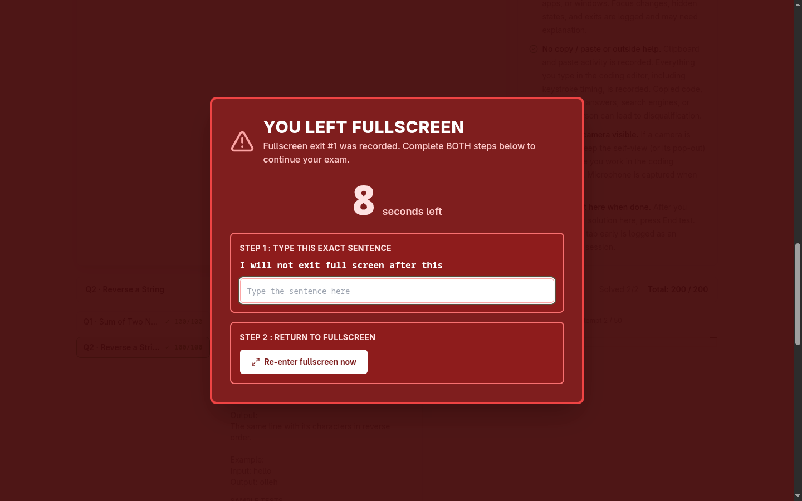
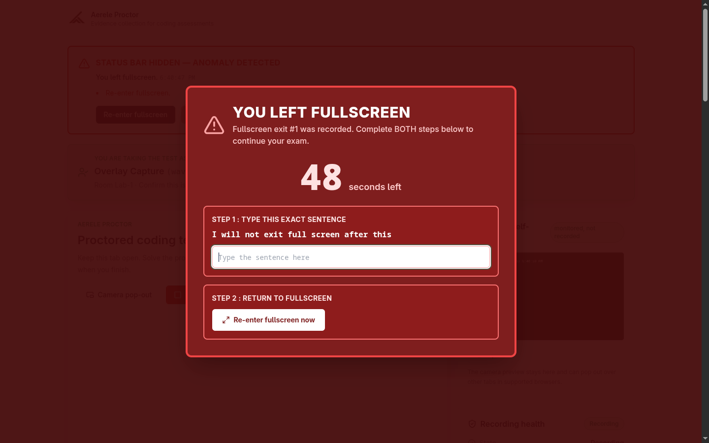
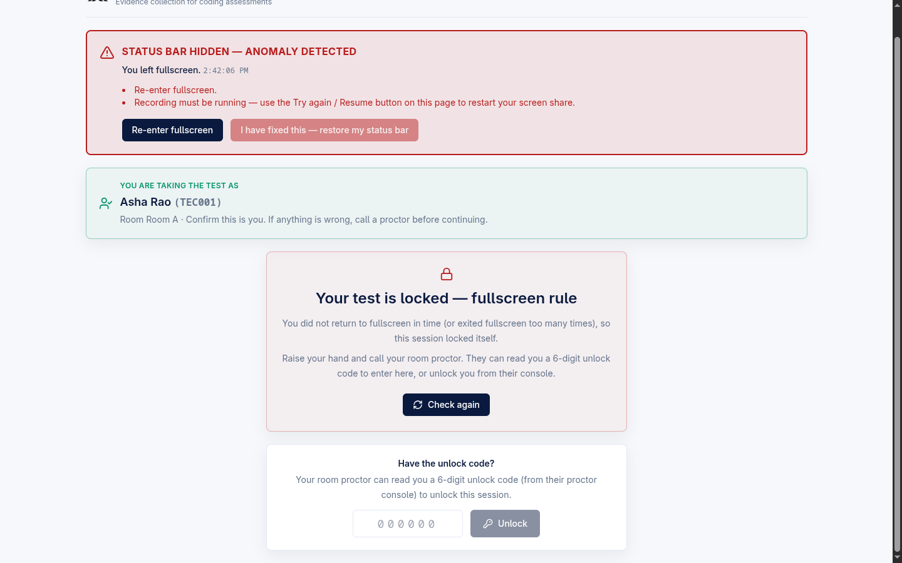
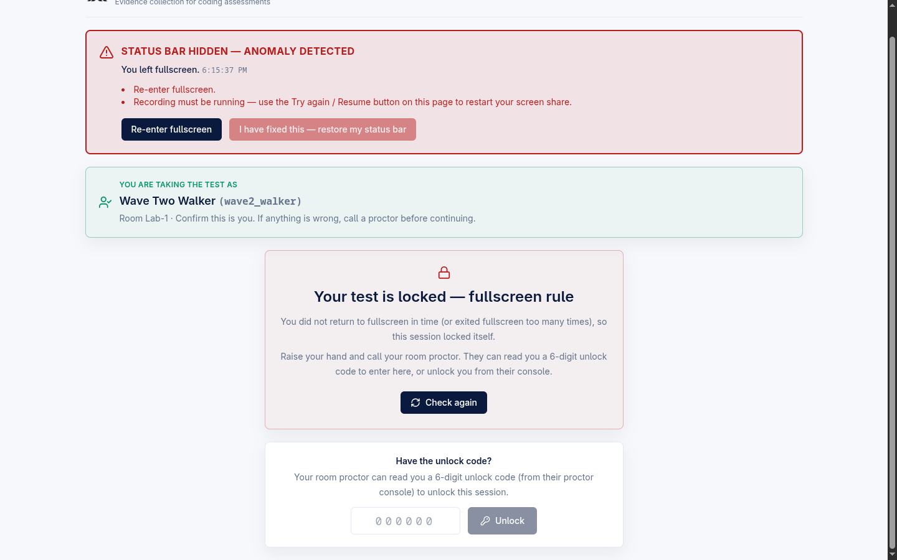
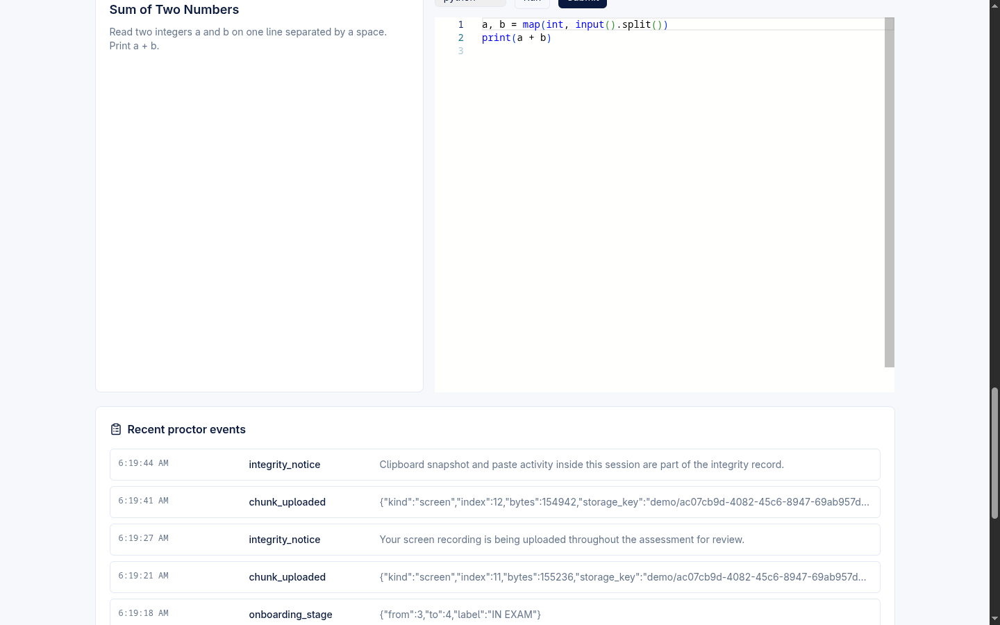

# Fullscreen Enforcement Ladder — L1 typed-ack and L2 lock with unlock codes

This page documents how the Aerele proctor platform keeps a candidate inside
fullscreen during a recording exam: a two-rung escalation ladder that first
**blocks** with a self-serve takeover overlay (L1) and, only if the candidate
fails to comply, **locks** the session (L2) so a proctor must intervene. It also
covers the related switch-away debounce and the per-session exemptions that turn
the ladder off for legitimate environment problems.

Aerele proctor is a **standalone, own-editor exam platform**: candidates write,
Run, and Submit code inside our React + Monaco workspace against a Judge0-backed
executor. (HackerRank was removed from the candidate path in F8.2; an
**optional** `monitoring/` contest-eval poller still exists separately for
externally-hosted contests and feeds the same alerts pipeline — see
[Related](#related). This page is about the own-editor candidate path.)

## Where the code lives

The entire ladder is a **pure state machine** with thin React glue and three
backend routes. A developer should start here:

| Concern | File |
|---------|------|
| Pure reducer (no React/DOM/network) | `frontend/src/shell/enforcement.ts` |
| Switch-away debounce reducer (pure) | `frontend/src/shell/switchAway.ts` |
| React glue: tick, POST, persistence | `frontend/src/shell/useEnforcement.ts` |
| Takeover overlay UI | `frontend/src/shell/EnforcementOverlay.tsx` |
| Candidate unlock-code entry panel | `UnlockCodePanel` in `frontend/src/App.tsx` |
| Wiring + locked screen + admin settings UI | `frontend/src/App.tsx` (`StudentApp`, `AdminSettings`) |
| Backend violation/unlock routes | `backend/src/handler.mjs` |
| Invigilator unlock / unlock-code / exempt | `backend/src/routes/invigilator.mjs` |

> Decomposition note: the backend was partially split into `lib/*.mjs`,
> `routes/invigilator.mjs`, and `config.mjs` (B0/B1, behaviour-preserving), but
> that refactor is **paused/partial** — the dispatch table and most session-route
> bodies (including the two `/api/session/...` enforcement routes) still live in
> `backend/src/handler.mjs`.

### Backing routes

| Route | Purpose |
|-------|---------|
| `POST /api/session/enforcement-violation` | Candidate reports the L1 ladder tripped; **the server** decides lock vs alert-only (`sessionEnforcementViolation` in `handler.mjs`). |
| `POST /api/session/unlock-gate` | Candidate releases an enforcement lock with the room's 6-digit unlock code (`sessionUnlockGate` in `handler.mjs`). |
| `POST /api/invigilator/unlock-code` | Mint / re-display / regenerate the room's enforcement-unlock code (`invigilatorUnlockCode` in `routes/invigilator.mjs`). |
| `POST /api/invigilator/unlock` | Release one student's enforcement lock from the room dashboard (`invigilatorUnlock`). |
| `POST /api/invigilator/exempt` | Toggle a per-student enforcement exemption (`invigilatorExempt`). |
| `POST /api/admin/session-action` | Admin `unlock` / `exempt` actions (`applySessionAction` in `handler.mjs`). |

## Configuration (admin)

An admin sets the ladder's three knobs under the proctor **Settings** tab
(`AdminSettings` in `App.tsx`). They ride exam-config / session start / heartbeat
so changes apply to a live session. Every value is NaN-guarded server-side
(`enforcementConfig` in `handler.mjs`), so a corrupt or blank setting falls back
to its default rather than stranding candidates.

| Setting (admin label) | Field | Default | Meaning |
|-----------------------|-------|---------|---------|
| Fullscreen re-entry countdown (seconds, blank = 20) | `fullscreen_reentry_seconds` | **20** | L1 countdown to type the phrase and re-enter fullscreen. Minimum 1. |
| Fullscreen exit limit (exits beyond this lock, blank = 2) | `fullscreen_exit_limit` | **2** | Exits **beyond** this count escalate straight to L2. `0` = the first exit escalates immediately. |
| Enforcement mode | `enforcement_mode` | **`block`** | `block` = countdown expiry / exit limit **locks** the test. `alert_first` = raise a critical alert, **never** auto-lock. |

The defaults are also the client fallbacks in `App.tsx` (`reentrySeconds ?? 20`,
`exitLimit ?? 2`, `mode ?? "block"`), so the out-of-the-box behaviour is
**block mode, 20-second countdown, lock after more than 2 exits**.

## L1 — blocking (self-serve resume)

**Candidate POV.** While the session is **recording**, leaving fullscreen (the
candidate exits fullscreen, and the exit is not an `expected` one) raises a
full-screen, unmissable red **takeover overlay** (`EnforcementOverlay.tsx`,
`role="alertdialog"`, fixed over everything). The overlay headline is **"You
left fullscreen"** and shows which exit number was recorded. To resume, the
candidate must complete **both** steps within the countdown:

- **Step 1** — type the exact phrase `I will not exit full screen after this`
  (constant `FULLSCREEN_ACK_PHRASE`). The input blocks paste and drop, so the
  phrase must be typed by hand.
- **Step 2** — click **Re-enter fullscreen now** to return to fullscreen.

When **both** conditions hold (`ackOk` and `fullscreen`), the episode resolves to
`idle`, the overlay unmounts, the top bar is restored, and a
`fullscreen_enforcement_ack` event is emitted — a **self-serve resume** with no
proctor needed. This is the `tryResolve` transition in `enforcement.ts`.

The same overlay, captured during a wave-2 verification run with the countdown at
48 seconds (a deployment configured with a longer re-entry window):

Key blocking-phase behaviours (all in `enforcement.ts`):

- **Reload cannot restart the countdown.** The episode deadline is stored as an
  **absolute** wall-clock time (`deadlineMs`) and persisted per session
  (`serializeEnforcementState` → localStorage key `aerele-proctor-enforcement-<sessionId>`).
  A reload mid-block re-engages the overlay with the **original** deadline, so F5
  is not an escape hatch.
- **The phrase must be retyped per episode.** `ackOk` is deliberately **not**
  persisted (`serializeEnforcementState` comment), so after a reload the candidate
  must type the sentence again. A fresh L1 episode also always mounts with an
  empty box.
- An exit **while already blocking** does **not** extend the countdown — the
  existing deadline is kept (`fullscreen_exit` branch in `enforcementReducer`).
- `exitCount` counts the **session**, not the episode — it is never reset when an
  episode resolves; it resets only after a proctor unlock (see L2).

## L2 — locking (proctor release required)

**How L2 is reached** (block mode). Either:

1. the L1 **countdown expires** (`tick` → `violate(..., "countdown_expired")`), or
2. the candidate **exceeds the exit limit** — more than `fullscreen_exit_limit`
   unexpected exits this session (`fullscreen_exit` → `violate(..., "exit_limit")`).

On either trigger the client POSTs `/api/session/enforcement-violation`. **The
server decides the consequence from its own settings, never the client**
(`sessionEnforcementViolation` → `applyEnforcementViolation` in `handler.mjs`):

- raises a critical `fullscreen_enforcement` alert (admin-configurable display;
  disabling the alert never disables the lock — policy lives in
  `enforcement_mode`);
- in **`block`** mode, sets the session `status: "locked"` with
  `locked_reason: "fullscreen_enforcement"` and returns `{ locked: true }`;
- in **`alert_first`** mode, alerts only and returns `{ locked: false }` — the
  client then holds the overlay in an `alert_hold` state with a "your proctor has
  been alerted" banner (no lock).

When the server confirms a block-mode lock, the candidate app flips its gate to
**locked** and shows the locked screen — headline **"Your test is locked —
fullscreen rule"** — telling the candidate to raise their hand and call the room
proctor.

The same locked screen reached via L1 countdown expiry during a wave-2 run:

### Server-side reconciliation (defence in depth)

The candidate POST is only the **fast path**. A client that blocks that single
URL or clears its localStorage ladder used to neutralise the hard block. The
server now **derives the same violations from evidence it already receives**
(`reconcileFullscreenEnforcement` in `handler.mjs`): it counts unexpected
`fullscreen_exit` events and uses the heartbeat's `fullscreen` field plus a
re-entry grace window (`ENFORCEMENT_COUNTDOWN_GRACE_SECONDS = 15`) to close the
countdown server-side. Exempt sessions are skipped; `alert_first` mode alerts
without locking, matching the self-report path.

### Releasing an L2 lock

There are three release paths. All of them reset the exit ladder
(`fullscreen_exit_count` / `fullscreen_out_since` → 0/null) so a single later
accident is an L1 episode again, not an instant re-lock.

**1. Candidate enters the room's unlock code** (`UnlockCodePanel` in `App.tsx` →
`POST /api/session/unlock-gate`). The locked screen shows a **"Have the unlock
code?"** panel with a 6-digit numeric entry. The room proctor reads the candidate
a code; on a match the session returns to `active`.

> The unlock code is a **separate** code from the room **start** OTP
> (`gate.unlock_otp`, its own namespace). In an OTP-gated room every candidate
> already typed the start code, so accepting it here would make the L2 lock
> self-serve — by design it is rejected (`sessionUnlockGate` comment in
> `handler.mjs`).

The candidate panel maps backend error codes to plain guidance:

| Error code | Candidate message (paraphrased) |
|------------|---------------------------------|
| `invalid_code` | "That code is not valid… the unlock code is NOT the code you started with." |
| `too_many_attempts` | "Too many attempts — only a proctor can unlock now." (cap = `GATE_ATTEMPT_LIMIT`, default **20**, in `config.mjs`) |
| `no_unlock_code` | "Your room proctor hasn't issued an unlock code yet." (a missing code does **not** burn an attempt) |
| `not_enforcement_locked` | "This lock can only be released by a proctor." (admin locks are not code-releasable) |

**2. Invigilator unlocks from the room console.** The invigilator portal shows a
per-student **Unlock** button **only** on enforcement locks
(`InvigilatorApp.tsx`, `unlockStudent` → `POST /api/invigilator/unlock`) and an
**Enforcement unlock code** card to release / regenerate the room's 6-digit code
(`releaseUnlock` → `POST /api/invigilator/unlock-code`). Admin locks stay
admin-released — an invigilator cannot undo a deliberate admin lock
(`not_enforcement_locked`).

**3. Admin unlocks** from the console (`POST /api/admin/session-action` with
`action: "unlock"`, `applySessionAction` in `handler.mjs`).

After any release, the candidate client resets to a fresh ladder
(`useEnforcement.ts` "lock was SERVED" effect). The screenshot below shows a
candidate workspace **resumed after a code unlock** (the Sum-of-Two-Numbers
problem editor with the proctor event log flowing again):

> Note: this screenshot illustrates the **post-unlock resumed workspace**, not
> the code-entry moment itself.

## `alert_first` mode (no lock)

When the admin sets **Enforcement mode = Alert first**, an L1 trip does **not**
lock. The overlay stays mounted in the `alert_hold` phase with a banner —
worded by the trigger (`alertHoldMessage` in `enforcement.ts`):

- exit-limit trigger → "You exited fullscreen too many times…"
- countdown trigger → "Time expired…"

The candidate can still self-resolve by completing both steps, or wait for an
invigilator. No screenshot of `alert_first` mode is available in
`night-run/evidence/` **(unverified by screenshot)**; the behaviour is verified
in code (`EnforcementOverlay.tsx` `phase === "alert_hold"` branch and
`enforcement.ts`).

## Per-session enforcement exemptions (F5.5)

For legitimate environment problems (e.g. a flaky projector hook stealing focus),
an admin or invigilator can **exempt one student** from `fullscreen` and/or
`switch_away` enforcement.

**Invigilator POV.** Each room-dashboard row has **Fullscreen** and
**Switch-away** exemption toggles (`ExemptionToggle` in `InvigilatorApp.tsx` →
`POST /api/invigilator/exempt`, merge semantics). **Admin POV.**
`POST /api/admin/session-action` with `action: "exempt"`.

**Effect.** An exempt fullscreen session **never engages the overlay**:

- The exemption is delivered live to the candidate via the heartbeat config; the
  client's `config_change` action **releases any active overlay immediately**
  (`enforcementReducer` `config_change` branch, `useEnforcement.ts`
  `exemptFullscreen` effect). This is the "heartbeat-delivered release".
- Exits on an exempt session ride the event pipeline as plain anomalies
  (`fullscreen_exit` short-circuits when `config.exemptFullscreen`), the soft S1
  treatment — no takeover.
- The **server-side check is authoritative**: even a stale client that missed the
  heartbeat can never lock an exempted candidate
  (`sessionEnforcementViolation` returns `{ exempt: true }`).

**Default: exemptions are OFF.** New sessions start with
`enforcement_exemptions: {}` (`handler.mjs`); a candidate is exempt only after an
explicit admin/invigilator toggle.

## Switch-away debounce (F5.4) — notify, do not block

Leaving the exam by switching windows/tabs (`window_blur` /
`visibility_change(hidden)`) is handled by a **debounce**, not a block
(`switchAway.ts`). Repeated away signals within a rolling **30-second** window
(`SWITCH_AWAY_WINDOW_MS`) collapse into **one** episode; when the window passes
the episode closes and a single `switch_away_episode` event carrying
`{count, duration_ms}` is emitted to the proctor pipeline.

- `count` is the number of **distinct excursions** (not-away → away transitions),
  not raw signals — one tab switch fires both `window_blur` and
  `visibility_change(hidden)`, and the reducer deliberately does not double-count
  the pair (wave-3 fix).
- An away-only episode (candidate leaves and never returns) reports its duration
  up to the **close** time, not the blur instant (wave-2 fix), so it is not lost.
- The **client never blocks on switch-away** (explicit F5.4 decision). The
  backend's threshold-based `tab_away` alerting (admin-configurable) decides
  whether an episode is alert-worthy — the proctor reviews video, then acts.
- Switch-away tracking runs **only while recording** (`useEnforcement.ts`); idle
  blurs while arranging windows are ignored.

A `switch_away` exemption (F5.5) suppresses the alert only, not the recording of
the raw events.

## Alert visibility default

The `fullscreen_enforcement` alert defaults to `enabled`, `severity: "critical"`,
and **`show_to_invigilator: false`** (`DEFAULT_ALERT_SETTINGS` in `handler.mjs`).
So out of the box the enforcement alert is raised and visible in the **admin**
console but is **not** pushed into the invigilator portal's selective alert feed
unless an admin shares that type. (Invigilators still see the per-student lock
state and the Unlock button regardless, because that comes from the room/session
data, not the alert feed.)

## State machine quick reference

Phases in `enforcement.ts` (`EnforcementPhase`):

| Phase | Meaning |
|-------|---------|
| `idle` | No active enforcement; normal exam. |
| `blocking` | L1 overlay up, countdown running; self-serve resume possible. |
| `locking` | Violation reported, block mode; session is being / has been locked. |
| `alert_hold` | `alert_first` mode; overlay holds with a "proctor alerted" banner, no lock. |

A reported violation stays **pending** and is **re-POSTed** on the 1-second tick
every `REPORT_RETRY_MS` (5 s) until the server returns a verdict, so a single
dropped request never strands a candidate in a dead overlay while the server
shows a healthy session (wave-2 fix, `enforcement.ts` / `useEnforcement.ts`).

## Related

- [Candidate Flow — onboarding to Run/Submit workspace](./candidate-flow.md)
- [Architecture Overview](./architecture-overview.md)
