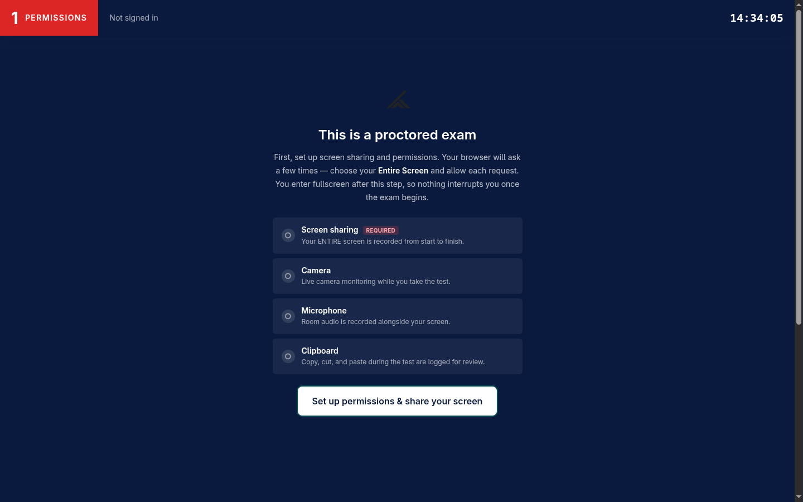
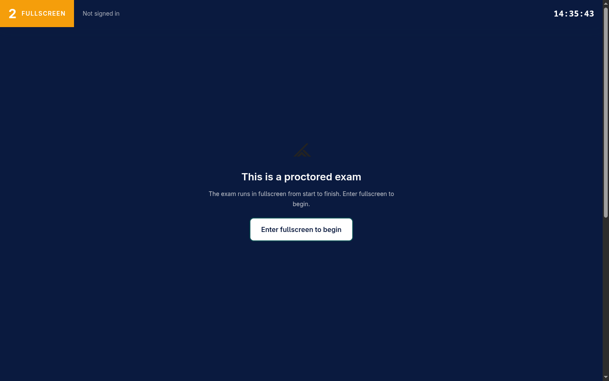
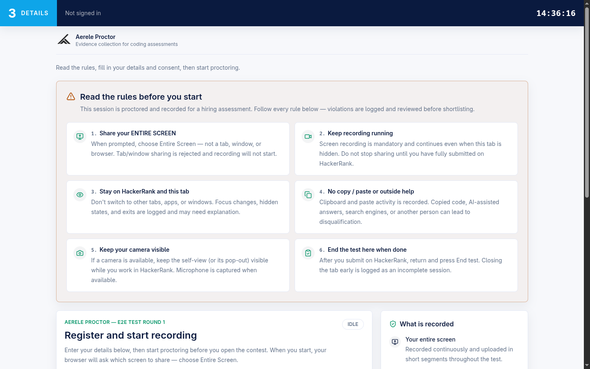
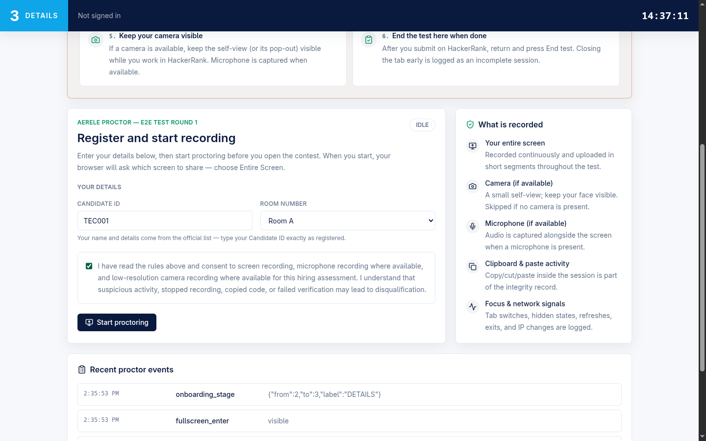
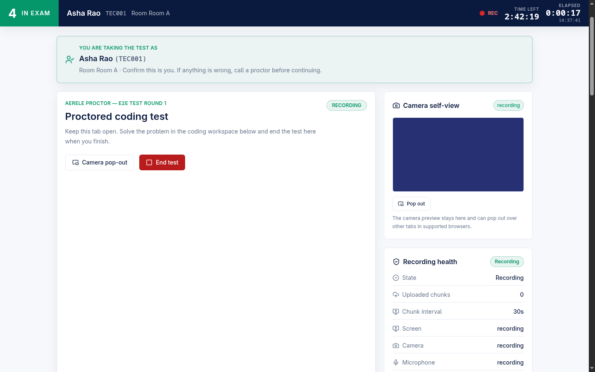
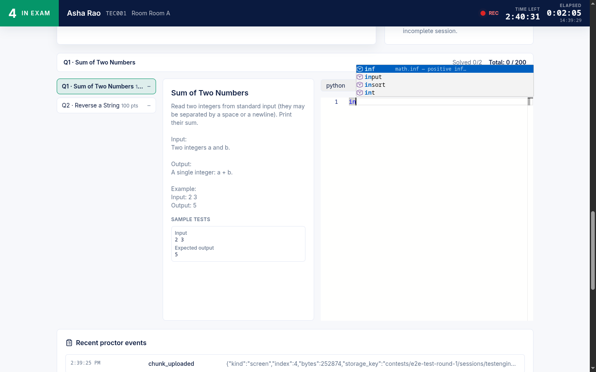
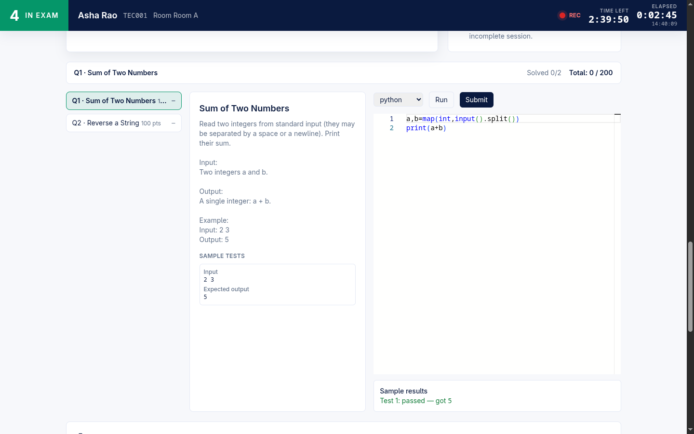
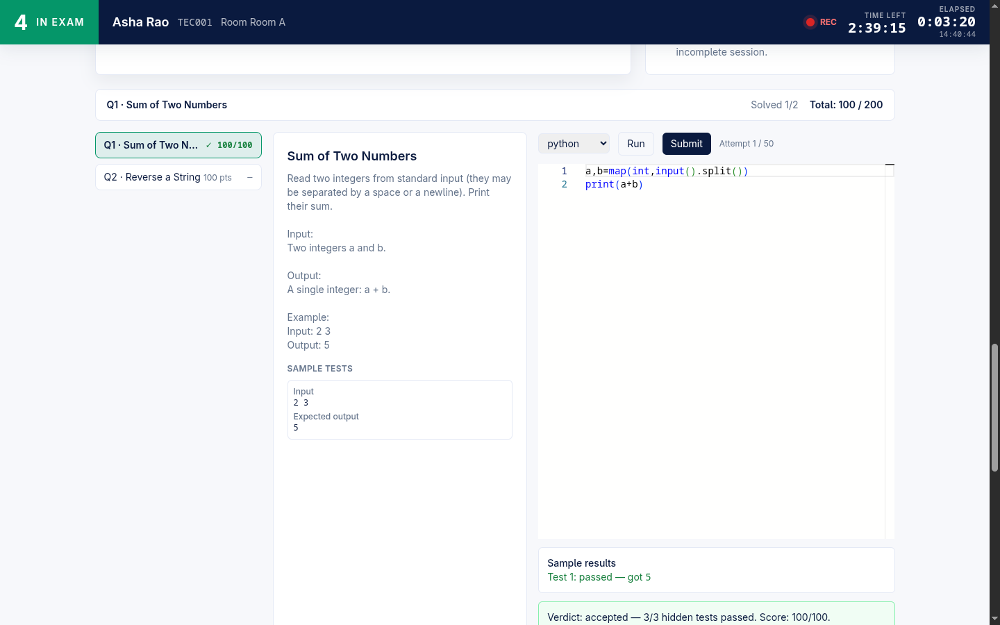
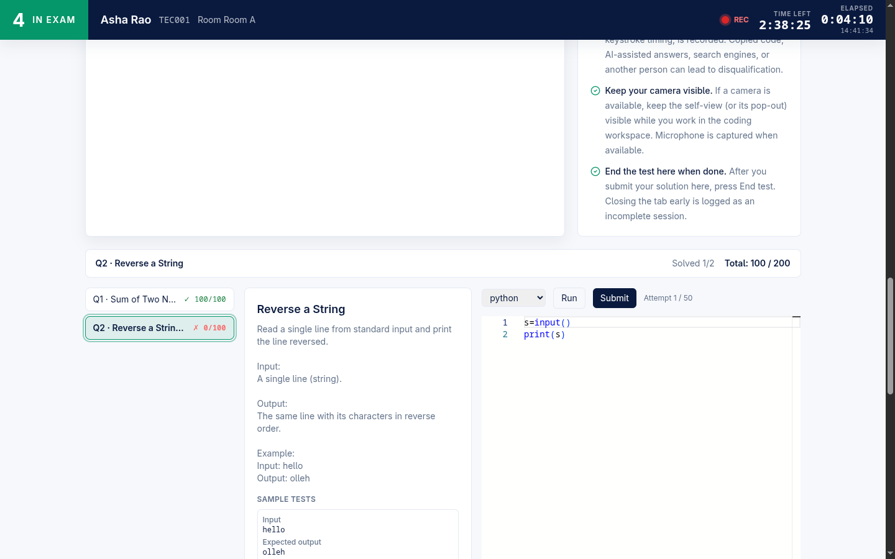
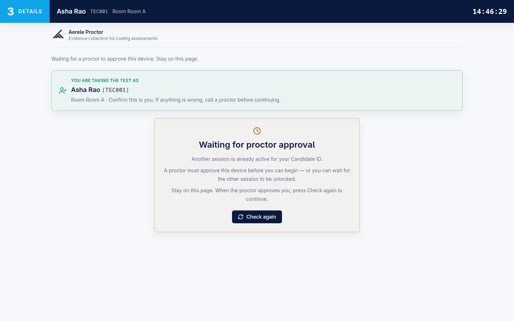

# Candidate Flow — permissions-first onboarding to Run/Submit workspace

This page documents what a candidate experiences from the moment they open the
Aerele proctor exam link to the moment they end their test, and names the
backing routes/components so a developer can find the code. Aerele proctor is a
**standalone, own-editor exam platform**: candidates write, Run, and Submit code
entirely inside our React + Monaco workspace against a Judge0-backed executor.
(HackerRank was removed from the candidate path in F8.2; an **optional**
`monitoring/` contest-eval poller still exists separately for externally-hosted
contests and is not part of this flow — see [Related](#related).)

The candidate app is a single React app (`frontend/src/App.tsx`, the
`StudentApp` component). Onboarding is a strict **5-stage** ladder rendered by
the exam shell (`frontend/src/shell/examShell.ts`), and the stage is derived
**purely** from `permissionsReady → fullscreen → gate/status` so a stage can
never be skipped.

| Stage | Label | Gate before it advances |
|------:|-------|--------------------------|
| 1 | PERMISSIONS | Entire-screen share is live (camera/mic/clipboard optional) |
| 2 | FULLSCREEN | Document is in fullscreen |
| 3 | DETAILS | Identity confirmed + form valid + consent + recording started (+ room released if room gate is on) |
| 4 | IN EXAM | Solve in the Monaco workspace; Run/Submit live |
| 5 | DONE | Test ended |

Stage metadata (label + colour) lives in `STAGE_META`; the derivation contract
is `deriveStage()` in `frontend/src/shell/examShell.ts`.

---

## Stage 1 — Permissions first (F5.1)

**Candidate POV.** Before anything else, the candidate sees a "This is a
proctored exam" gate that asks them to **share their Entire Screen** and allow
**camera, microphone, and clipboard** — all browser prompts fire here, *before*
fullscreen. The reason: a permission dialog can drop the page out of fullscreen,
so we collect every prompt first, then enter fullscreen, so nothing interrupts
the candidate once the exam begins.

A single "Set up permissions & share your screen" button drives the flow on the
first attempt; after any attempt, per-item statuses and retry buttons take over
(`permissionsAttempted()` in `frontend/src/shell/permissions.ts`).

**What is required vs optional.**

| Permission | Required? | Notes |
|------------|-----------|-------|
| Screen sharing | **Required (hard gate)** | Must be the **Entire Screen / monitor** — the recorder rejects any tab/window/browser surface |
| Camera | Optional | Denials are recorded for the proctor, never blocking |
| Microphone | Optional | Room audio rides the screen recording |
| Clipboard | Optional | Copy/cut/paste during the test are logged |

Only the screen share unlocks Stage 2 (`permissionsReady()` returns true once
`screen === "granted"`). Camera/mic/clipboard keep optional semantics: each
denial is audited but never blocks onboarding. The clipboard primer is raced
against a ~3.5 s timeout so a hanging clipboard prompt can never wedge
onboarding (`CLIPBOARD_PRIMER_TIMEOUT_MS`, `primeClipboardWithTimeout()` in
`permissions.ts`).

**Recording starts here, on a verified monitor surface only.** The screen
stream is acquired by `acquireScreenShareStream()`
(`frontend/src/useProctorRecorder.ts`), which inspects the track's
`displaySurface`: if it is anything other than `"monitor"`, the stream is
stopped and an `InvalidShareSurfaceError` is thrown **before** any recording
begins (it also emits an `invalid_share_surface` audit event). The recorder
*refuses* a non-monitor share.

- Component / gate: `PermissionsGate` (in `App.tsx`), visibility from
  `permissionsGateVisible()`.
- Acquisition helpers: `acquireScreenShareStream()`,
  `acquireCameraMicrophone()` (camera+mic → camera-only → mic-only fallback
  ladder, never throws), `useProctorRecorder.ts`.

---

## Stage 2 — Fullscreen first (anti-proxy gate)

**Candidate POV.** With permissions set, the candidate is asked to enter
fullscreen. The hint reads: *"Permissions are set. The exam runs in fullscreen
from start to finish — enter fullscreen to continue."*

Fullscreen is required **before** identity is collected, so a candidate cannot
fill in someone else's details in a small window and hand the laptop over. The
overlay renders only at Stage 2 (`fullscreenGateVisible()` in
`examShell.ts`); the component is `FullscreenGate` in `App.tsx`.

**Note (unverified):** the precise "anti-proxy" rationale is reflected in the
stage ordering and code comments; this page documents the observable ordering
(fullscreen before the details form), which is enforced by `deriveStage()`.

---

## Stage 3 — Details: unique-ID identity confirm

**Candidate POV.** Inside fullscreen, the candidate confirms **who they are**
before filling the rest of the form. For a roster-backed contest they enter
their **unique ID**, press **Find me**, and the server returns the matched
record (name, roll, room, masked email) for them to confirm with **"Yes, this
is me."**

The lookup component is `IdentityLookupPanel` (`App.tsx`). It is a two-step
panel: *Step 1 — confirm your identity* (ID entry + "Find me"), then an *"Is
this you?"* confirmation card showing the matched fields, with "Yes, this is me"
/ "No — search again". Once confirmed it collapses to a compact
"Identity confirmed: `<id>`" bar with a "Not you? Re-enter ID" reset.

- Lookup route: `POST /api/roster/lookup` (`rosterLookup()` in `handler.mjs`).
  Returns only the **minimum confirmation set** — mapped name/roll/room/username
  plus a **masked** email; the raw email and any unmapped columns never leave
  via this route. The route is rate-limited per IP (M3); see
  `rosterLookupErrorMessage()` in `frontend/src/shell/candidateRouting.ts` for
  the candidate-facing error copy (429 wait-and-retry, 404 "not on the student
  list").

On confirm, the form is **pre-filled** from the roster record (name / roll /
email / room). Roster-sourced fields drive the rest of the page so the candidate
does not retype registered data:

**Form modes.** What "Start proctoring" requires depends on the contest's
identity mode (`candidateFormMode()` / `candidateFormReady()` in
`candidateRouting.ts`):

| Mode | What gates "Start proctoring" |
|------|-------------------------------|
| `person_roster` | unique ID + room + consent (roster supplies name/roll/email server-side) |
| `person_open` | candidate ID + name + valid email + room + consent (roll optional) |
| `legacy` | unique ID (if roster required) + candidate ID + name + roll + valid email + room + consent |

Room is chosen from a pre-fed dropdown (with an "Other…" free-text fallback) via
`RoomField` (`App.tsx`); it falls back to a plain text field when no rooms are
configured.

**Room-gate waiting variant.** When a contest enables the room gate
(`room_gate_enabled`), recording starts but the workspace is held back: the
candidate waits at a 6-digit **`RoomCodePanel`** until the invigilator releases
the room (or does a start-now bypass). The exam-shell stage stays at 3 while
`examReleased` is false (`deriveStage()` returns `examReleased ? 4 : 3`), and the
hint reads *"Recording is active. Waiting for your room's exam code to be
released."*

- Backing flag: `room_gate_enabled` on the start response
  (`startResponse()` in `handler.mjs`); client gate in `App.tsx`
  (`examGateActive`), poll via `pollRoomGate`.

---

## F12.1 — Email field no longer drops fullscreen

**The bug it fixes.** On the DETAILS page (Stage 3, already in fullscreen),
focusing the **Email** field used to trigger Chrome's native email/address
autofill popup, which dropped the document out of fullscreen and re-prompted the
fullscreen gate — an exam blocker.

**The fix.** Every detail-field `<input>` is rendered with autofill suppression
so no native popup can appear: `autoComplete="off"`, a **stable non-email-like**
`name="f_<slug>"` that defeats Chrome's field-name heuristic, plus
`data-1p-ignore` / `data-lpignore="true"` / `data-form-type="other"` for
password managers. The email field is treated as plain text rather than
`type=email`. The helper is `autofillSuppressionProps()` /
`autofillFieldName()` in `frontend/src/shell/autofill.ts`.

**Transient pre-exam fullscreen loss is non-punitive.** Anomalies only vanish
the top bar and increment the flag chip **while actively recording**: the
top-bar reducer ignores any anomaly event whose `recording` flag is false
(`topBarReducer` in `examShell.ts` — `if (!verdict.anomaly || !action.recording)
return { state, emit: null }`). Because recording does not start until the form
is submitted, a fullscreen blip during Stages 1–3 raises no flag and is not
counted against the candidate.

---

## Stage 4 — Workspace: multi-problem Monaco + Run/Submit

Once recording is live (and the room is released), the candidate lands in the
own-editor workspace. The contest's problems come from the server on the
start/resume response (`problems[]`, with a single-problem `problem` alias).

- Container: `MultiProblemWorkspace`
  (`frontend/src/coding/MultiProblemWorkspace.tsx`). With **≥2** problems it
  renders a left **problem switcher** (per-problem status chips + points) and a
  header showing *Solved x/y* and *Total: earned / possible*. A **single**
  problem (and the legacy deployment) renders the exact pre-S-I single-pane
  layout — no sidebar, no header (`showProblemSidebar()`).
- Presentational pane: `ProblemPane` in
  `frontend/src/coding/CodingWorkspace.tsx` — statement, sample tests, language
  picker, Monaco editor, Run/Submit buttons.

### Per-language starter stubs (F12.2)

Each editor opens pre-loaded with starter code for the chosen language. A
problem may ship **author-supplied per-language stubs**; when it doesn't, a
generic read-stdin/print-stdout scaffold is used. The single resolver is
`starterFor()` (`CodingWorkspace.tsx`): a problem stub wins, else the generic
`STARTERS` map (`python` / `cpp` / `java` / `javascript`). Switching language
replaces the code **only if it is still the previous language's untouched
starter** (`nextCodeOnLanguageSwitch()`), so real work is never clobbered. A
saved draft from a resume takes precedence over both (`initialPane()` in
`MultiProblemWorkspace.tsx`).

### Curated autocomplete (F12.3)

The editor offers a hand-picked library/function autocomplete list per language
— "we test problem-solving, not memory." This is **v1 by design: no language
server, no LSP, no web-workers** — just a static curated Monaco completion
provider (`registerCuratedCompletions()` /
`getCompletions()` in `frontend/src/coding/completionProviders.ts`). Built-in
word suggestions stay on; this only *adds* a curated provider. Coverage includes
Python builtins + `math`/`collections`/`itertools`/`heapq`/`bisect`, C++ STL
containers + `<algorithm>`, Java `java.util`/IO, and JS array/string/`Math`
methods.

### Run (sample) vs Submit (hidden), live Judge0

| Action | Tests run | Result shown | Route |
|--------|-----------|--------------|-------|
| **Run** | **Sample** tests only (visible) | Per-test passed/failed + captured stdout; sample input/expected echoed back | `POST /api/exec/run` (`execRun()` in `handler.mjs`) |
| **Submit** | **Hidden** tests | A single verdict (Accepted / Wrong answer / error) + score; stored | `POST /api/exec/submit` (`execSubmit()` in `handler.mjs`) |

Both call the live Judge0 executor through `judge0Adapter.mjs`
(`makeJudge0Adapter().runBatch()`), batched, polled, with bounded concurrency
lanes (`execQueue.mjs`). Network is disabled on every submission
(`enable_network: false`). The submit verdict is derived from counts only:
all-passed → `accepted`; any judging timeout (infra) → `error` (never silently
"wrong answer"); otherwise `wrong_answer`. The score comes from
`scoreSubmission()`. **Hidden test inputs/expected are never returned** to the
candidate — the submit response carries only the verdict, passed/total counts,
and score.

### Server cooldowns + submit budget

Run and Submit are rate-limited **server-side, per (session, problem)**. A
rejected request returns the server's `retry_after_seconds`, and the button
shows a live countdown ("Run (5s)" / "Submit (20s)") — the client never
double-accounts (`handleExecError()` in `MultiProblemWorkspace.tsx`;
`runCooldownSeconds` / `submitCooldownSeconds` props on `ProblemPane`). Stored
submissions are capped per session; on reaching the cap the Submit button
disables and the pane shows "Submission limit reached… your best score so far is
kept."

| Limit | Env var | Default |
|-------|---------|---------|
| Run cooldown | `EXEC_RUN_COOLDOWN_SECONDS` | 5 s |
| Submit cooldown | `EXEC_SUBMIT_COOLDOWN_SECONDS` | 20 s |
| Stored submissions per session | `EXEC_MAX_SUBMISSIONS_PER_SESSION` | 50 |

(Defaults from `backend/src/config.mjs`. The budget is surfaced to the client as
`submit_budget` on the start response and drives the "Attempt N / budget" meter.)

Editor activity (`code_run`, `code_submit`, focus/keystroke batches, and
`problem_switched` markers) is batched and posted via `POST /api/editor-events`
(`ingestEditorEvents()` in `handler.mjs`).

---

## The 5-stage top bar (status-bound timer, F5.7)

A persistent top bar shows the stage block (1–5), the candidate name + room, and
a clock. The bar is rendered by the exam shell and is present on every branch
**except during an anomaly episode and on the locked screen**
(`topBarVisible()`). The room label is normalised so "Room A" is never
double-prefixed (`formatRoomLabel()`).

- **Vanish on anomaly.** When the candidate leaves fullscreen, blurs the window,
  hides the tab, or stops the screen share *while recording*, the bar vanishes
  and a permanent flag chip (⚑) increments once per episode; it restores only
  when fullscreen + visibility + recording all hold again (`topBarReducer`,
  `anomalyFromEvent`, `topBarVisible` in `examShell.ts`). The flag chip survives
  a reload (per-session persistence via `serializeShellState` /
  `deserializeShellState`); the durable record is the server event stream
  (`topbar_hidden` / `topbar_restored`).
- **Status-bound timer (F5.7).** The elapsed count-up ticks **only while
  actively recording and not ended**; the moment status/gate report ended (or
  "ending"/"error"), it freezes (`elapsedTimerActive()`). Exam *time left* comes
  from the authoritative server end time echoed on every heartbeat, so a
  proctor's live time change propagates within one heartbeat (≤15 s) — no reload
  (`onExamTimeChange` in `useProctorRecorder.ts`).

---

## Reload resumes the same session; second device → pending approval

**Reload.** A reload does not lose the session. The session token is persisted
(`sessionStorageKeyFor()` in `candidateRouting.ts`), and on load the app calls
`POST /api/session/resume` (`resumeSession()` in `handler.mjs`) to restore the
**same** session **without re-collecting details**. Because media streams never
survive a reload, the candidate reruns Stage 1+2 (permissions + fullscreen) and
then presses **"Resume recording"** — recording resumes on a fresh user gesture
(`resumeRecording()` in `App.tsx`). Per-problem code drafts are restored from
`localStorage`.

**Second device → pending approval.** If a *different* device/browser starts a
session for a candidate who already has a live (active/locked/pending) session,
the second start is created as **`pending_approval`** so two live sessions never
run at once. The decision is made atomically by acquiring the live-slot lock
(`acquireLiveSlot()`; `startSession()` in `handler.mjs`). The candidate sees a
"Waiting for proctor approval" screen — *"Another session is already active for
your Candidate ID."* — with a **Check again** button (`BlockedScreen` in
`App.tsx`). A proctor approves the device (or the candidate waits for the other
session to be unlocked/ended).

**Identity model.** Under person identity, `person_id` is
`"{college_norm}~{uid_norm}"`, stable across contests, so the same person recurs
across rounds by design (`backend/src/identity.mjs`).

---

## Recording: screen + separate low-res camera (F10.1, default ON)

Two independent recordings run during the exam, both uploaded to GCS in ~30 s
chunks (`useProctorRecorder.ts`):

1. **Screen** — a direct display-media stream (chosen so capture survives a
   hidden proctor tab), with the microphone mixed in. Chunks upload as
   `kind: "screen"`.
2. **Camera** — when enabled, a **separate** low-res, video-only MediaRecorder
   on the raw camera track (eye-movement evidence), with its **own** chunk
   series and upload chain. Any camera failure degrades to `mediaState.camera =
   "error"` and an audit event and **never** touches the screen recording (no
   `onFatalError`, no retry loop). Chunks upload as `kind: "camera"`.

| Camera setting | Default | Bounds |
|----------------|---------|--------|
| `enabled` | **ON** (true) | only an explicit `false` disables |
| `fps` | 10 | 1–15 (out-of-range falls back to default) |
| `width` | 640 | 320–1280 (out-of-range falls back to default) |

Defaults and normalisation: `CAMERA_RECORDING_DEFAULTS` in
`frontend/src/cameraRecording.ts` (backend-parity rules). The recorder starts
the camera MediaRecorder only when the server enabled it **and** a live camera
track exists (`shouldRecordCamera()`). The candidate sees a "Camera self-view"
preview with a pop-out option and a "Recording health" panel (screen / camera /
microphone states) in the workspace sidebar.

---

## Inline recovery + integrity-assurance to end

Onboarding/recording failures recover **inline** — never a forced reload that
could orphan a session:

| Situation | What the candidate sees / does |
|-----------|--------------------------------|
| Shared a tab/window instead of the whole screen | "Share your ENTIRE screen — press the button again and pick the whole screen." (`invalid_surface`, `screenShareFailureMessage()`) |
| Cancelled / blocked the screen share | "Screen share was cancelled or blocked. Press the button again, choose your Entire Screen, and Allow." (`share_cancelled`) |
| Screen sharing stopped mid-exam | A recoverable "Resume screen share" prompt + spoken warning; logged, tab must stay open |
| End-submit failed after recording stopped | Stays on a recoverable "error" state with an inline **Retry** (`retryEnd()` in `App.tsx`) — no reload, so the session is never orphaned as incomplete |

**Ending the test.** The candidate presses **End test**, which opens an
`EndTestPanel` (`App.tsx`) with a required **integrity-assurance checkbox**:
*"I assure that I worked independently, did not copy, did not use AI/external
help, and submitted only my own solution."* "End and close session" is disabled
until the box is checked. On end, the client calls
`POST /api/session/validate-end` then stops the recorder, uploads the final
chunk, and calls `POST /api/session/end` with the manifest and
`assuranceAccepted` (`stop()` in `App.tsx`; `validateEndSession()` /
`endSession()` in `handler.mjs`).

When done, Stage 5 (DONE) shows *"Your test is complete. You may close this
tab."*

---

## Related

- [candidate-enforcement-ladder.md](./candidate-enforcement-ladder.md) — the fullscreen-enforcement ladder (L1 typed-ack → L2 lock + unlock codes).
- [admin-roster-rooms-identity.md](./admin-roster-rooms-identity.md) — roster upload, rooms, and the `person_id` identity model behind the login step.
- [admin-problems-stubs-autocomplete.md](./admin-problems-stubs-autocomplete.md) — the Problem bank, hidden tests, per-language stubs, and curated autocomplete the workspace serves.
- [admin-contests-templates.md](./admin-contests-templates.md) — Contests + Templates, the access code, and `?contest=` routing.
- [admin-live-monitoring.md](./admin-live-monitoring.md) · [admin-results-people.md](./admin-results-people.md) · [admin-recording-review.md](./admin-recording-review.md) · [admin-data-lifecycle.md](./admin-data-lifecycle.md) — the admin console surfaces.
- [invigilator-portal.md](./invigilator-portal.md) — tokenized name-only auth, room stats, unlock codes, enforcement exemptions, selective alerts.
- [contest-eval-monitoring.md](./contest-eval-monitoring.md) — the optional `monitoring/` poller for externally-hosted HackerRank contests (feeds the same alerts pipeline).
- [architecture-overview.md](./architecture-overview.md) — the full platform tour.
