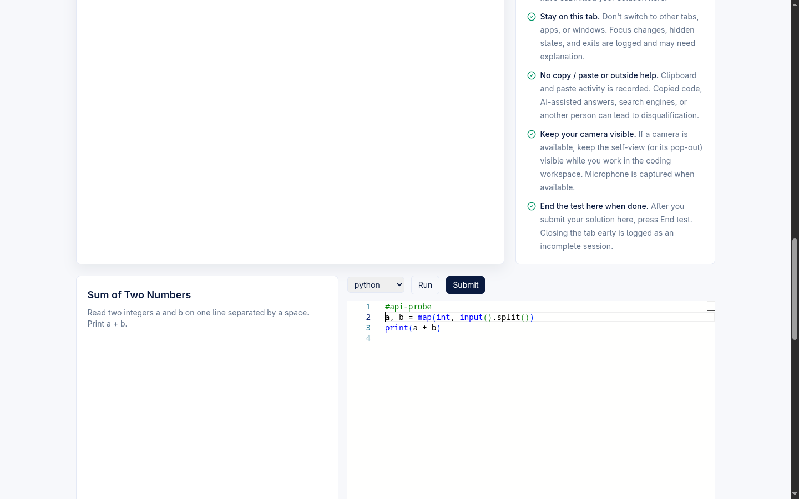

# Deploy / Build Runbook — GCP end-to-end (F11.1)

This page is the operator's runbook for standing up the Aerele Proctor platform on Google Cloud from nothing: an isolated GCP project, the backend API, the candidate/admin frontend, the optional video-merge worker, and the daily retention sweep. It documents what the deploy scripts in this repo actually do — and, just as importantly, the env keys and steps they do **not** yet wire up (flagged so you set them by hand before a real exam).

> **Product orientation.** Proctor is now a **standalone own-editor exam platform**: candidates do everything inside our own React + Monaco editor with Judge0-backed Run/Submit. (HackerRank was dropped from the candidate path in F8.2.) A separate, **optional** contest-eval monitoring poller under `monitoring/` still exists — it live-watches an externally-hosted HackerRank contest and emits cheating alerts into the same `POST /api/alerts` pipeline — but it is not part of this primary-stack deploy and is not covered here.

Components deployed by this runbook:

| Component | Cloud Run service (default) | Deploy script |
| --- | --- | --- |
| Backend API | `proctor-api` | `backend/deploy-gcp.sh` |
| Frontend (candidate + admin + invigilator SPA) | `proctor-web` | `frontend/deploy-gcp.sh` |
| Video merge/review worker (optional) | `proctor-video-worker` | `video-worker/deploy-gcp.sh` |
| Daily retention sweep | (Cloud Scheduler job → backend) | **manual — see §6** |

---

## 1. From-scratch isolated GCP project bootstrap

**Source of truth:** [`night-run/GCP-SETUP-INSTRUCTIONS.md`](../../night-run/GCP-SETUP-INSTRUCTIONS.md)

This first step is run by a **setup agent / person with full `gcloud` auth** (someone who can create projects and link billing), **not** by the build/deploy agent. Its job is only: project + billing + APIs + deployer service account + key + handoff. It deliberately does **not** create app secrets or run the deploy scripts.

The hard requirement is **isolation**: a brand-new, budget-capped, deletable project; the deployer SA is a member of **only this project** (GCP IAM is per-project, so it cannot see Karthi's other projects/VMs/prod); **no** org/folder-level roles; **no** handover of personal user credentials.

### What the bootstrap does

| Step | Action |
| --- | --- |
| 1. Create project | `gcloud projects create "$PROJECT_ID"` — IDs are globally unique (6-30 chars). Reference value: `aerele-proctor-dev`, region `asia-south1`. |
| 2. Link billing | Links an open billing account. Recommended: a small budget (e.g. ~$20) with 50/90/100% alerts so an overnight run can't run up cost. |
| 3. Enable APIs | `run`, `cloudbuild`, `artifactregistry`, `firestore`, `storage`, `iamcredentials`, `cloudresourcemanager`. |
| 4. Deployer SA | `proctor-deployer@…`, granted **`roles/owner` on this project only** (a documented tighter per-role alternative is listed in the brief). |
| 5. Create key | A scoped SA JSON key at `$HOME/proctor-dev-sa.json`, `chmod 600`. |
| 6. Cloud Build perm | Grants the Cloud Build SA `roles/cloudbuild.builds.builder` (fresh-project gotcha; non-fatal if redundant). |
| 7. Verify | Activates the key on its own and confirms `gcloud projects describe` prints the project id. |

### Handoff to the build agent

On the machine that holds the proctor repo, the bootstrap writes a gitignored env file the deploy agent reads:

```bash
cd /home/karthi/arogara/proctor
mkdir -p monitoring/.data
cat > monitoring/.data/gcp-dev.env <<EOF
GCP_PROJECT_ID=$PROJECT_ID
GCP_REGION=$REGION
GOOGLE_APPLICATION_CREDENTIALS=$KEY_PATH
EOF
chmod 600 monitoring/.data/gcp-dev.env
```

`gcloud` must be installed on the build machine; the deploy agent runs `gcloud auth activate-service-account --key-file=$GOOGLE_APPLICATION_CREDENTIALS` before the `deploy-gcp.sh` scripts.

**Cleanup** when done: delete the SA key, then `gcloud projects delete "$PROJECT_ID"`.

---

## 2. Fill `.env.deploy.local` (all required keys)

**Source of truth:** [`.env.deploy.example`](../../.env.deploy.example)

Copy the template, then edit the copy (never commit it):

```bash
cp .env.deploy.example .env.deploy.local
# edit .env.deploy.local
```

The deploy scripts read their config from the process environment, so in practice you `source .env.deploy.local` (or export the same vars) before running each `deploy-gcp.sh`. The table below lists every key, where it is documented, and which script consumes it.

| Key | Required? | Purpose | Consumed by |
| --- | --- | --- | --- |
| `PROJECT_ID` | **Yes** | GCP project id (not display name). | all scripts |
| `REGION` | Yes (defaults `asia-south1`) | One region for Cloud Run, Firestore, buckets, images. | all scripts |
| `REPOSITORY` | Yes | Artifact Registry Docker repo (created if missing). Example `proctor`; **scripts default to `aerele-proctor`** if unset. | all scripts |
| `ADMIN_PASSWORD` | **Yes** | Admin unlock for `/admin`. Backend gets the plaintext; frontend gets only its sha256 hash (see §4). | backend, frontend |
| `INVIGILATOR_PASSWORD` | Read by backend config | Password auth for the invigilator portal. **Not set by any deploy script (gap — see §4 / §8).** | backend (`config.mjs`) |
| `ALERTS_INGEST_API_KEY` | **Yes** | Shared secret for `POST /api/alerts` (`x-api-key`). Closed-by-default: unset ⇒ every ingest rejected. | backend |
| `RETENTION_SWEEP_API_KEY` | Required for the daily sweep job | `x-api-key` for `POST /api/admin/retention-sweep`. Closed-by-default: unset ⇒ key-auth rejected (admin password still triggers a manual sweep). | backend |
| `ALERTS_COLLECTION` | Optional | Firestore collection for alerts; defaults `proctor_alerts`. | backend |
| `PUBLIC_APP_ORIGIN` | Optional | CORS origin the backend accepts; defaults `*`. Tighten after frontend deploy (see §8 "lock CORS"). | backend |
| `EVIDENCE_BUCKET` | **Yes** | Evidence/recordings bucket (globally unique). Created if missing; lifecycle + CORS applied. | backend (also worker's `SOURCE_BUCKET`) |
| `SOURCE_BUCKET` | Worker only | Where screen chunks live; usually the same as `EVIDENCE_BUCKET`. | video worker |
| `DEST_BUCKET` | Worker only | Merged/review-video bucket (globally unique). Created if missing. | video worker |
| `BACKEND_SERVICE_NAME` | Yes (default `proctor-api`) | Cloud Run service id, not a URL. | backend (as `SERVICE_NAME`) |
| `FRONTEND_SERVICE_NAME` | Yes (default `proctor-web`) | Cloud Run service id. | frontend (as `SERVICE_NAME`) |
| `VIDEO_WORKER_SERVICE_NAME` | Worker only (default `proctor-video-worker`) | Cloud Run service id. | video worker (as `SERVICE_NAME`) |
| `API_URL` | **Yes, before frontend deploy** | Backend Cloud Run URL printed by `backend/deploy-gcp.sh`. | frontend |
| `WORKER_TOKEN` | Worker only | Protects the worker `/merge` endpoint. | video worker |
| `MAX_USERNAMES_PER_REQUEST` | Optional | Local helper cap for the merge script; default 25. | merge helper |

**Judge0 (Run/Submit) keys.** The backend's `config.mjs` reads `JUDGE0_BASE_URL` (default `https://judge0-ce.p.rapidapi.com`), `JUDGE0_MODE` (default `rapidapi`), `JUDGE0_API_KEY` (the RapidAPI key), and `JUDGE0_AUTH_TOKEN`. These are **not** present in `.env.deploy.example` and **not** set by `backend/deploy-gcp.sh` (gap — see §3 / §8). The dev stack supplies them out of band (the project keeps the RapidAPI key in a gitignored `monitoring/.data/judge0.env`, per the resume anchor — *(unverified at the deploy-script level; the script does not pass these env vars)*).

> Naming note: the example uses `BACKEND_SERVICE_NAME` / `FRONTEND_SERVICE_NAME` / `VIDEO_WORKER_SERVICE_NAME`, but each `deploy-gcp.sh` actually reads `SERVICE_NAME`. Either export `SERVICE_NAME` per script, or rely on each script's built-in default (`proctor-api` / `proctor-web` / `proctor-video-worker`).

---

## 3. Backend deploy script

**Source:** [`backend/deploy-gcp.sh`](../../backend/deploy-gcp.sh) · routes live in `backend/src/handler.mjs` (+ `routes/invigilator.mjs`); env contract in `backend/src/config.mjs`.

Run after sourcing your env:

```bash
source .env.deploy.local
bash backend/deploy-gcp.sh
```

The script is `set -euo pipefail` and hard-fails early if `PROJECT_ID`, `ADMIN_PASSWORD`, or `ALERTS_INGEST_API_KEY` are unset. In order, it:

1. **Sets project** and **enables APIs** (`run`, `cloudbuild`, `artifactregistry`, `firestore`, `storage`, `iamcredentials`).
2. **Creates Firestore** `(default)` database in `$REGION` if absent.
3. **Submits a composite index** on `proctor_sessions(username_norm ASC, contest_slug ASC)` — `--async --quiet`, wrapped `|| echo` so "already exists / building / any error" never blocks the deploy. (Also declared in `backend/firestore.indexes.json`.)
4. **Creates the evidence bucket** (`gs://$EVIDENCE_BUCKET`, uniform bucket-level access) if missing.
5. **Applies CORS** from [`backend/gcs-cors.json`](../../backend/gcs-cors.json): `PUT`/`GET`/`HEAD` from origin `*`, headers `Content-Type`/`ETag`, `maxAge 3600` (so the browser can `PUT` evidence chunks directly to signed URLs).
6. **Applies lifecycle** from [`backend/gcs-lifecycle.json`](../../backend/gcs-lifecycle.json) — the Wave-7 3-day / 11-day split (see §5).
7. **Creates the Artifact Registry repo** if missing.
8. **Grants runtime IAM** to the Cloud Run runtime SA (`<projnum>-compute@…`): `roles/datastore.user` on the project, `roles/storage.objectAdmin` on the evidence bucket, and `roles/iam.serviceAccountTokenCreator` on itself (needed to mint V4 signed URLs for evidence upload/download).
9. **Builds** the image with Cloud Build and **deploys** to Cloud Run.

### Cloud Run deploy parameters (backend)

| Flag | Value | Why |
| --- | --- | --- |
| `--allow-unauthenticated` | on | Public API; auth is app-level (admin password / invigilator token). |
| `--port` | `8080` | |
| `--memory` / `--cpu` | `256Mi` / `1` | |
| `--min-instances` | **`0`** | Default off for testing. **Set `1` for a real exam** (see §8). |
| `--max-instances` | `20` | |
| `--concurrency` | `100` | |
| `--timeout` | **`120s`** | `/api/exec/*` requests block while the Judge0 adapter polls (up to ~90s); a 30s timeout killed them mid-poll. |

### Env the backend script sets

`--set-env-vars` passes: `EVIDENCE_BUCKET`, `ADMIN_PASSWORD`, `ALERTS_INGEST_API_KEY`, `ALERTS_COLLECTION`, `PUBLIC_APP_ORIGIN`, `SESSION_COLLECTION`, `SETTINGS_COLLECTION=proctor_settings`, `URL_EXPIRY_SECONDS=900`.

### Env gaps the backend script does **not** set (flagged)

These are read by `backend/src/config.mjs` but never passed by the deploy script. Set them yourself (e.g. with `gcloud run services update <service> --update-env-vars=…` or by extending the script) before the corresponding feature is exercised:

| Missing env | Effect if left unset | Feature affected |
| --- | --- | --- |
| `INVIGILATOR_PASSWORD` | Invigilator portal password auth has no configured secret. | Invigilator portal login *(unverified end-state behavior; config defaults to `undefined`)*. |
| `RETENTION_SWEEP_API_KEY` | Key-auth path to the sweep stays closed (manual admin-password sweep still works). | Daily retention sweep (§6). |
| `JUDGE0_API_KEY` / `JUDGE0_AUTH_TOKEN` | No RapidAPI credential ⇒ Run/Submit cannot reach Judge0. | Candidate Run/Submit. |
| `EXEC_*` tuning | Falls back to code defaults (see §7). | Exec rate limits / concurrency. |

> The resume anchor confirms the live dev stack was deployed with `RETENTION_SWEEP_API_KEY` added by hand after this script ran. Treat that as the standing pattern: the script gives you a working core; the retention-sweep key, invigilator password, and Judge0 credentials are operator-applied add-ons.

The script ends by printing the **Backend URL** — copy it into `API_URL` before the frontend deploy.



*The candidate workspace running against the deployed `aerele-proctor-dev` stack — confirmation that the backend + frontend deploy described here yields a working in-exam experience.*

---

## 4. Frontend deploy script

**Source:** [`frontend/deploy-gcp.sh`](../../frontend/deploy-gcp.sh) · SPA entry `frontend/src/App.tsx`.

Run **after** the backend is deployed and `API_URL` is filled:

```bash
source .env.deploy.local   # must now include API_URL
bash frontend/deploy-gcp.sh
```

It hard-fails if `PROJECT_ID`, `API_URL`, or `ADMIN_PASSWORD` are unset. Then it:

1. Sets project, enables `run`/`cloudbuild`/`artifactregistry`, creates the Artifact Registry repo if missing.
2. **Computes the admin password hash** (C1 hardening): `ADMIN_PASSWORD_HASH = sha256(ADMIN_PASSWORD)` (hex). The plaintext admin password is **never** put in the bundle — it stays a backend-only secret.
3. **Builds the SPA** with two Vite env vars baked in:
   - `VITE_API_BASE_URL = $API_URL`
   - `VITE_ADMIN_PASSWORD_HASH = $ADMIN_PASSWORD_HASH`
   The admin unlock gate hashes the typed password client-side and compares to this hash (it only controls hiding/showing the admin UI; the backend still independently checks the real password on every privileged call).
4. Builds the image with Cloud Build and deploys to Cloud Run.

### Cloud Run deploy parameters (frontend)

| Flag | Value |
| --- | --- |
| `--allow-unauthenticated` | on |
| `--port` | `8080` |
| `--memory` / `--cpu` | `128Mi` / `1` |
| `--min-instances` | `0` |
| `--max-instances` | `3` |
| `--concurrency` | `1000` |

It prints the **Frontend URL** at the end.

### Flagged invigilator-hash gap

The script bakes in **only** `VITE_ADMIN_PASSWORD_HASH`. The invigilator portal's client gate expects a `VITE_INVIGILATOR_PASSWORD_HASH` (sha256 hex of `INVIGILATOR_PASSWORD`) — confirmed required by the resume anchor's frontend-build note — but `frontend/deploy-gcp.sh` does **not** compute or pass it. To enable invigilator password unlock you must build with that var set yourself, e.g.:

```bash
INVIG_HASH="$(printf '%s' "$INVIGILATOR_PASSWORD" | sha256sum | awk '{print $1}')"
VITE_API_BASE_URL="$API_URL" \
VITE_ADMIN_PASSWORD_HASH="$(printf '%s' "$ADMIN_PASSWORD" | sha256sum | awk '{print $1}')" \
VITE_INVIGILATOR_PASSWORD_HASH="$INVIG_HASH" \
npm --workspace frontend run build
# then gcloud builds submit / gcloud run deploy as the script does
```

*(The exact frontend env-var name `VITE_INVIGILATOR_PASSWORD_HASH` is taken from the resume anchor; verify against `frontend/src` before relying on the unlock in production.)* Note the invigilator portal's primary auth is the **tokenized name-only** link (the `?key=…` invigilator key) — see [invigilator-portal.md](./invigilator-portal.md); the password hash is the additional gate.

---

## 5. Wave-7 additions — retention key, lifecycle split, daily sweep

Wave-7 introduced the data-retention safety story. Three deploy-time pieces:

**1. `RETENTION_SWEEP_API_KEY`.** A new closed-by-default secret (`openssl rand -base64 32`). It is the `x-api-key` the Cloud Scheduler job sends to `POST /api/admin/retention-sweep`. The route (`adminRetentionSweep` in `handler.mjs`, authed via `requireSweepAuth`) accepts **either** this key **or** the admin password (manual "run now"). As noted in §3, the backend deploy script does not set it — apply it by hand.

**2. The `gcs-lifecycle.json` 3-day / 11-day split.** [`backend/gcs-lifecycle.json`](../../backend/gcs-lifecycle.json) has two prefix-scoped Delete rules:

| Prefix(es) | Delete at age | Meaning |
| --- | --- | --- |
| `contests/`, `sessions/` | **3 days** | Per-session evidence (screen/camera chunks). |
| `exports/` | **11 days** | Export recovery zips. |

The split is load-bearing (Wave-7 review finding): export zips are the recovery anchor for an irreversible purge, and the **retention-sweep endpoint owns their canonical 10-day deletion** — the GCS `age:11` rule is only a backstop just past that window. A single blanket `age:3` rule would have deleted export recovery archives 7 days early.

**3. The daily Cloud Scheduler retention-sweep job.** A scheduler job calls `POST /api/admin/retention-sweep` daily with header `x-api-key: $RETENTION_SWEEP_API_KEY`. For each contest whose retention window elapsed, the sweep deletes that contest's **evidence** (keeping results/snapshots), stamps `evidence_purged_at` only when a final listing returns empty (resume-safe), and deletes `exports/` zips older than 10 days.

> **Gap:** no deploy script creates this Cloud Scheduler job. Create it manually, e.g.:
> ```bash
> gcloud scheduler jobs create http proctor-retention-sweep \
>   --location="$REGION" --schedule="0 3 * * *" \
>   --uri="$API_URL/api/admin/retention-sweep" --http-method=POST \
>   --headers="x-api-key=$RETENTION_SWEEP_API_KEY"
> ```
> *(Command shape illustrative — `cloudscheduler.googleapis.com` is not in the scripts' enabled-API list and no in-repo script automates this; verify flags against your `gcloud` version. The resume anchor also warns to watch for a Firestore composite-index prompt on the first big export/purge.)*

---

## 6. Optional video-merge worker

**Source:** [`video-worker/deploy-gcp.sh`](../../video-worker/deploy-gcp.sh) · worker code `video-worker/src/server.mjs`; the backend deep-links to its output via `merged_video_key` in `handler.mjs`.

The worker is **optional**. It stitches a session's 30-second screen chunks into one playable review video, remuxes with `ffmpeg`, and writes `merged_video_key` (+ `merged_at`) back onto the session doc — which is what the admin recording-review player and "sure-shot" alert deep-links point to.

```bash
source .env.deploy.local   # needs SOURCE_BUCKET, DEST_BUCKET, WORKER_TOKEN
bash video-worker/deploy-gcp.sh
```

It creates `DEST_BUCKET` if missing, applies the **same** `backend/gcs-lifecycle.json` to it, grants the runtime SA `objectViewer` on `SOURCE_BUCKET` + `objectAdmin` on `DEST_BUCKET` + `datastore.user` (to write `merged_video_key`), then builds and deploys with: `--memory 1Gi`, `--cpu 1`, `--min-instances 0`, `--max-instances 2`, `--concurrency 1`, **`--timeout 3600s`** (long merges). Env set: `SOURCE_BUCKET`, `DEST_BUCKET`, `SESSION_COLLECTION`, `MAX_USERNAMES_PER_REQUEST=25`, `WORKER_TOKEN`. The `/merge` endpoint is `x-worker-token`/bearer-authenticated.

### The cross-bucket `video_key` 404 caveat

Documented in [`video-worker/README.md`](../../video-worker/README.md) and reflected in `handler.mjs` (`sureShotVideoKey` returns `session.merged_video_key || null`):

> If `DEST_BUCKET` ≠ `EVIDENCE_BUCKET`, the backend signs the alert `video_key` **against the evidence bucket**, so a deep-link to a merged video that actually lives in the review-video bucket can **404**.

The README marks this **untested against real GCP**. The safe operating choice today is to merge into the **same bucket** as the evidence (set `DEST_BUCKET = EVIDENCE_BUCKET = SOURCE_BUCKET`); the alternative is teaching the backend the review-video bucket. Note `.env.deploy.example` defaults `SOURCE_BUCKET` to the same value as `EVIDENCE_BUCKET` but `DEST_BUCKET` to a **separate** review-video bucket — so the out-of-the-box config is exactly the cross-bucket case that can 404. Adjust deliberately.

---

## 7. `EXEC_*` exam tuning

The candidate Run/Submit limits are **deploy-time env knobs (not code)**, read by `backend/src/config.mjs`. None are set by `backend/deploy-gcp.sh`, so they fall back to these defaults unless you pass them:

| Env | Default | Meaning |
| --- | --- | --- |
| `EXEC_RUN_COOLDOWN_SECONDS` | `5` | Min seconds between Runs. |
| `EXEC_SUBMIT_COOLDOWN_SECONDS` | `20` | Min seconds between Submits. |
| `EXEC_MAX_SUBMISSIONS_PER_SESSION` | `50` | Submit cap per session. |
| `EXEC_RUN_CONCURRENCY` | `2` | Run lane concurrency. |
| `EXEC_SUBMIT_CONCURRENCY` | `4` | Submit lane concurrency. |
| `EXEC_POLL_CONCURRENCY` | `16` | Judge0 poll concurrency. |
| `EXEC_MAX_QUEUE` | `200` | Max queued exec jobs. |
| `EDITOR_EVENTS_INGEST_LIMIT` | `5000` | Max editor events per ingest. |
| `DISCONNECTED_STALENESS_MS` | `45000` | When a session is treated as disconnected. |
| `GATE_ATTEMPT_LIMIT` | `20` | Brute-force cap on roster/gate lookups (a bad/≤0 value falls back to 20, never disabling the cap). |

For a real ~700-candidate exam the project's capacity work settled on roughly `EXEC_SUBMIT_COOLDOWN_SECONDS≈20`, `EXEC_MAX_SUBMISSIONS_PER_SESSION≈200`, and generous lane concurrency (resume anchor §3 / task #49), staying on the RapidAPI Judge0 key (load probe passed at ~$0.99). Tune to your contest.

---

## 8. Real-exam standing rules

- **`min-instances = 1` for a real exam.** Both backend and frontend scripts default `--min-instances 0` (fine for testing — scale-to-zero). For an exam, set the backend to `1` so the first candidate doesn't eat a cold start. Apply with `gcloud run services update "$BACKEND_SERVICE_NAME" --region "$REGION" --min-instances=1`.
- **Lock CORS.** First deploy can keep `PUBLIC_APP_ORIGIN=*`. After the frontend URL exists, set `PUBLIC_APP_ORIGIN` to the exact frontend Cloud Run URL and redeploy the backend for a tighter production posture (per `.env.deploy.example`).
- **Apply the operator-set env by hand.** Because the scripts don't set them: `RETENTION_SWEEP_API_KEY`, `INVIGILATOR_PASSWORD`, `JUDGE0_API_KEY`/`JUDGE0_AUTH_TOKEN`, `VITE_INVIGILATOR_PASSWORD_HASH` (frontend build), and any `EXEC_*` overrides.
- **Create the Cloud Scheduler sweep job** (§5) — not automated by any script.
- **NO git push — standing rule.** Deploy from local commits only; deploying does **not** require a push. Per the resume anchor §4, the repo must not be pushed until Karthi runs the history PII scrub. Treat "deploy ≠ push" as absolute.

### Live dev-stack reference (`aerele-proctor-dev`)

*(From `night-run/RESUME-ANCHOR.md`, last updated 2026-06-11 — point-in-time; verify current revisions with `gcloud run services list` before relying on these.)*

| Item | Value |
| --- | --- |
| Project / region | `aerele-proctor-dev` / `asia-south1` |
| Backend revision | `proctor-api-00006-pjr` |
| Frontend revision | `proctor-web-00006-d66` |
| Backend URL | `https://proctor-api-238846959672.asia-south1.run.app` (also `…-ej4cpz43iq-el.a.run.app`) |
| Frontend URL | `https://proctor-web-238846959672.asia-south1.run.app` (also `…-ej4cpz43iq-el.a.run.app`) |
| Notes | api `/` returns 404 by design (routes are `/api/*`); `min-instances` left at 0 for testing; Wave-6/7 admin routes (`/api/admin/{people,contest-results,contest-export,retention-sweep}`) return 401 live without auth. |

---

## Quick sequence

```bash
# 0. (setup agent) bootstrap project + SA key + handoff env   → §1
# 1. fill secrets
cp .env.deploy.example .env.deploy.local && $EDITOR .env.deploy.local
source .env.deploy.local
# 2. backend → prints Backend URL
bash backend/deploy-gcp.sh
# 3. put that URL into API_URL, then frontend
$EDITOR .env.deploy.local   # set API_URL=...
source .env.deploy.local
bash frontend/deploy-gcp.sh
# 4. (optional) video worker
bash video-worker/deploy-gcp.sh
# 5. operator-apply: RETENTION_SWEEP_API_KEY, INVIGILATOR_PASSWORD, JUDGE0 keys,
#    invigilator hash, EXEC_* tuning, min-instances=1, locked CORS, scheduler job
# NEVER git push.
```

---

**Related:** [architecture-overview.md](./architecture-overview.md) · [admin-data-lifecycle.md](./admin-data-lifecycle.md) · [admin-recording-review.md](./admin-recording-review.md) · [admin-live-monitoring.md](./admin-live-monitoring.md) · [invigilator-portal.md](./invigilator-portal.md) · [alert-taxonomy.md](./alert-taxonomy.md)
