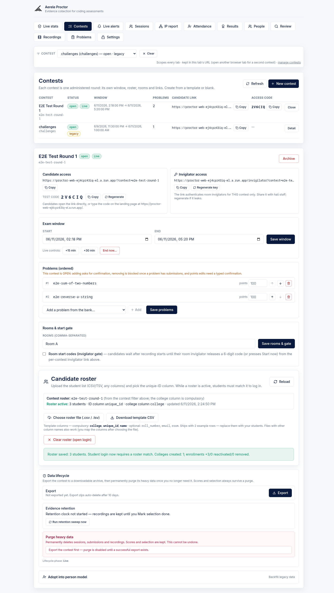
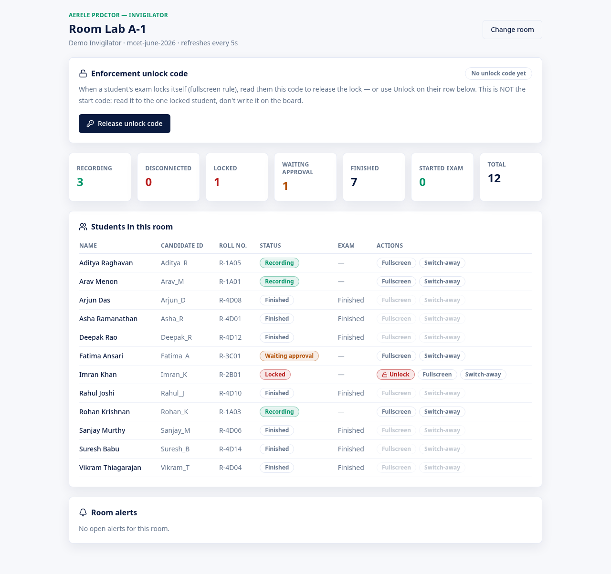

# Exam-Day Operations Runbook (1-page, F11.3)

**Purpose.** A single page the test-day team works from: how an admin sets up a round, what a candidate sees, how an invigilator runs a room, and exactly what to do when a candidate gets locked. Aerele Proctor is a **standalone own-editor exam platform** — candidates code, Run, and Submit entirely inside our React + Monaco workspace against a live Judge0 backend; there is no HackerRank in the candidate path. (The legacy HackerRank contest-eval poller was removed; proctor now uses its own in-app contest platform.)

Code-truth note: the backend has been **decomposed** — `backend/src/handler.mjs` is now the composition root that owns the request **dispatch table**, while route bodies live in 18 `backend/src/routes/*.mjs` factory modules (plus `lib/*.mjs`, `config.mjs`, and the feature/domain modules). The frontend is likewise split: `frontend/src/App.tsx` is a tiny pathname router, and the surface UI lives under `candidate/`, `admin/`, `invigilator/`, `shell/`, etc. Routes below are cited by their HTTP path, which is stable regardless of where the body lives.

---

## 1. Setup order (Admin)

Do these in order. The admin console is the `/admin` surface of the React app (root: `frontend/src/admin/AdminApp.tsx`); Contests/Templates/Problems panels live in `frontend/src/admin/`.

| # | Step | Where (UI) | Backing route(s) |
|---|------|-----------|------------------|
| 1 | *(Optional)* Author a **Template** — a reusable group of problems + default settings (window/rooms/gate/camera/enforcement/retention/languages). Instantiate it into a real contest later. | **Templates** tab → `TemplatesPanel.tsx` | `GET/POST /api/admin/templates`, `/api/admin/template-update`, `-clone`, `-archive`, `-delete` |
| 2 | Create **Problems** with statement, **hidden tests**, per-problem limits/scoring, and (optional) **per-language starter stubs**. | **Problems** tab → `ProblemBank.tsx` | `GET/POST /api/admin/problems`, `/api/admin/problem`, `/api/admin/problem-delete` |
| 3 | Create a **Contest** (one administered round) — from a template or blank. It gets a **name** (slug derived from the name), an **exam window** (start/end), **rooms**, and **retention** days. Created as a **draft**. | **Contests** tab → `ContestsPanel.tsx` | `POST /api/admin/contests`; edit via `/api/admin/contest-update` |
| 4 | Upload the **Roster** with the compulsory **college** + **unique-ID** columns (a downloadable template CSV is provided); assign rooms. The upload is scoped to the contest selected in the top-right scope picker. Identity is `person_id = "{college_norm}~{uid_norm}"`, stable across contests. | Contest detail → **Candidate roster** section (the same panel is also on the **Settings** tab) | `POST /api/admin/roster`, `GET /api/admin/roster`; candidate-side `POST /api/roster/lookup` |
| 5 | **Open** the contest, then **distribute**: the **candidate link** + **access code**, and the **per-contest invigilator link** (carries the contest's `invigilator_key`). Codes/keys are copy-buttoned and individually regenerate-able. | **Contests** → contest detail card | `POST /api/admin/contest-status` (open); `/api/admin/contest-regenerate` (rotate access_code / invigilator_key) |

The contest detail card is where the live round is run from. The exam window, rooms, links, and codes all live here:

Notes on step 5:
- **Candidate link** is `…/?contest={slug}`. Candidates can also open the bare landing page at `origin/` and **type the access code** (`POST /api/access-code` resolves it).
- **Invigilator link** is `…/invigilator?contest={slug}&key={invigilator_key}`. The key authenticates *that contest only*, server-side, on the first call. Regenerating either secret immediately invalidates every previously distributed copy.

See [admin-contests-templates.md](admin-contests-templates.md) and [admin-roster-rooms-identity.md](admin-roster-rooms-identity.md) for the full setup detail; [admin-problems-stubs-autocomplete.md](admin-problems-stubs-autocomplete.md) for hidden tests, stubs, and autocomplete.

---

## 2. Candidate flow (what the candidate experiences)

The candidate opens the contest link and moves through onboarding gates (the candidate surface root is `frontend/src/candidate/StudentApp.tsx`), **permissions-first → fullscreen-first**:

1. **Permissions first (F5.1).** All prompts — screen share (entire screen required), camera, clipboard — are requested **before** fullscreen, so a permission dialog can't bounce the candidate out of fullscreen mid-exam.
2. **Fullscreen first.** The shell goes fullscreen and starts proctoring/recording.
3. **Roster identity confirm.** The candidate enters their **unique ID** (labeled per the roster's `identity_label`, e.g. "roll number"); the rest of their roster row pre-fills; they confirm "yes, this is me" and complete the details form. (`POST /api/roster/lookup`; roster identity gate in `candidate/StudentApp.tsx`.)
4. **Workspace.** Multi-problem **Monaco** workspace (`frontend/src/coding/CodingWorkspace.tsx` + the `shell/` exam chrome; starter code via `STARTERS` + per-problem `stubs[lang]`; curated autocomplete) with **Run** and **Submit** against live Judge0. (`POST /api/exec/run`, `POST /api/exec/submit`.)
5. A slim **proctoring strip** (stage block, pulsing REC, name + ID + room, time left/elapsed) tops the exam; on any anomaly a **big full-width red banner replaces it** — invigilator glance rule: **red banner = walk over** (flipped 2026-06-12 from the old vanishing-bar cue; see [candidate-flow.md](candidate-flow.md)).

The candidate session is created by `POST /api/session/start` (resume via `/api/session/resume`); screen + camera chunks and editor/proctoring events upload through `/api/upload-url`, `/api/events`, `/api/editor-events`. Full detail: [candidate-flow.md](candidate-flow.md).

---

## 3. Invigilator live-ops (the room console)

Invigilators open the per-contest link and authenticate **name-only** (the link's key is the credential; a typed invigilator/admin password is the fallback if the key is rejected). Component: `frontend/src/InvigilatorApp.tsx`. The dashboard polls **every 5 seconds** (`GET /api/invigilator/room`).

| Capability | What it does | Route |
|-----------|--------------|-------|
| **Status tiles** | Recording / Disconnected / Locked / Waiting approval / Finished / Started exam / Total. Click a tile to **filter** the student list to that status; click again to clear. | `/api/invigilator/room` |
| **Room start gate** | Only shown when the contest's room gate is **enabled**. "Release room code" puts a 6-digit start OTP on the board; "Start now — allow all" admits the whole room with no code. | `/api/invigilator/release-code`, `/api/invigilator/open-room` |
| **Enforcement unlock code** | Always shown. A separate 6-digit code (its own namespace — never the start code) read to **one** locked student to release a fullscreen lock. | `/api/invigilator/unlock-code` |
| **Per-student exemptions** | Toggle **Fullscreen** and/or **Switch-away** enforcement OFF for one student (legit environment problems); applies to the live session within a heartbeat. | `/api/invigilator/exempt` |
| **Per-student Unlock** | "Unlock" button appears only on a student whose lock reason is `fullscreen_enforcement` (admin locks are not invigilator-releasable). | `/api/invigilator/unlock` |
| **Room alerts** | A **selective** alert feed — only alert types the **admin** marked "share with invigilator" appear here (default: **all OFF**). Click an alert to expand candidate detail (name, roll no., roster ID) within least-privilege limits. | `/api/invigilator/room` (alerts join) |

Full detail: [invigilator-portal.md](invigilator-portal.md).

---

## 4. When a candidate is locked (the escalation ladder)

The fullscreen-enforcement ladder (`frontend/src/shell/EnforcementOverlay.tsx` + `shell/enforcement.ts`; candidate-side wiring in `candidate/StudentApp.tsx`):

- **L1 — self-serve typed acknowledgement.** A fullscreen exit raises a red hard-block takeover with a countdown ("seconds left"). The candidate must (a) type the exact phrase **"I will not exit full screen after this"** and (b) press **Re-enter fullscreen now** within the **re-entry countdown (default 20s)**. Doing both clears the block with no staff involvement.
- **L2 — locked, needs a code.** If the countdown expires **or** the exit limit (**default 2** exits) is exceeded, the session **locks itself** (`status: locked`, `locked_reason: "fullscreen_enforcement"`). The candidate is told to raise their hand. To release:
  - **Invigilator path:** read the room's **enforcement unlock code** to the student, who types it on their locked screen (`POST /api/session/unlock-gate`), **or** the invigilator clicks **Unlock** on that student's row (`POST /api/invigilator/unlock`).
  - **Admin path:** Unlock the session from the admin session card / Sessions list (`POST /api/admin/session-action`).
- **Admin locks** (an admin manually locking a session) do **not** show the candidate unlock-code panel and are **not** invigilator-releasable — an admin must unlock them.

> The unlock code is **not** the start code. Too many wrong unlock-code attempts (`too_many_attempts`) disables the typed path — only a proctor can then unlock.

Enforcement mode and the two thresholds are admin-configurable (Settings → enforcement; "Block" mode, re-entry seconds blank = 20, exit limit blank = 2). Full detail: [candidate-enforcement-ladder.md](candidate-enforcement-ladder.md).

---

## 5. Live time control + End-now (Admin)

On the **Live stats** view there is an exam-time card (remaining time computed against the **server** clock, skew-corrected). The card **follows the contest scope** and says so with a chip: scoped to a real contest it shows/edits **that contest's window** (chip "Contest: {slug}", writes via `POST /api/admin/contest-exam-time`); an unknown scoped slug disables the controls.

| Action | Effect | Route / body |
|--------|--------|--------------|
| **+15 / +5 / −5 min** | Shift the current end time. | `POST /api/admin/contest-exam-time` `{ extend_minutes }` |
| **New end time** | Set an absolute end. | `POST /api/admin/contest-exam-time` `{ end_at }` |
| **End for everyone** | End-now: sets end = now **and** force-ends every non-ended session in scope. | `POST /api/admin/contest-exam-time` `{ end_now: true }` |

A plain extend/new-end change **never** force-ends sessions — recording keeps running so candidates end their own test; candidates pick up the new end time via heartbeat (≤15s, no reload). **End-now is the explicit hard stop.** Per-contest end time also lives on the contest detail card (same `POST /api/admin/contest-exam-time` route). The candidate strip timer is **status-bound** — it follows session status (it stops once the session is ended) and anchors on the session's server-side start, so it survives recording restarts.

---

## 6. Where to watch (live monitoring surfaces)

All under the admin console (`frontend/src/admin/`); details in [admin-live-monitoring.md](admin-live-monitoring.md).

| Surface | What you see | Refresh | Route |
|---------|--------------|---------|-------|
| **Live stats** | Status counts (live/disconnected/locked/pending/finished/total); cards are clickable into the Sessions drill-down. | **5s auto-poll** | `GET /api/admin/stats` |
| **Live alerts** | Alert console with filters, **Group by** (none/candidate/type), bulk select + bulk actions (archive, etc.). | **5s auto-poll** | `GET /api/admin/alerts`, `/api/admin/alert-action` |
| **IP report** | Logged-in users grouped by IP (off-campus / cluster detection); row click drills into that IP's sessions with per-user actions. | on demand | `GET /api/admin/ip-report` |
| **Attendance** | Taken / not-taken / absentees from the uploaded roster (absentees CSV export). | on demand | `GET /api/admin/attendance` |
| **Sessions** | All-docs session list (matches the stat-card counts; reaches zero-chunk 2nd-device sessions). Click a row → session card with status-valid actions. | on demand | `GET /api/admin/sessions-list`, `/api/admin/session-detail` |
| **Invigilator portal** | Per-room view (see §3). | 5s | `GET /api/invigilator/room` |

The alert feed carries candidate proctoring alerts, which land in the `/api/admin/alerts` pipeline — see [alert-taxonomy.md](alert-taxonomy.md). (`proctor` is the only alert source now; the legacy HackerRank contest-eval poller that used to feed this pipeline was removed.)

---

## 7. After the exam

| Surface | What it gives | Route(s) |
|---------|---------------|----------|
| **Results** | Per-contest rank / per-problem / integrity columns; bulk-select a shortlist and mark **selection-done** (a snapshot). | `GET /api/admin/contest-results`, `/api/admin/contest-selection`, `/api/admin/contest-selection-done` |
| **People** | Cross-round scorecard per person (`person_id` = `{college}~{uid}`) across every contest they attempted. | `GET /api/admin/people`, `/api/admin/person` |
| **Recording review** | Screen **+ camera** playback with an events/alerts timeline (click an entry to jump the scrubber). Camera recording defaults **ON** (separate low-res stream). | `GET /api/admin/recording-sessions`, `/api/admin/session-events` |
| **Data lifecycle** | Per-contest **export** (scores/sessions/attendance to files) → triple-gated **purge** (type the contest **slug**) → tombstone; evidence/exports auto-expire via retention. | `POST /api/admin/contest-export`, `/api/admin/contest-purge`, `/api/admin/retention-sweep` |

Detail: [admin-results-people.md](admin-results-people.md), [admin-recording-review.md](admin-recording-review.md), [admin-data-lifecycle.md](admin-data-lifecycle.md).

**After contest end: run Evaluate on the Results tab.** Once the window closes,
press **Evaluate contest** on Results to compute the deterministic talent +
integrity scorecards from the captured session evidence (keystroke/paste
telemetry, replayed editor state, submissions, shell/clipboard streams). It is
admin-triggered only, cursor-batched (resumes automatically until done), and
idempotent (re-running skips unchanged candidates; pass `force` to recompute).
The Results columns then gain a talent tier + 0–100 composite, an integrity tier
with flag counts, and a per-row evidence drawer. See
[candidate-evaluation.md](candidate-evaluation.md).

---

## Key defaults (confirm before exam)

| Setting | Default | Source |
|---------|---------|--------|
| Room start gate | **OFF** (no start code; candidates self-start) | `contest.room_gate_enabled` defaults false |
| Camera recording | **ON** (~10 fps, 640w defaults) | `normalizeCameraRecording` / camera_recording defaults enabled |
| Invigilator alert sharing | **All OFF** (admin opts each type in) | per-type "Share with invigilator" default off |
| Fullscreen enforcement mode | **Block** (lock on expiry / exit limit) | enforcement mode select |
| Fullscreen re-entry countdown | **20 s** (blank = 20) | `FULLSCREEN_REENTRY_DEFAULT_SECONDS`, `backend/src/templates.mjs` |
| Fullscreen exit limit | **2** exits (blank = 2) | `FULLSCREEN_EXIT_LIMIT_DEFAULT`, `backend/src/templates.mjs` |
| Live stats / alerts auto-poll | **5 s** | `ADMIN_POLL_INTERVAL_MS = 5000` |
| Purge confirmation | Type the contest **slug** *(unverified: F9 design originally said the contest name; shipped as slug)* | `dataLifecycle` purge gate |

---

## Related

- [architecture-overview.md](architecture-overview.md)
- [candidate-flow.md](candidate-flow.md) · [candidate-enforcement-ladder.md](candidate-enforcement-ladder.md)
- [invigilator-portal.md](invigilator-portal.md)
- [admin-contests-templates.md](admin-contests-templates.md) · [admin-roster-rooms-identity.md](admin-roster-rooms-identity.md) · [admin-problems-stubs-autocomplete.md](admin-problems-stubs-autocomplete.md)
- [admin-live-monitoring.md](admin-live-monitoring.md) · [admin-recording-review.md](admin-recording-review.md) · [admin-results-people.md](admin-results-people.md) · [admin-data-lifecycle.md](admin-data-lifecycle.md)
- [alert-taxonomy.md](alert-taxonomy.md)
