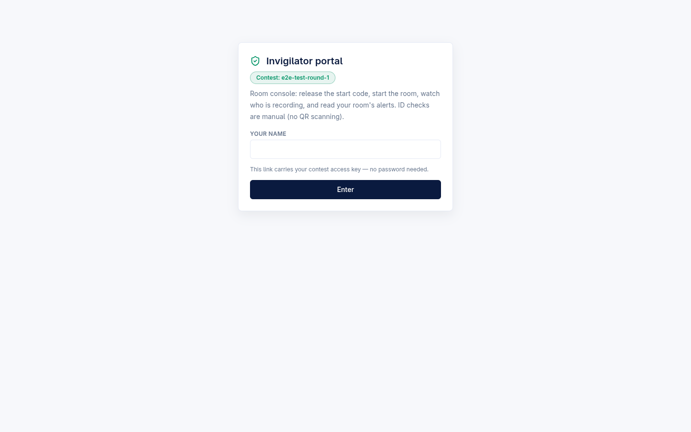
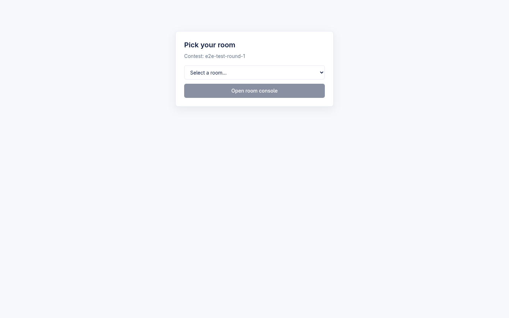
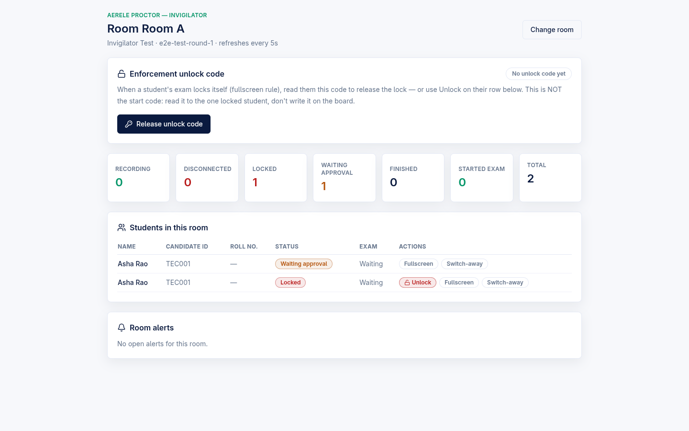
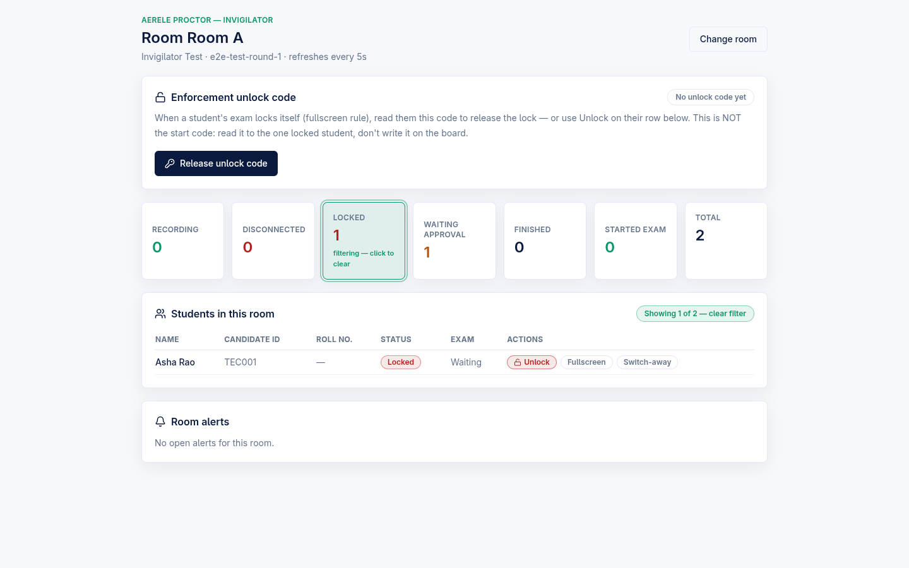
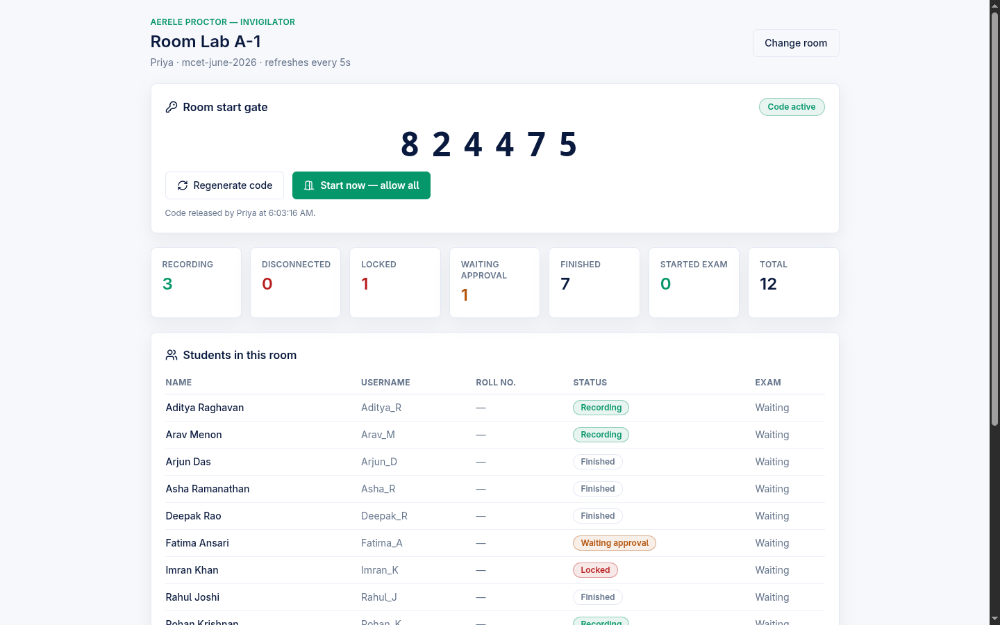
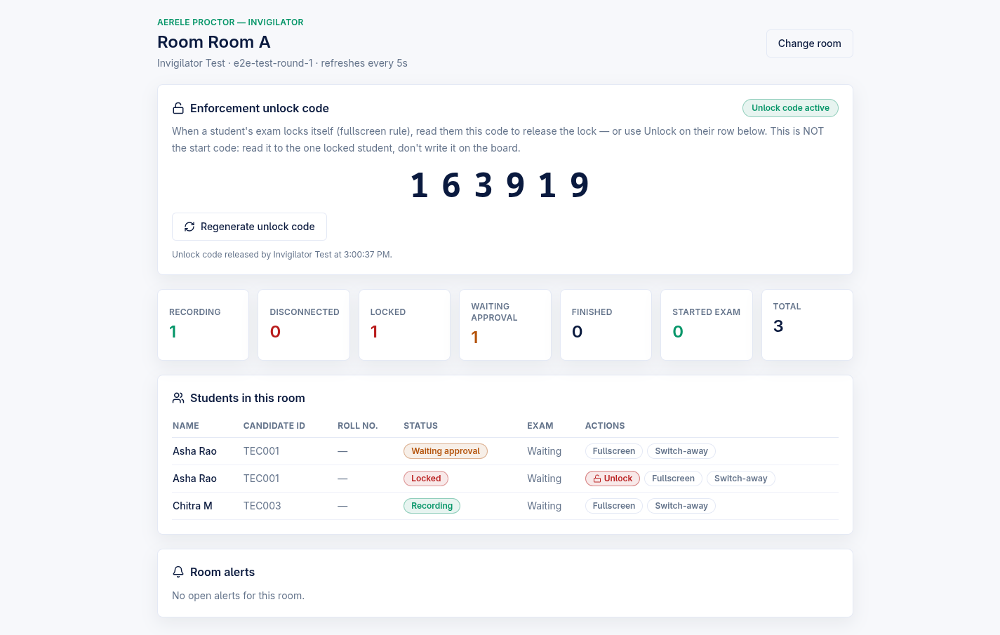
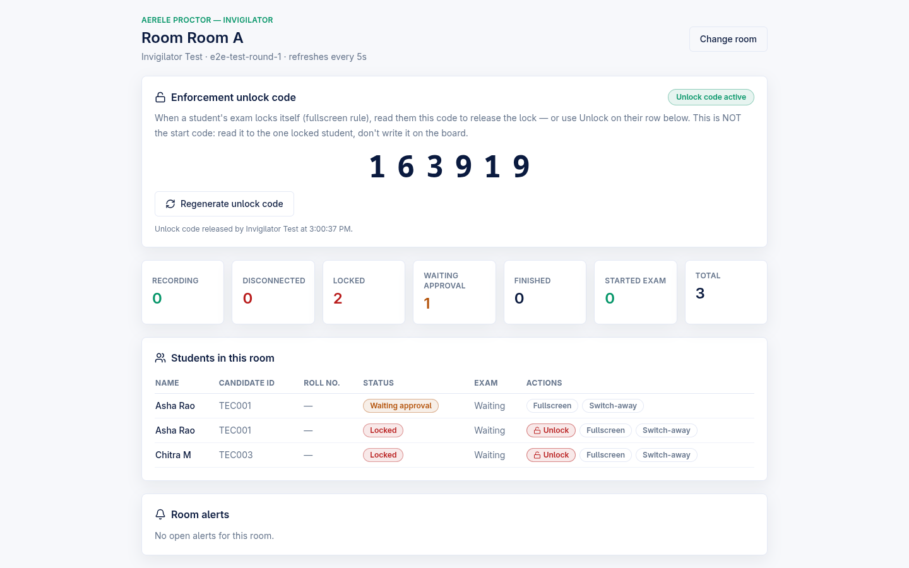
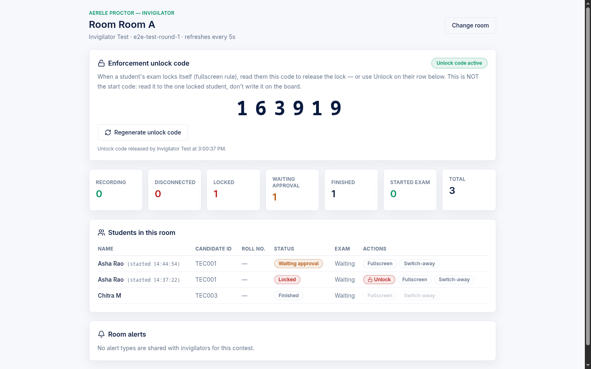

# Invigilator Portal — tokenized room ops

A least-privilege, name-only portal that lets a room invigilator run the floor for a single exam room: release the room start code, mint per-room enforcement unlock codes, unlock or exempt individual students, and watch live room status plus the alert types the admin chose to share. The portal never exposes emails, IP addresses, signed media URLs, or session-id bearer tokens.

> Standard of truth: every behaviour below was read from the live code in this repo. Where a behaviour could not be verified, it is marked **(unverified)**.

Backing surfaces:

- Frontend: `frontend/src/InvigilatorApp.tsx` (the whole portal UI), with pure helpers in `frontend/src/invigilator/roomView.ts`, `frontend/src/invigilator/gateLogic.ts`, and `frontend/src/invigilator/portalLink.ts`. API client functions live in `frontend/src/api.ts`.
- Backend routes: `backend/src/routes/invigilator.mjs` (the `makeInvigilatorRoutes(ctx)` factory), dispatched from `backend/src/handler.mjs` (lines 394-400). Auth guards are in `backend/src/lib/auth.mjs`.
- The portal mounts at the `/invigilator` route.

---

## Where the portal fits in the product

Proctor is a standalone, own-editor exam platform: candidates sit the exam entirely inside our React + Monaco workspace with Judge0-backed Run/Submit. The invigilator portal is the on-the-ground operator surface for that platform — the person standing in the exam hall. A separate, optional `monitoring/` contest-eval poller (which watches an externally-hosted HackerRank contest and emits cheating alerts into the same alerts pipeline) still exists as its own component; when it is in use, the alerts it raises can also surface here through the same selective-alerts mechanism described below.

---

## Tokenized name-only auth

The portal is reached two ways, both verified in `InvigilatorApp.tsx` (`unlock()`) and `routes/invigilator.mjs` / `lib/auth.mjs`:

| Entry | URL | What the user types | Backend check |
| --- | --- | --- | --- |
| Per-contest tokenized link | `/invigilator?contest={slug}&key={invigilator_key}` | **Only their name** | The key is verified server-side on the first call — there is no client-side hash for it (`requireInvigilatorFor` compares it timing-safe against the named contest's `invigilator_key`). |
| Typed-password fallback | `/invigilator` (legacy portal) or after a key is rejected | Name + invigilator password | Client pre-check (invigilator hash → plain → admin hash → plain), then the overview call scopes to the contest. |

Key facts (from `portalLink.ts` and `auth.mjs`):

- A `key` only authenticates the **named contest** it was issued for. It never authenticates another contest and never authenticates the legacy no-contest portal — `portalLinkOf()` drops a `key` that arrives without a `contest`.
- **The admin password also opens the portal.** `requireInvigilatorFor` accepts the admin credential in either the `x-admin-password` or `x-invigilator-password` header, so an admin can walk into any room console.
- The global `INVIGILATOR_PASSWORD` is the staff fallback. With it unset and no admin credential, invigilator-password requests are rejected (closed-by-default).
- A rejected/regenerated link key reveals the typed-password field on the entry screen (`keyRejected` state) with the message: "This invigilator link is invalid or was regenerated…".

**Name is mandatory and is recorded against every code release.** `unlock()` refuses to proceed without a name ("Enter your name — code releases are recorded against it."), and the name rides every gate mutation: `releaseRoomCode`, `openRoom`, and `releaseUnlockCode` all send `invigilator_name`, which the backend stores as `released_by` / `opened_by` / `unlock_released_by` (`routes/invigilator.mjs`). The room console footer then shows e.g. "Code released by {name} at {time}".

The entry blurb is contest-gate aware (`portalEntryBlurb()` in `roomView.ts`): with the room gate ON it promises "release the start code, start the room, watch who is recording…"; with the gate OFF it drops the start-code clause and only describes the monitoring view. Both variants end with "ID checks are manual (no QR scanning)" — signed-QR ID verification is deferred by design.

### Where the link comes from

The admin Contests detail page derives the per-contest `?contest=&key=` link; each contest owns a regenerate-able `invigilator_key` (see `admin-contests-templates.md`). Regenerating the key invalidates any link already handed out — the next portal call returns 401 and the invigilator falls back to the typed password.

---

## Room picker → room console

After auth the portal calls `GET /api/invigilator/overview` (`invigilatorOverview`) to bootstrap the picker. The overview returns the distinct room labels (in contest mode, the contest's configured rooms unioned with rooms any session already carries, so an invigilator can pick their room before a single candidate has joined), whether blank-room sessions exist (the `(no room set)` pseudo-room, key `_`), and `room_gate_enabled`.

The picker offers each known room, optionally `(no room set)`, and an `Other…` free-text entry. Picking a room opens the console, which polls `GET /api/invigilator/room?room={label}` once every **5 seconds** (`POLL_INTERVAL_MS = 5000`). That single call returns counts, the per-student list, the room gate, and the room's open alerts. Transient poll errors are swallowed (the next tick retries).

### Live status counters (clickable filters, F9.2)

Seven stat tiles sit above the student table, fed by `data.stats` from `invigilatorRoom`:

| Tile | Counts | Filter value |
| --- | --- | --- |
| Recording | all `active` sessions (stale included) | `recording` |
| Disconnected | `active` + stale | `disconnected` |
| Locked | `locked` | `locked` |
| Waiting approval | `pending_approval` | `pending_approval` |
| Finished | `ended` | `finished` |
| Started exam | rows with `exam_started_at` | `started` |
| Total | all rows | — (not clickable) |

Clicking a tile filters the student list to exactly the rows that tile counts; clicking it again clears the filter (`toggleFilter` + `matchesStatusFilter` in `roomView.ts`). The active tile is highlighted with a "filtering — click to clear" hint, and the table header shows "Showing N of M — clear filter". The filter logic is built so the filtered list length always agrees with the number on the tile (e.g. `recording` matches all `active`, matching `stats.live`).

### Candidate table

Columns: Name, Candidate ID, Roll no., Status, Exam (Started/Waiting), Actions. The backend deliberately omits `session_id` (it is the candidate's write-endpoint bearer token), emails, and IPs — invigilators identify candidates by name / roll / candidate id only.

If the same candidate appears on two rows (a stale session plus a fresh re-join), the duplicate rows get a "(started HH:MM:SS)" session-start disambiguator so the invigilator can tell which one is live (`duplicateRowKeys` + `sessionStartedLabel` in `roomView.ts`). Unique candidates stay uncluttered.

---

## Release / regenerate the room START code (F9.1)

The **Room start gate** card renders only when the room gate is enabled for the contest. When the gate is OFF, the entire card is hidden — there is no explainer block — so invigilators are never shown machinery they cannot use (`gateEnabled ?` guard in `InvigilatorApp.tsx`; `GateCard` component).

| State | Card shows | Primary action |
| --- | --- | --- |
| No code yet (`idle`) | "No code released yet" | **Release room code** → `POST /api/invigilator/release-code` |
| Code active (`armed`) | the 6-digit OTP, large | **Regenerate code** (confirms first: "the code currently on the board stops working") |
| Room open | "Everyone in this room is admitted automatically" | **Start now — allow all** → `POST /api/invigilator/open-room` |

Behaviour from `invigilatorReleaseCode` / `invigilatorOpenRoom`:

- Release is **idempotent by default**: an existing OTP is returned unchanged, so a portal reload never silently invalidates the code already written on the board. Pass `regenerate:true` for a fresh one.
- **Start now** marks the room OPEN; every waiting candidate's next gate poll admits them without a code (the room-scoped parallel of the admin master switch). It confirms first.
- Both mutations require the admin to have enabled the room gate (`requireGateEnabledFor` → 400 `room_gate_disabled` otherwise).
- The OTP is a 6-digit code, stored in plaintext deliberately (it is a short-lived room-coordination code the invigilator must be able to re-display, not a data-guarding credential; online guessing is bounded by a per-session attempt cap on the candidate side).

---

## Mint a 6-digit enforcement UNLOCK code

The **Enforcement unlock code** card renders **always** — locks happen whether or not the start gate is in use (`UnlockCodeCard` component; comment "Renders ALWAYS"). This is a distinct code from the start OTP and a distinct namespace on the gate doc (`gate.unlock_otp`, never `gate.otp`). The product reason (in `routes/invigilator.mjs`): in an OTP-gated room every candidate personally typed the *start* code, so reusing it for unlocks would make the lock self-serve.

- **Release unlock code** / **Regenerate unlock code** → `POST /api/invigilator/unlock-code` (`invigilatorUnlockCode`). Idempotent like the start code; regenerate confirms first.
- This endpoint is deliberately **not** gated on `room_gate_enabled`: in the default deployment (enforcement "block" mode, start gate off) it is the room proctor's only code path, so an unlock code must always be mintable.
- Card copy: "read them this code to release the lock… This is NOT the start code: read it to the one locked student, don't write it on the board."

### Per-student unlock of a lock

When a student's exam locks itself for fullscreen enforcement, an **Unlock** button appears on that student's row — and **only** on rows whose `locked_reason` is `fullscreen_enforcement`. Admin locks (any other / no reason) never show the button and stay admin-released (`InvigilatorApp.tsx` row render; backend `invigilatorUnlock` returns 403 `not_enforcement_locked` for non-enforcement locks).

Clicking Unlock (after a confirm) calls `POST /api/invigilator/unlock` with room + username (never `session_id`). The backend finds the locked session in that room, sets it back to `active`, clears `locked_reason`, stamps `unlock_method: "invigilator"`, and **resets the server-side fullscreen exit ladder** (`fullscreen_exit_count: 0`) so a later accident is L1 again, not an instant relock. The row updates optimistically. See `candidate-enforcement-ladder.md` for the candidate-side ladder.

---

## Per-student enforcement-exemption toggles (F5.5)

Each student row carries two pill toggles in the Actions column: **Fullscreen** and **Switch-away**. These exempt that one student from a specific enforcement rule, for legitimate environment problems (e.g. a flaky projector hook stealing focus). An active exemption is shown amber with a ": exempt" suffix; the toggles are disabled for ended sessions.

Mechanics (`toggleExemption` in `InvigilatorApp.tsx`, `invigilatorExempt` in `routes/invigilator.mjs`):

- Toggling calls `POST /api/invigilator/exempt` with room + username + the single changed exemption (`{ fullscreen }` or `{ switch_away }`).
- The backend resolves the **live** session in that room by username (never `session_id`), merges the new exemption onto the existing ones, and echoes the merged `enforcement_exemptions` back; the row updates from that echo.
- It is **not** gated on `room_gate_enabled` — exemptions are an enforcement tool, independent of the start gate.
- The exemption applies to the student's live session within one heartbeat **(unverified — the propagation timing is asserted in code comments but not confirmed by a runtime test in this repo).**

---

## Selective alerts (F9.3 / F9.4)

The **Room alerts** panel only shows alert types the admin explicitly marked "Share with invigilator". This is **DEFAULT ALL OFF**: in the alert catalog (`handler.mjs` `PROCTOR_ALERT_DEFAULTS`, mirrored in `api.ts`), every type ships with `show_to_invigilator: false`. Nothing reaches an invigilator until the admin opts a type in.

Default `show_to_invigilator` per type (all `false`):

| Alert type | Default severity | Shared by default |
| --- | --- | --- |
| `recording_stopped` | critical | OFF |
| `screen_share_stopped` | critical | OFF |
| `recording_error` | critical | OFF |
| `fullscreen_enforcement` | critical | OFF |
| `ip_changed` | warning | OFF |
| `tab_hidden` | warning | OFF |
| `tab_away` | warning | OFF |
| `disconnected` | warning | OFF |

The filtering is enforced **server-side** in `invigilatorRoom` (`isAlertShownToInvigilator`), so hidden alert types never leave the backend. The alert projection that does ship is stripped to `id / type / severity / timestamp / title / hackerrank_username` — `detail` is dropped (the `ip_changed` alert would otherwise leak candidate IPs) and `session_id` is dropped (bearer token).

The empty-state copy distinguishes the two empty cases (`emptyAlertsHint` in `roomView.ts`, driven by `alerts_shared` from the backend's `anyAlertSharedWithInvigilator`):

- "No open alerts for this room." — types are shared, nothing has fired.
- "No alert types are shared with invigilators for this contest." — the admin opted nothing in (the default).

### Alert click → candidate detail (within least-privilege)

Clicking an alert expands it (`AlertRow`) to show candidate detail **joined from the room's own session rows** — name, roll no., roster id, the alert time, and a plain-language explanation of what the alert type means (`alertExplanation` in `roomView.ts`, e.g. for `fullscreen_enforcement`: "…Use Unlock on their row, or read them the room's unlock code"). No alert internals and no extra server fields are exposed; the expansion only re-displays identity data the dashboard already holds. The "Share with invigilator" toggles are configured on the admin side — see `admin-live-monitoring.md`.

---

## Least-privilege scope (summary)

Verified across `routes/invigilator.mjs` and `auth.mjs`. The portal's endpoints expose:

- **No** emails, **no** IP addresses, **no** signed media / download URLs, **no** `session_id`.
- Candidates are always addressed by room + username, never by `session_id` (so an invigilator cannot end a candidate's exam or call candidate write-endpoints).
- Alerts are server-filtered to shared types and stripped of `detail` and `session_id`.
- An invigilator can unlock only **enforcement** locks, never admin locks.
- Auth is always contest-scoped; a contest key cannot reach another contest's data.

The **admin password also opens the portal** (full least-privilege scope still applies to what the portal endpoints return).

---

## Routes reference

All dispatched in `backend/src/handler.mjs` (lines 394-400), implemented in `backend/src/routes/invigilator.mjs`:

| Method + path | Handler | Purpose |
| --- | --- | --- |
| `GET /api/invigilator/overview` | `invigilatorOverview` | Room-picker bootstrap (rooms, unassigned, gate-enabled) |
| `GET /api/invigilator/room?room=` | `invigilatorRoom` | One-call room dashboard (stats + students + gate + alerts) |
| `POST /api/invigilator/release-code` | `invigilatorReleaseCode` | Mint / re-display the room START OTP |
| `POST /api/invigilator/open-room` | `invigilatorOpenRoom` | Start now — admit everyone, no code |
| `POST /api/invigilator/unlock-code` | `invigilatorUnlockCode` | Mint / re-display the room ENFORCEMENT unlock code |
| `POST /api/invigilator/unlock` | `invigilatorUnlock` | Release one student's enforcement lock |
| `POST /api/invigilator/exempt` | `invigilatorExempt` | Toggle a per-student enforcement exemption |

> Decomposition note: the route bodies and room-gate helpers moved verbatim into `routes/invigilator.mjs` (decomp B1, behavior-preserving), but the dispatch table itself still lives in `handler.mjs`, and that refactor is paused/partial.

### Auth / config

| Item | Where | Default |
| --- | --- | --- |
| `INVIGILATOR_PASSWORD` | backend env (`auth.mjs`) | unset → invigilator-password path rejects (closed-by-default) |
| `ADMIN_PASSWORD` | backend env (`auth.mjs`) | also opens the portal; required for the admin fallback |
| per-contest `invigilator_key` | contest doc | issued / regenerated on the admin Contests page |
| `show_to_invigilator` (per alert type) | alert settings | **`false` for every type** (default all OFF) |
| room poll interval | `InvigilatorApp.tsx` | 5 s |

---

## Related

- [Admin — Contests and Templates](./admin-contests-templates.md) — where the per-contest invigilator link/key is derived and regenerated
- [Admin — Live Stats, Sessions, Alerts Console, IP Report, Attendance](./admin-live-monitoring.md) — where "Share with invigilator" is toggled per alert type
- [Admin — Roster, Rooms, College + Person Identity](./admin-roster-rooms-identity.md) — room labels and person identity the console displays
- [Fullscreen Enforcement Ladder](./candidate-enforcement-ladder.md) — the candidate-side lock that the unlock code / per-row Unlock releases
- [Candidate Flow](./candidate-flow.md) — the candidate onboarding and workspace the invigilator oversees
- [Architecture Overview](./architecture-overview.md) — standalone own-editor platform plus the optional contest-eval poller
